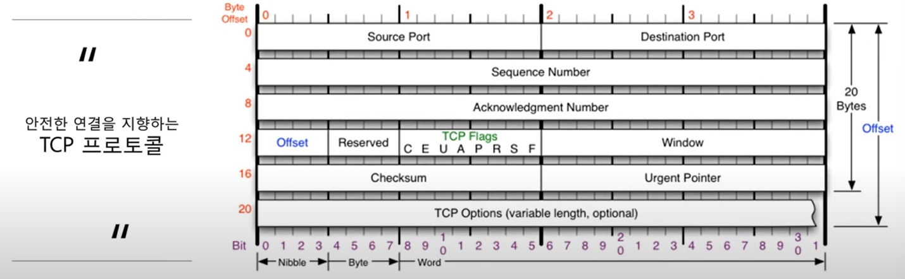
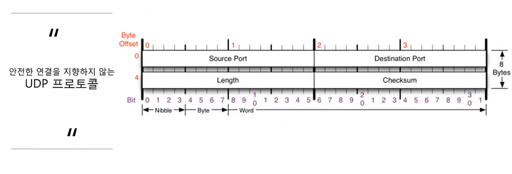
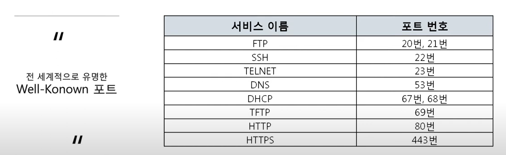
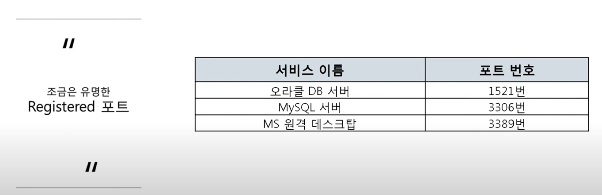
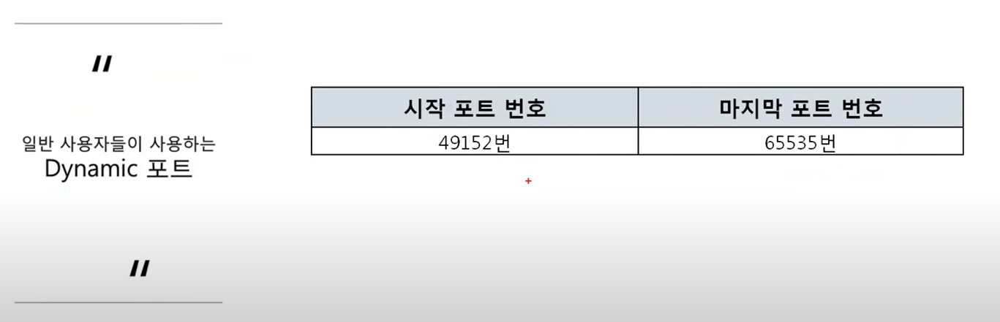
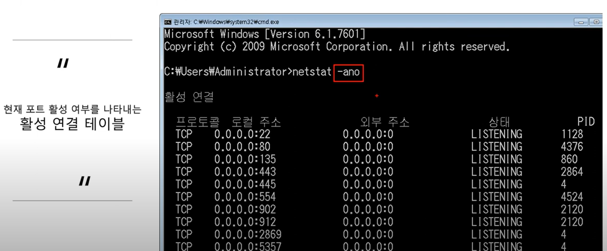
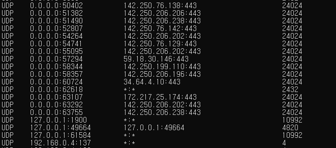

# 컴퓨터의 프로그램끼리는 이렇게 데이터를 주고 받는다

## INDEX

1. 4계층 프로토콜 : 4계층에서 하는 일, 4계층 프로토콜의 종류
2. 포트번호 : 포트번호의 특징, Well-Known 포트, Registered 포트, Dynamic 포트
3. 프로그램의 연결 정보 : 어떤 프로세스와 어떤 프로세스가 연결되어 있는지 확인
4. 따라학 IT : 현재 연결 상태 확인하기, 특정 서비스의 포트번호 확인하기

## 4계층 프로토콜

1. 4계층에서 하는 일

- 전송 계층(Transport layer)은 송신자의 프로세스과 수신자의 프로세스를 연결하는 통신 서비스를 제공한다
- 전송 계층은 연결 지향 데이터 스트림 지원, 신뢰성, 흐름 제어, 그리고 다중화와 같은 편리한 서비스를 제공한다
- 전송 프로토콜 중 가장 잘 알려진 것은 연결 지향 전송 방식을 사용하는 전송 제어 프로토콜(TCP)이다. 보다 단순한 전송에 사용되는 사용자 데이터그램 프로토콜(UDP)도 있다

2. 4계층 프로토콜의 종류

- TCP 프로토콜 : 안전을 지향하기 때문에 과정이 복잡합

- UDP 프로토콜 : 안전을 지향하지 않기 때문에 과정이 단순함

## 포트번호

1. 포트번호의 특징

- 특정 프로세스와 특정 프로세스가 통신을 하기 위해 사용한다
- 하나의 프로트는 하나의 프로세스만 사용 가능하다(여러가지 프로그램이 같은걸 동시에 쓴다면 어디로 갈지 찾을수가 없겠쥬)
- 하나의 프로세스가 여러 개의 포트를 사용하는 것은 가능하다
- 포트 번호는 일반적으로 정해져 있지만 무조건 지켜야 하는 것은 아니다
- 예를 들어 일반적으로 웹 서비스는 80번 포트를 사용하지만 웹 서비스가 항상 80번 포트를 사용해야만 하는 것은 아니다

2. Well-Known 포트

- 다른것은 알 필요 없지만 요기꺼는 알아야 한다!!
- 잘 알려진 유명한 프로그램들이 어떤 포트를 쓰는지 나와있음
- HTTP(80), HTTPS(443) 모르면 바보

3. Registered 포트

- 웬논 만큼은 아니지만 웬만큼 공신력 있는 프로그램들이 등록한 포트..
- 간단하게만 추린거지 진짜 왕 많음

4. Dynamic 포트

- 클라이언트(우리)는 일반적으로 Dynamic 포트 중에 아무거나 하나 쓴다

## 프로그램의 연결 정보

1. 나와 현재 연결되어 있는 컴퓨터들

- cmd 창에서 netstat -ano명령어 입력하면 볼 수 있다

## 따라학 IT

1. 현재 연결 상태 확인하기
