# 연결지향형 TCP 프로토콜

## INDEX

1. TCP 프로토콜 : TCP가 하는 일, TCP 프로토콜의 구조
2. TCP 플래그 : TCP 플래그의 종류, 각 플래그의 기능
3. TCP를 이용한 통신 과정 : 연결 수립 과정, 3WayHandshake, 데이터 송수신 과정
4. TCP 상태전이도 : TCP 연결 상태의 변화, 3Way Handshaking과 함께보기
5. 따라학 IT

### TCP 프로토콜

1. TCP가 하는 일

- 전송 제어 프로토콜(Transmission Control Protocol, TCP)은 인터넷에 연결된 컴퓨터에서 실행되는 프로그램 간에 통신을 안정적으로, 순서대로, 에러없이 교환할 수 있게 한다
- TCP의 안정성을 필요로 하지 않는 애플리케이션의 경우 일반적으로 TCP 대신 비접속형 사용자 데이터그램 프로토콜(User Datagram Protocol)을 사용한다
- TCP는 UDP보다 안전하지만 느리다(체감할 수 있을 정도는 아니다..)

2. TCP 프로토콜의 구조

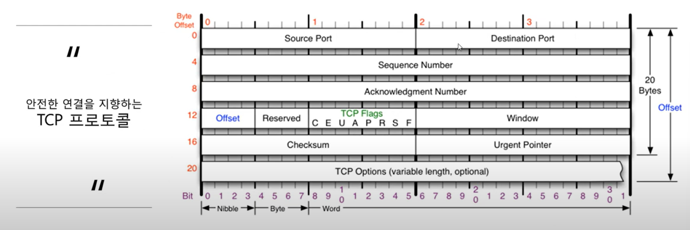

- 시퀀스 넘버, 애크놀지먼트 넘버가 다른점~
- 일반은 20Byte지만 60까지 늘어날 수 있다~

### TCP 플래그

1. TCP 플래그의 종류
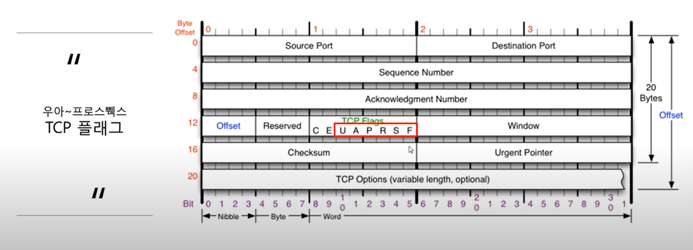

2. 각 플래그의 기능 

- 여러 형태로 데이터를 보내는데, 나타내는 값이 바로 플래그 값
- U : 긴급 비트, 우선 순위 높은 데이터가 포함됐음을 지정
- A : 승인 비트, 매우 중요하고 많이 사용하는 플래그, 물어본 것에 대해 응답, 승인을 해줄 때 사용...
- P : 밀어넣기 비트, TCP 버퍼가 일정 크기만큼 쌓여야 패킷을 추가적으로 전송하는데, 이와 상관 없이 계속 데이터를 밀어넣을 때 사용
- R : 초기화 비트, 상대와 연결된 상태에서 추가적으로 데이터 주고 받으려고 할 때 문제 발생하면 연결을 초기화 
- S : 싱크 비트(동기화 비트, 제일 중요), 상대와 연결 시작할 때 무조건 사용하는 플래그, 처음 보내진 후 그 연결은 동기화됨(서로 계속 연락)
- F : 종료 비트, 데이터를 다 주고 받은 후 연결을 끊을 때 사용

### TCP를 이용한 통신 과정(TCP가 어려운 이유...)

1. 연결 수립 과정

- TCP를 이용한 데이터 통신을 할 때 프로세스와 프로세스를 연결하기 위해 가장 먼저 수행되는 과정!!!!
    1. 클라이언트가 거버에게 요청 패킷을 보내고
    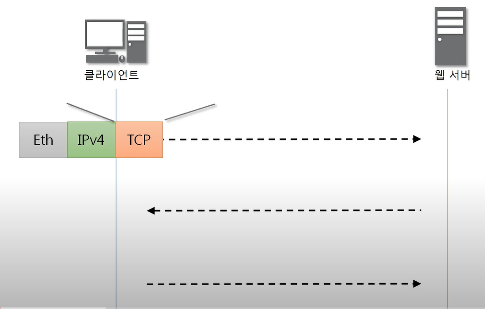
    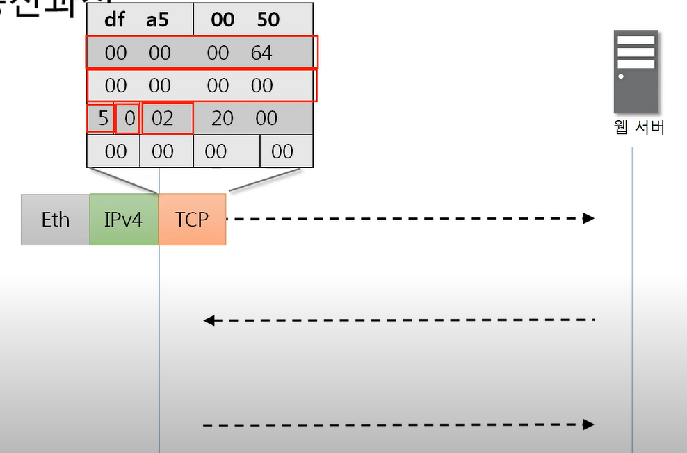

    2. 서버가 클라이언트의 요청을 받아들이는 패킷을 보내고
    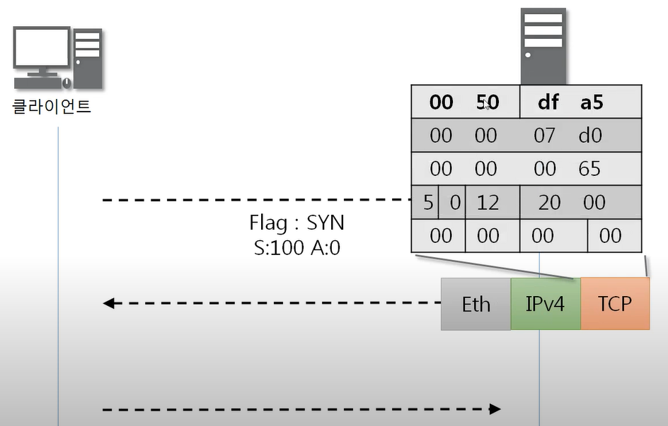

    3. 클라이언트는 이를 최종적으로 수락하는 패킷을 보낸다.
    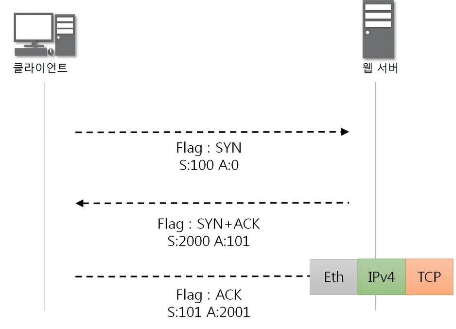

- 위의 3개의 과정을 3Way Handshake 라고 부른다
- 네트워크 보안까지 가면 S, A가 뭔지 까지도 알아야 한다.... (이 부분을 계산할 줄 알아야 한, 이 값을 계산해서 할 수 있는 네트워크 공격이 있음.. 난 안할래)

2. 데이터 송수신 과정(위에꺼에 이어서)

- TCP를 이용한 데이터 통신을 할 때 단순히 TCP 패킷만을 캡슐화해서 통신하는 것이 나닌 페이로드를 포함한 패킷을 주고 받을 때의 일정한 규칙

    1. 보낸 쪽에서 또 보낼 때는 SEQ 번호와 ACK 번호가 그대로다
    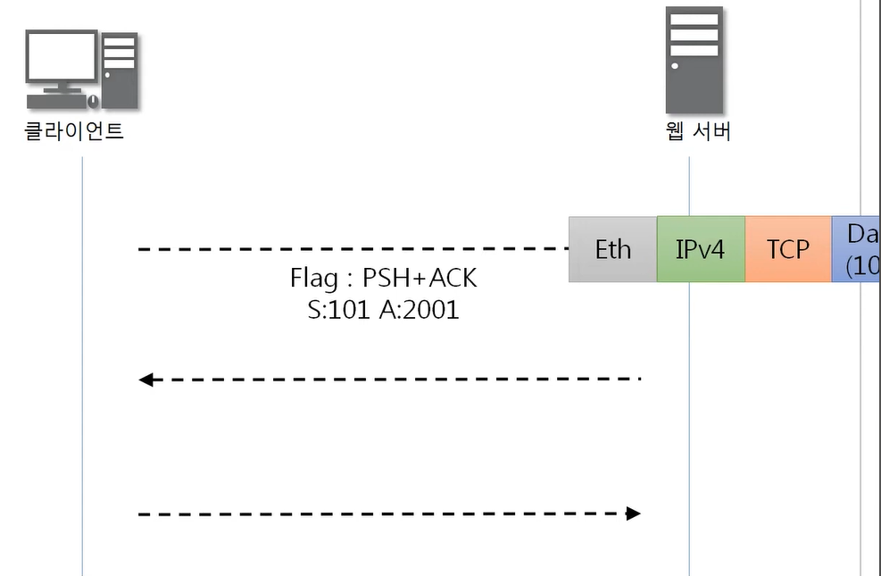

    2. 받는 쪽에서 SEQ번호는 받은 ACK번호가 된다
    3. 받는 쪽에서 ACK번호는 받은 SEQ번호 + 데이터의 크기
    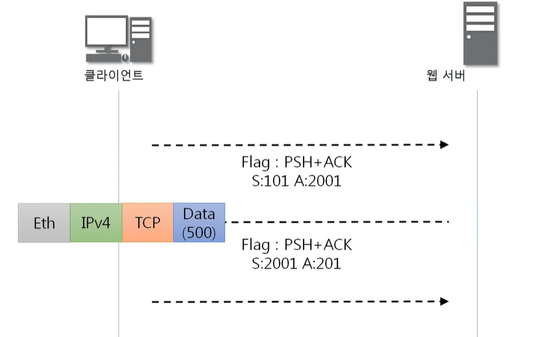
    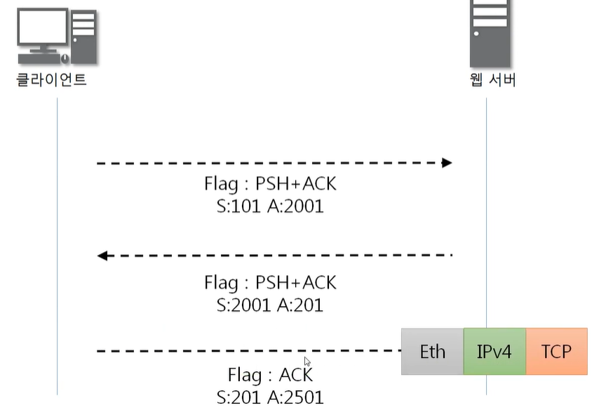

### TCP 상태전이도

1. TCP 연결 상태의 변화
 
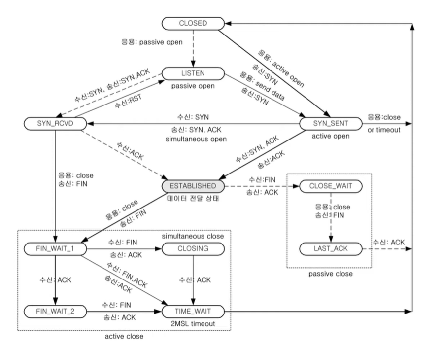

- 실선 : 클라이언트의 상태 변화
- 점선 : 서버의 상태 변화
- 상태는 겁나 많음... 여기서 중요한 상태는 LISTEN, ESTABLISHED
- LISTEN 상태 : 포트번호를 프로그램이 사용하고 있는 상태(서버쪽에서), 클라이언트의 요청을 응답해주도록 듣고 있는 상태
- ESTABLISHED : 요청이 수립된 상태

2. 3Way-Hamdshake와 함께보기

1. SYN_SENT
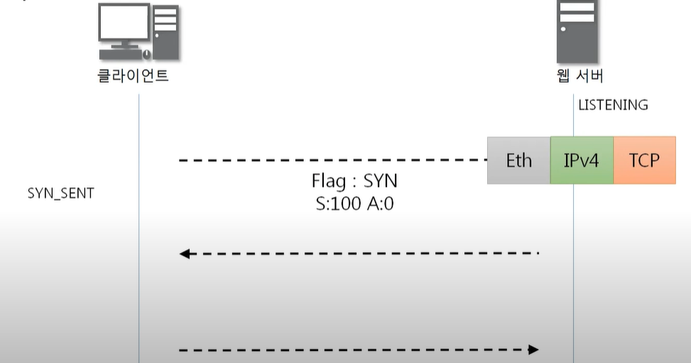

2. SYN_RECEIVED
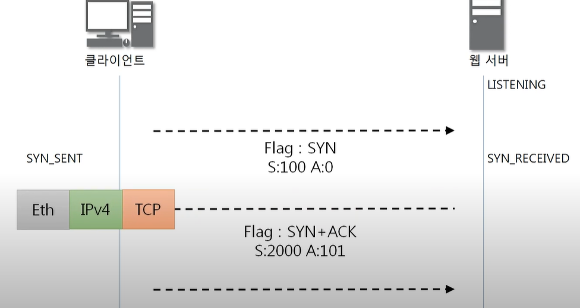

3. ESTABLISHED
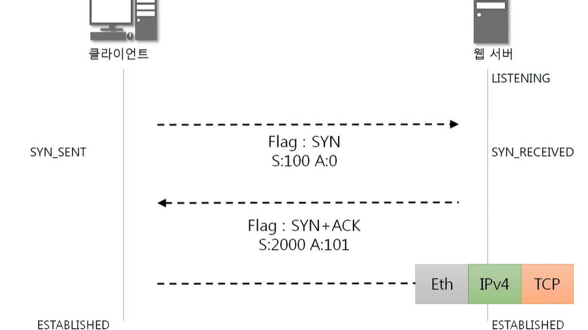