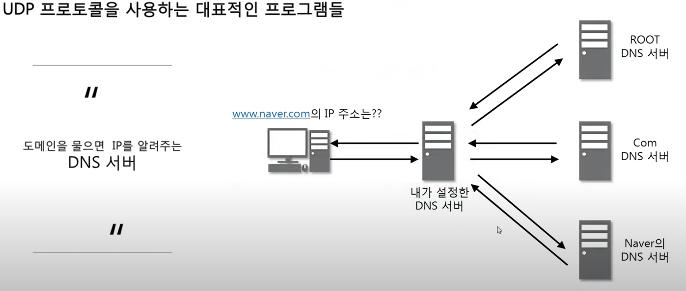

# 비연결지향형 UDP 프로토콜~

## INDEX

1. UDP 프로토콜 : UDP가 하는 일, UDP 프로토콜의 구조
2. UDP 프로토콜을 사용하는 프로그램 : UDP 프로토콜을 사용하는 대표적인 프로그램들
3. 따라학 IT : tftpd를 사용하여 데이터 공유해보기

### UDP 프로토콜

1. UDP가 하는 일

- 사용자 데이터그램 프로토콜(User Datagram Protocol, UDP)은 유니버설 데이터그램 프로토콜(Universal Datagram Protocol)이라고 일컫기도 한다
- UDP의 전송 방식은 너무 단순해서 서비스의 신회성이 낮고, 데이터그램 도착 순서가 바뀌거나, 중복되거나, 심지어는 통보 없이 누락시키기도 한다.
- UDP는 일반적으로 오류의 검사와 수정이 필요 없는 프로그램에서 수행할 것으로 가정한다

2. UDP 프로토콜의 구조

### UDP 프로토콜을 사용하는 프로그램

1. UDP 프로토콜을 사용하는 대표적인 프로그램들

 

 
h

- RIP, OSPF 나중에 라우터 할때 배운다고...

