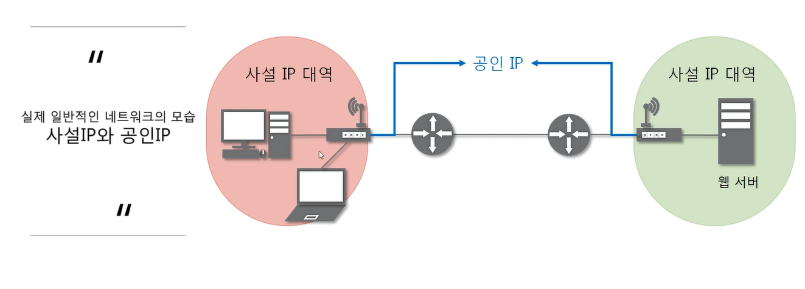
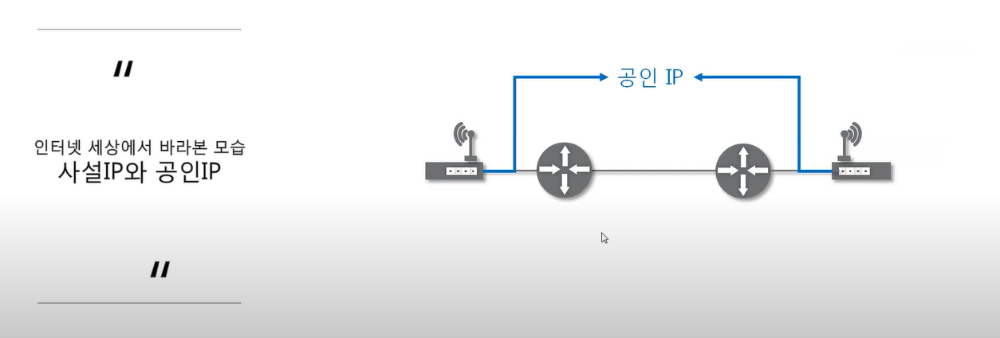
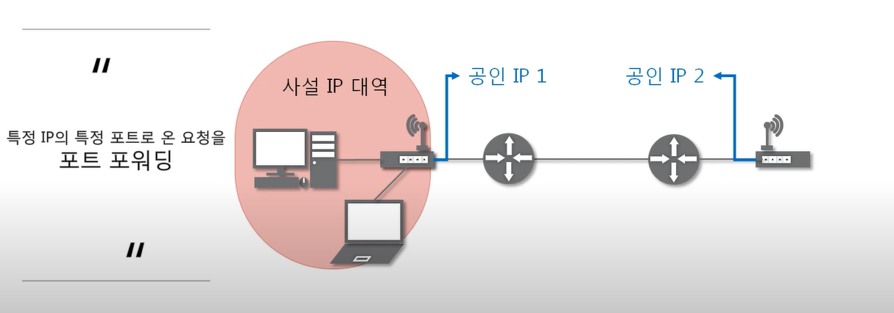
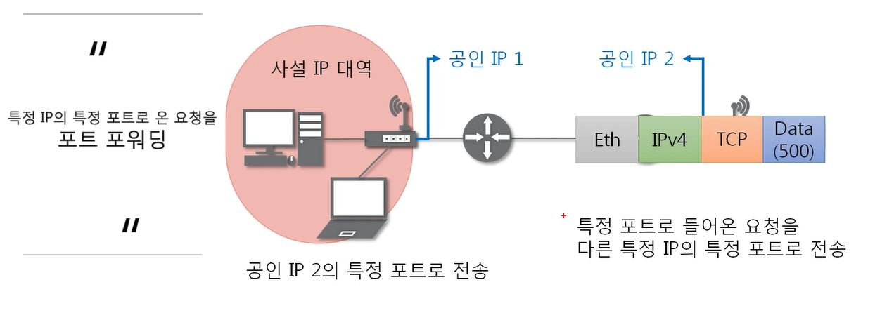
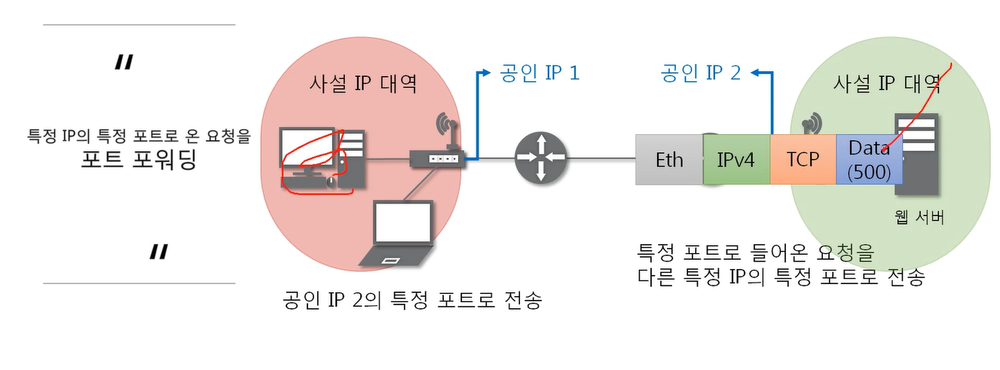
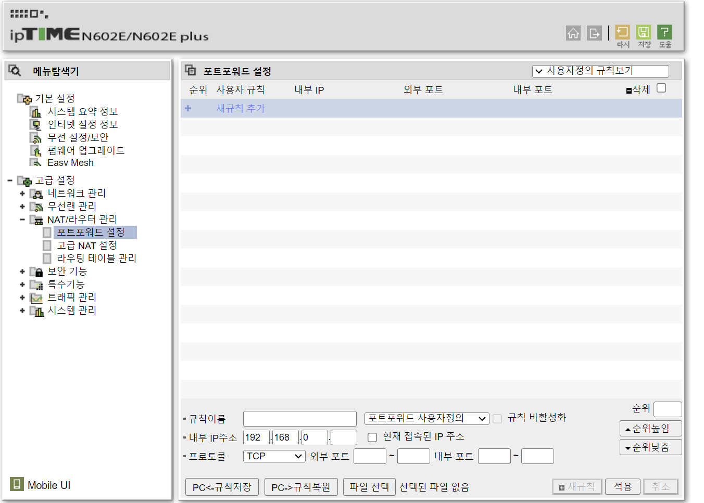
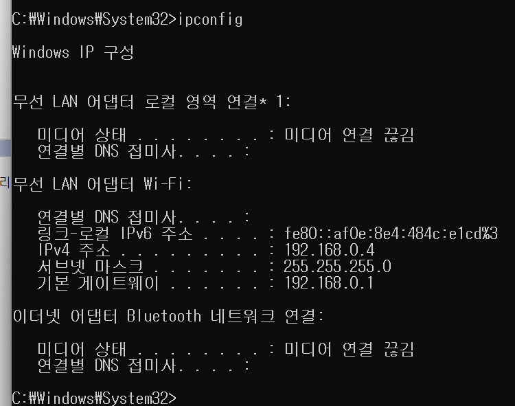
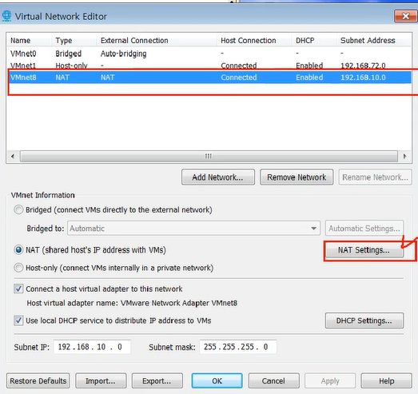
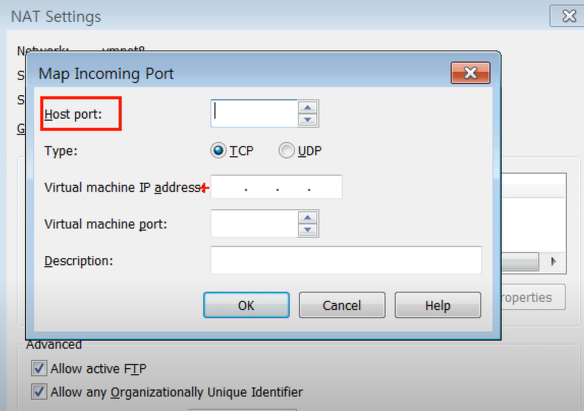

#  NAT와 포트포워딩 

## INDEX

1. NAT : NAT 란?
2. 포트포워딩 : 포트포워딩이란?
3. 따라학 IT : 포트포워딩 설정해보기, 사설 IP를 사용하는 서버로 접속해보기

### NAT

- NAT(Network Address Translation)은 IP 패킷의 TCP/UDP 포트 숫자와 소스 및 목적지의 IP 주소 등을 재기록하면서 라우터를 통해 네트워크 트래픽을 주고 받는 기술을 말한다
- 패킷에 변화가 생기기 때문에 IP나 TCP/UDP의 체크섭(checksum)도 다시 계산되어 재기록해야 한다
- NAT를 이용하는 이유는 대개 사설 네트워크에 속한 여러 개의 호스트가 하나의 공인 IP 주소를 사용하여 인터넷에 접속하기 위함이다
- 하지만 꼭 사설 IP를 공인 IP로 변환하는 데이만 사용하는 기술은 아니다

### 포트포워딩

- 포트 포워딩 또는 포트 매핑(port mapping)은 패킷이 라우터나 방화벽과 같은 네트워크 장비를 가로지르는 동안 특정 IP 주소와 포트 번호의 통신 요청을 특정 다른 IP와 포트번호로 넘겨주는 네트워크 주소 변환(NAT)의 응용이다
- 이 기법은 게이트웨이(외부망)의 반대쪽에 위치한 사설네트워크에 상주하는 호스트에 대한 서비스를 생성하기 위해 흔히 사용된다
- 직접 그 컴퓨터의 IP를 치는게 아니라 해당 공유기의 공인 IP로 보내고 거기에 포트포워딩 설정(특정 포트로 들어온 것을 다른 특정 IP의 특정 포트로 전송한다던지)을 해놔야한다!

### 따라학 IT

1. 포트포워딩 설정해보기
- 포트포워딩을 이요하여 다른 사용자들이 사설 IP를 사용하는 서버로 접속할 수 있도록 설정해보기
- 일반적으로 설정은 공유기나 네트워크 장비에서 한다
- 실습은 가상 머신에서 

2. 사설 IP를 사용하는 서버로 접속해보기
- 사설 IP를 사용하는 가상머신에 서버를 설정하고 해당 서버를 포트포워딩을 통해 접속할 수 있도록 설정해보기