# www(웹)를 이용할 때는 이렇게 데이터를 주고 받는다 - HTTP 프로토콜이란?

## INDEX

1. HTTP 프로토콜 : 웹을 만드는 기술들, HTTP 프로토콜의 특징, HTTP 프로토콜의 통신 과정
2. HTTP 요총 프로토콜 : HTTP 요청 프로토콜의 구조, 요청 타입, URI
3. HTTP 응답 프로토콜 : HTTP 응답 프로토콜의 구조, 상태 코드
4. HTTP 헤더 포캣 : HTTP 헤더 구조, 일반 헤더, 요청 헤더, 응답 헤더
6. 따라학 IT : HTTP 작성 실습, HTTP 수정 실습

### HTTP 프로토콜(7계층 프로토콜의 많은 것들 중에 제일 중요한 친구!!)

1. 웹을 만드는 기술들

- 가장 일반적이고 기초적인 것들...
- 무조건 알아야 한다...(웹을 만든다고 했을 때)
- HTTP : 서버에 저장된 데이터를받아오는 프로토콜(밑의 내용들이 저장은 서버에 되어있다는) / HTTPS : HTTP에 SSL을 추가하여 보안적인 요소들이 추가된 것이다
- HTML : 웹 페이지를 채울 내용 / Javascript : 웹 페이지에 들어갈 기능 / CSS : 웹 페이지를 예쁘게 꾸민 디자인 => 웹을 만드는 표준, 클라이언트 컴퓨터에서 동작하는 코드... 
- ASP/ASP.NET & JSP, PHP : 서버에서 실행될 코드들!
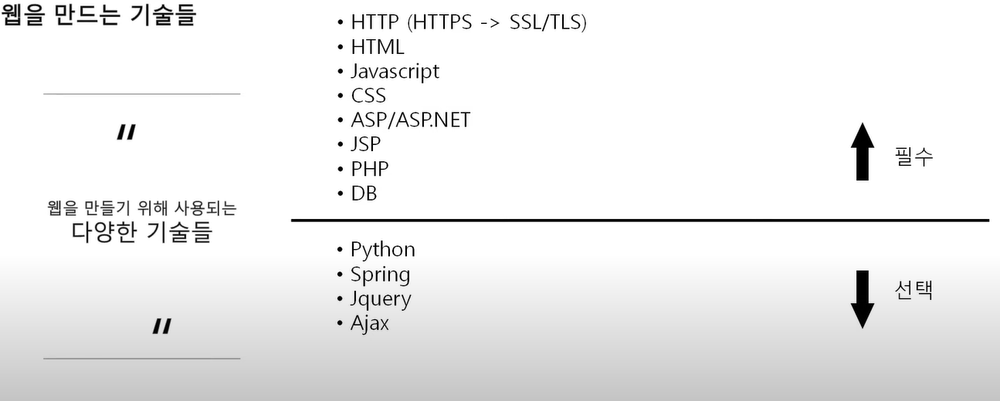

2. HTTP 프로토콜의 특징

- HyperText Transfer Protocol (하이퍼 텍스트 전송 프로토콜)
- www에서 쓰이는 핵심 프로토콜로 문서의 전송을 위해 쓰이며, 오늘날 거의 모든 웹 애플리케이션에서 사용되고 있다 -> 음성, 화상 등 여러 종류의 데이터를 MIME로 정의하여 전송 가능
- HTTP 특징 : Request / Response(요청 / 응답) 동작에 기반하여 서비스 제공

- HTTP 1.0의 특징(요즘은 많이 안쓴다) : 연결 수립, 동작, 연결 헤제의 단순함이 특징(하나의 URL은 하나의 TCP 연결), HTML 문서를 전송 받은 뒤 연결을 끊고 다시 연결하여 데이터를 전송한다
- HTTP 1.0의 문제점 : 단순 동작 (연결 수립, 동작, 연결 해제)이 반복되어 통신 부하 문제 발생

3. HTTP 프로토콜의 통신 과정

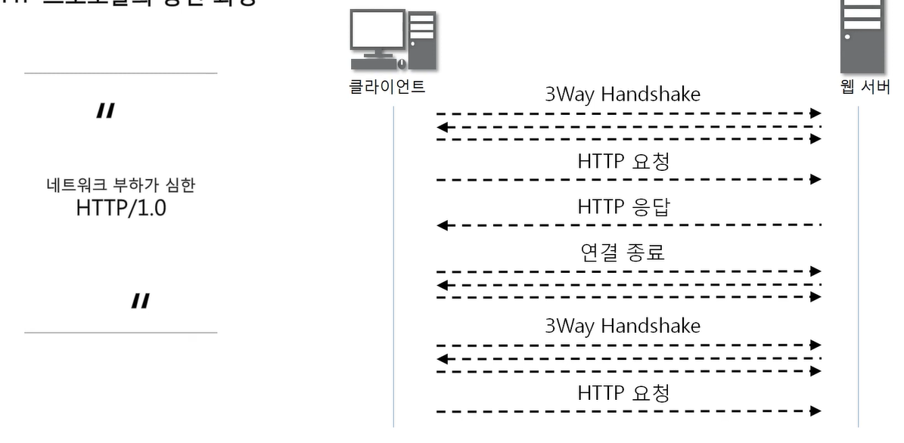

- 한번에 한가지 동작만을 하기 때문에 그림 파일이 10개라면 동작을 10번 넘게 해야하니까 1.1로 업데이트 해서 나옴

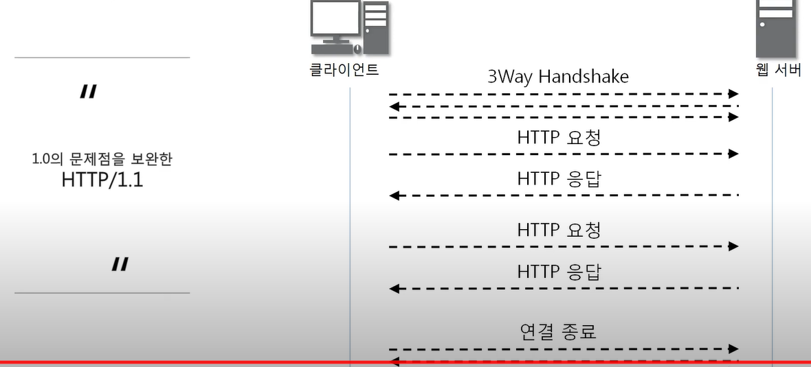

- 모든 데이터를 3WayHandShake로 한번에 받아와서 보여줌~~

### HTTP 요청 프로토콜의 구조

1. HTTP 요청 프로토콜의 구조

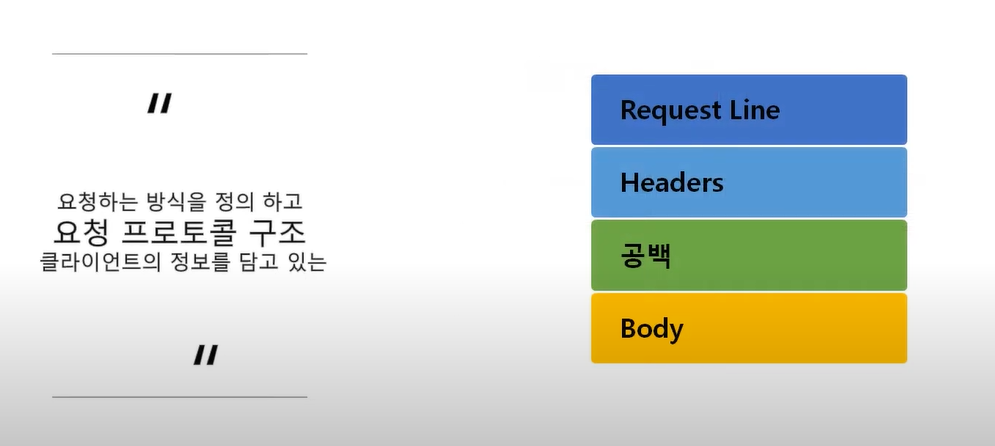
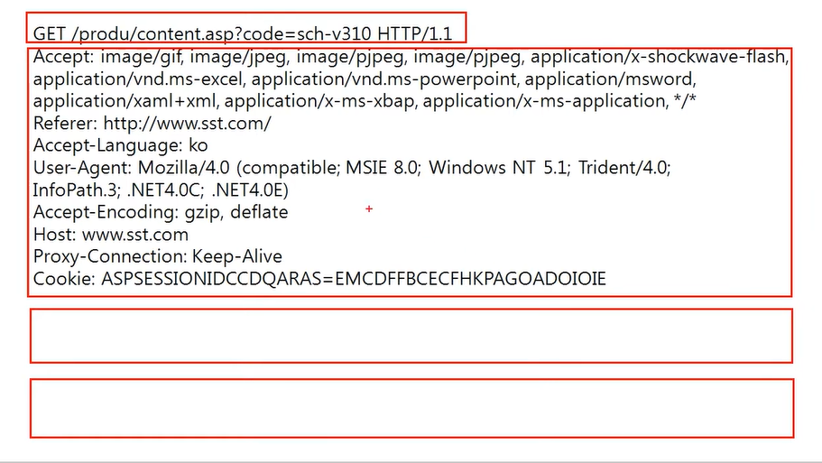

- Request 라인
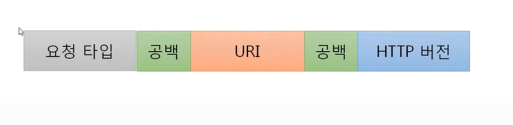

- HTTP 요청 방식..

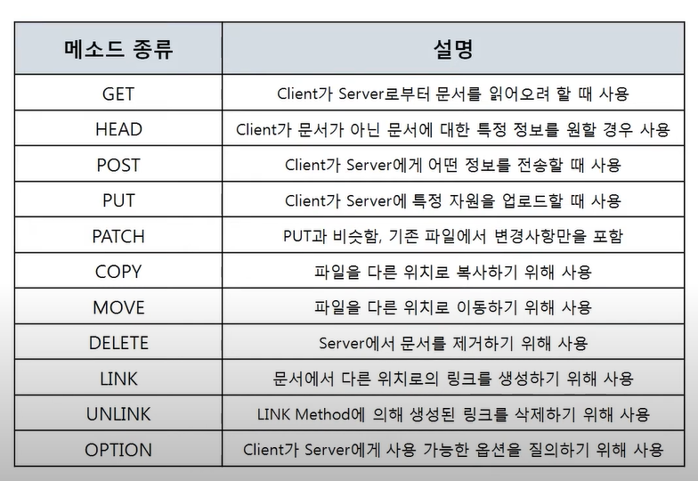

- GRT, POST를 제외한 나머지 요청 방식은 관리자가 설정하기 나름이지만 보안에 걸리도록 되어 있다
- GET은 데이터를 요청할때, POST는 클라이언트가 서버한테 데이터를 보낼때
- GET은 데이터를 요청하면서 데이터를 보낼수 있고 POST 역시 보내면서 요청할 수 있다... 뭥밍
- 둘을 굳이 왜 나눠났을까... GET 방식은 데이터를 보낼때 URI에 포함시켜서 보냄 POST 방식은 바디에 포함해서 보냄
    - GET 방식

    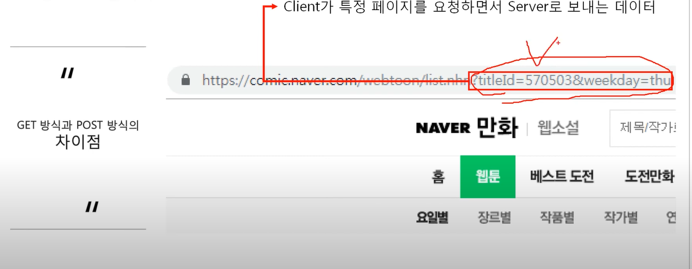
        
    - 사람들이 볼 수 있다
    - URI에 나타나므로 중요한 것은 GET 방식으로 보내지 않는다

    - POST 방식

    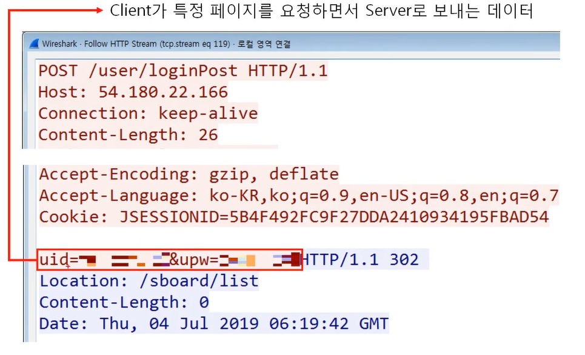

    - 사람들이 볼 수 없어야 한다(중요한 정보 : 아이디, 패스워드)
    - 이것도 보일 수 있으니까 HTTPS를 써야한다!
    - 로그인할 때 만큼이라도 HTTPS를 쓴다

2. URI

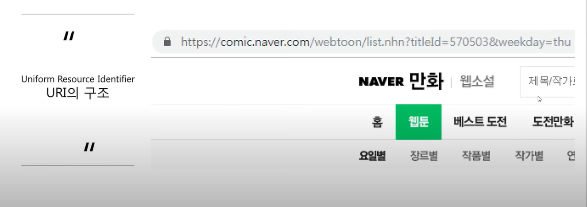
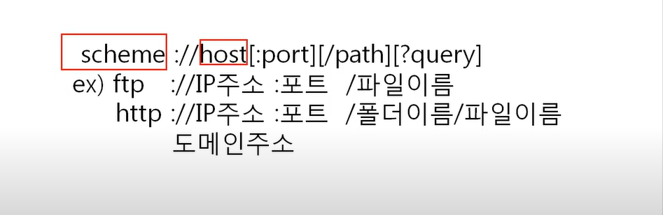

- 링크 창에 나오는 전체를 뜻함
- 인터넷 상에서 특정 자원(파일)을 나타내는 유일한 주소

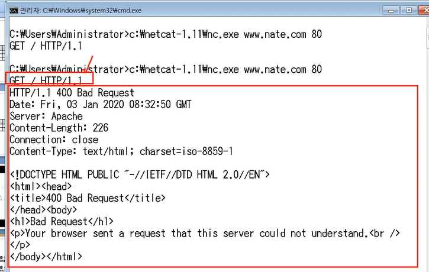 