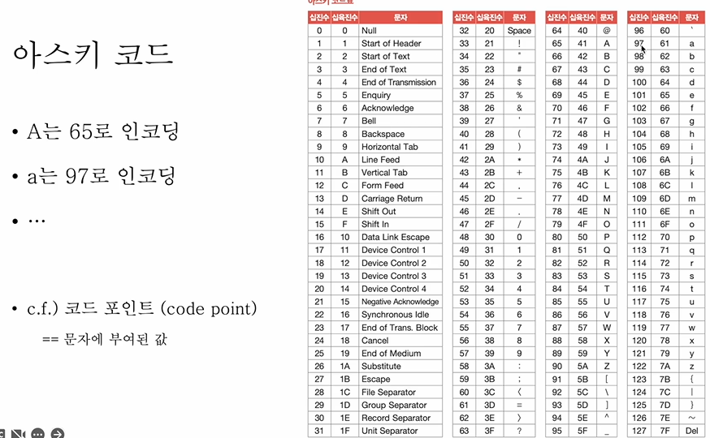
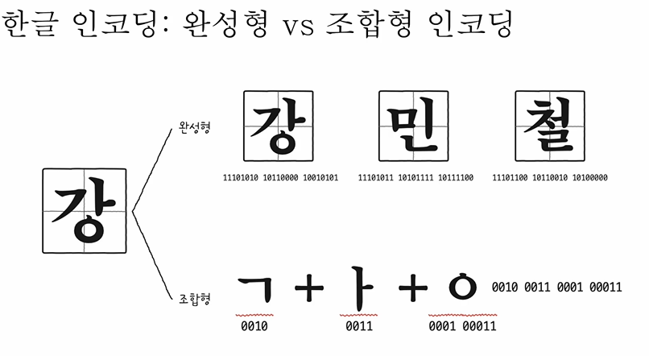
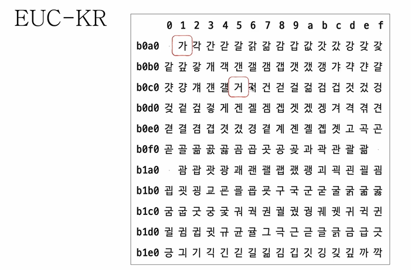

# 문자 집함과 인코딩
- 문자 집합(character set) : 컴퓨터가 이해할 수 있는 문자의 모음
- 인코딩(encoding) 
    - 코드화하는 과정
    - 문자를 0과 1로 이루어진 문자 코드로 변환하는 과정
- 디코딩(decoding)
    - 코드를 해석하는 과정(인코딩의 반대, 우리가 이해하도록)
    - 0과 1로 표현된 문자 코드로 문자로 변환하는 과정

# 인코딩 방식 3가지

1. 아스키 코드
- 초창기 문자 집합 중 하나
- 알파벳, 아라비아 숫자, 일부 특수 문자 및 제어 문자
- 7비트로 하나의 문자 표현
    - 8비트 중 1비트는 오류 검출을 위해 사용되는 패리티 비트(parity bit)

- 간단한 인코딩
- But 한글을 포함한 다른 언어 문자, 다양한 특수 문자 표현 불가
    - 아스키 코드는 7비트로 하나의 문자를 표현하기에
    - 128개보다 많은 문자를 표현할 수 없음
    - 8비트 확장 아스키(extended ASCII)의 등장, 여전히 부족

2. 한글 인코딩 vs 조합형 인코딩
- 한글을 위한 인코딩이 필요
    - 한글의 특징
    - 알파벳을 이어 쓰면 단어가 되는 영어
    - 초성, 중성, 종성의 조합으로 이루어진 한글
    - 완성형 인코딩 방식과 조합형 인코딩 방식이 존재

3. EUC-KR
- KS X 1001 KS X 1003 문자집합 기반의 한글 인코딩 방식
- 완성형 인코딩
- 글자 하나 하나에 2바이트 크기의 코드 부여
    - 2 바이트 == 16비트 == 4자리 십육진수로 표현

- 실습 해보기 : https://dencode.com/
- 2300여개의 한글 표현 가능
- 여전히 모든 한글을 표현하기에는 부족한 수
- 쀏, 뙠, 휔 같은 한글은 표현 불가능

=> 모든 언어, 특수문자까지 통일된 문자 집합을 사용하면 어떻까?, 통일된 문자 집합 & 인코딩 방식이 있다면 어떨까에 의해 만들어진것이 더 있을까??

4. 유니코드 문자 집합과 utf-8
- 유니코드
    - 통일된 문자 집합
    - 한글, 영어, 화살표와 같은 특수 문자, 심지어 이모티콘까지
    - 현대 문자 표현에 있어 매우 중요한 위치
- 유니코드의 인코딩 방식
    - utf-8, utf-16, utf-32
- 실습해보기 :  https://symbl.cc/en/unicode/blocks/

- utf-8 인코딩
    - UTF(Unicode Transformation Format) == 유니코드 인코딩 방법
    - 가변 길이 인코딩 : 인코딩 결과가 1바이트 ~ 4바이트
    - 인코딩 결과가 몇 바이트가 될지는 <strong>유니코드에 부여된 값에 따라 다름</strong> 👇👇👇

