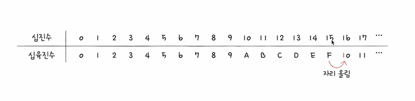

## 이번 시간에 알아볼 것 
: 컴퓨터는 0과 1을 이용하여 표현을 하는데 이것 가지고 어떻게 많은 정보들을 이해할 수 있는지 알아보오자!!

# 정보 단위

1. 비트 : 0과 1을 표현하는 가장 작은 정보 단위
    - n의 비트로는 2의 n승 가지의 정보 표현 가능
    - 프로그램은 수많은 비트로 이루어져 있음
    - 다만, 평소 "이 파일은 8,920,120 비트야"라고 표현하진 않음
    - 비트보다 더 큰 단위를 사용(바이트, 킬로바이트, 메가바이트, 기가바이트, 테라 바이트...)
    

2. 워드(word)
    - CPU가 한 번에 처리할 수 있는 정보의 크기 단위
    - 하프 워드(half word) : 워드의 절반 크기
    - 풀 워드(full word) : 워드 크기
    - 더블 워드(double word) : 워드의 두 배 크기

# 이진법 : 0과 1로 숫자 표현하기

1. 이진법(binary)
    - 0과 1로 수를 표현하는 방법
    - 숫자가 1을 넘어가는 시점에 자리올림
    - 우리가 일상적으로 사용하는 진법은 숫자가 9를 넘어갈 때 자리올림하는 십진법(decimal)
    - 이진수 8표기 2가지 : 1000(2) / ob1000

2. 0과 1로 음수 표현하기 : 2의 보수
    - 어떤 수를 그보다 큰 2의 n승에서 뺀값
    
    - 모든 0과 1을 뒤집고 1을 더한 값 (11 -> 00 -> 01)

3. "-1011(2)를 표현하기 위한 0101(2)과 십진수 5를 표현하기 위한 0101(2)은 똑같이 생겼는데, 어떻게 구분하나요....?"
    - cpu 내부에는 플래스 레지스터라고 하는 것이 있는데 현재 값이 양수인지 음수인지에 대한 값을 표시해준다... (겉모습으로는 판별 안되는 것이 마줌...)

#  십육진법
    - 이전법으로는 숫자의 길이가 너무 길어진다(십진수 32 = 이진수 100000)
    - 그래서 컴퓨터의 데이터를 표현할 때 십육진법도 많이 사용(수가 15를 넘어가는 시점에 자리올림)    
    
    - 십육진수 15 표기 2가지 : 15(16) / ox15

    
