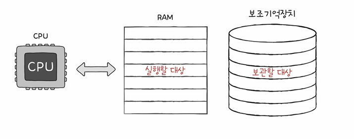
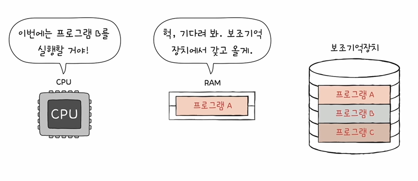

# 들어가며...
- 주기억장치의 종류에는 크게 RAM과 ROM 두 가지가 있고, 메모리 라는 용어는 그 중 RAM을 지칭하는 경우가 많다

# RAM의 특징

- 램은 <strong>휘발성 저장 장치</strong>로 전원이 꺼지면 저장된 내용을 잃어버림
- 보조기억 장치는 전원이 꺼져도 저장된 내용을 기억할 수 있는 비휘발성 저장장치

# RAM의 용량과 성능
- RAM이 크면 뭐가 좋을까?
- RAM의 용량은 컴퓨터 성능에 어떤 영향을 미칠까?
    1) RAM아 작을 경우 느껴지는 불편 : 램이 작아서 프로그램 셋 중에 하나밖에 저장하지 못한다면 CPU가 한번에 여러 개의 프로그램을 동시에 실행할 수 있는 성능이 저하됨
    
    2) 근데 램이 커서 보조기억장치에 있는 모든 프로그램이 다 랩에 저장된다면 그때그때 필요한거 갖다 쓰면 된당

# RAM의 종류
1. DRAM(Dynamic RAM)
- Dynamic = '동적의'
- 저장된 데이터가 동적으로 사라지는 RAM
- 데이터 소멸을 막기 위해 주기적으로 재활성화(리프레쉬) 해야함
- 뭔가 안 좋을거 같지만...
- 일반적으로 메모리로 사용되는 RAM
- 이유는 : 상대적으로 소비전력이 낮고 저렴하고 집적도가 높아 대용량으로 설계하기 용이하기 때문

2. SRAM(Static RAM)
- Static = '정적의'
- 저장된 데이터가 정적인(사라지지 않는) RAM
- DRAM 보다 일반적으로 더 빠름(빠르게 동작해야 되는 저장장치에 사용 : 캐시메모리)
- 일반적으로 캐시 메모리에서 사용되는 RAM
- 이유는 : 상대적으로 소비전력이 높고 가격이 높고 집적도가 낮아 대용량으로 설계할 필요는 없으나 빨라야 하는 장치에 사용

3. SDRAM(Synchronous DRAM)
- 특별한 (발전된 형태의) DRAM
- 클럭 신호(똑-딱-똑-딱)와 동기화된 DRAM(박자를 맞춰서 움직일 수 있는 디렘)

4. DDR SDRAM(Double Data Rate SDRAM)
- 특별한 (발전된 형태의 SDRAM)
- 최근 가장 대중적으로 사용하는 RAM
- 대역폭을 넓혀 속도를 빠르게 만든 SDRAM
- 대역폭은 데이터를 주고받는 길의 너비
- 이보다 대역폭을 2배 넓힌 램 :  DDR2 SDRAM
- 현재 가장 대중적으로 사용되는것 : DDR4 SDRAM(길이가 16개..)

# DRAM vs SRAM
| 분류 | DRAM | SRAM |
| ---- | ---- | ---- |
| 재충전 | 필요함 | 필요 없음 |
| 속도 | 느림 | 빠름 |
| 가격 | 저렴함 | 비쌈 |
| 집적도 | 높음 | 낮음 |
| 소비 전력 | 적음 | 높음 |
| 사용 용도 | 주기억장치(RAM) | 캐시 메모리 |
