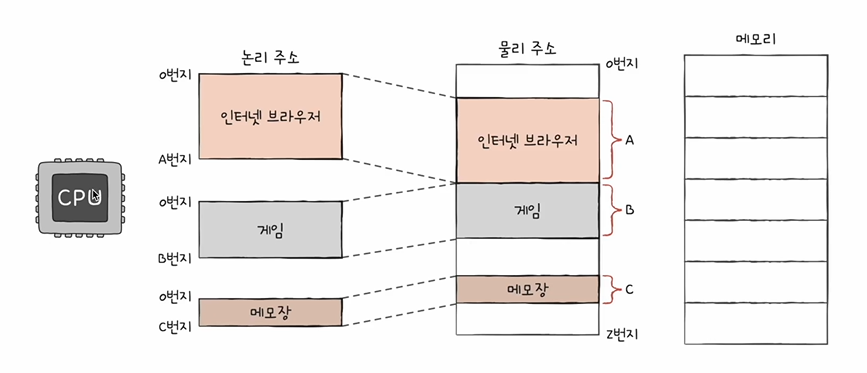
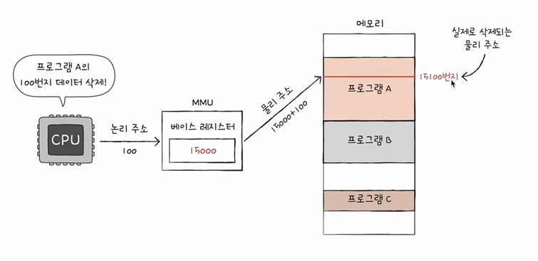
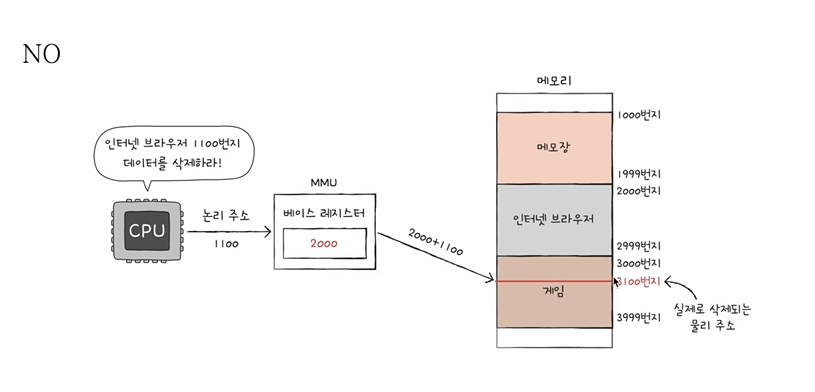
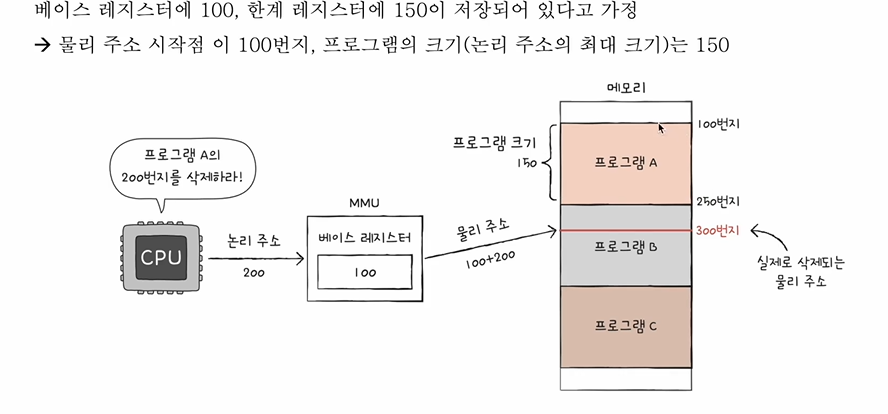

# 들어가며...
- 논리 주소와 물리 주소로 주소 공간을 나눈 이유?
- 논리 주소를 물리 주소로 변환하는 방법?

# 물리 주소와 논리 주소
- CPU와 실행 중인 프로그램은 현재 메모리 몇 번지에 무엇이 저장되어 있는지 다 알고 있을까요? NO

- 메모리에 저장된 값들은 시시각각 변하기 때문
    - 새롭게 실행되는 프로그램은 새롭게 메모리에 적재
    - 실행이 끝난 프로그램은 메모리에서 삭제
    - 같은 프로그램을 실행하더라도 실행할 떄마다 적재되는 주소는 달라짐

- 물리 주소
    - 메모리 입장에서 바라본 주소
    - 말 그대로 정보가 실제로 저장된 하드웨어상의 주소
    - 겹치는 주소 번지가 없다

- 논리 주소
    - CPU와 실행 중인 프로그램 입장에서 바라본 주소
    - 실행 중인 프로그램 각각에게 부여된 0번지부터 시작하는 주소

- 물리주소에는 겹치는 주소 번지가 없기 때문에 CPU가 메모리와 상호작용을 하려면 결국 논리주소를 물리 주소로 변환하는 과정이 있어야 한다!!

- 그렇다면 물리 주소와 논리 주소 간의 변환은 어떻게 이루어질까??

# 물리 주소와 논리 주소의 변환
- MMU(메모리 관리 장치)라는 하드웨어에 의해 변환
- MMU는 논리 주소와 베이스 레지스터 값을 더하여 논리주소를 물리주소로 변환

- 베이스 레지스터 : 프로그램의 가장 작은 물리 주소(프로그램의 첫 물리 주소)를 저장하는 셈

- 논리 주소 : 프로그램의 시작점으로부터 떨어진 거리인 셈
- 다른 프로그램의 영역을 침범하는 명령어는 실행하면 안된다

# 메모리 보호
- 한계 레지스터
    - 프로그램의 영역을 침범할 수 있는 명령어의 실행을 막음
    - 베이스 레지스터가 실행중인 프로그램의 가장 작은 물리 주소를 저장한다면, 한계 레지스터는 논리 주소의 최대 크기를 저장
    - 베이스 레지스터 값 <= 프로그램의 물리 주소 범위 < 베이스 레지스터 + 한계 레지스터 값
    
- 이처럼 CPU는 메모리에 접근하기 전 접근하고자 하는 논리 주소가 한계 레지스터보다 작은지를 항상 검사
- 이로써 실행 중인 프로그램의 독립적인 실행 공간을 확보 & 하나의 프로그램이 다른 프로그램을 침범하지 못하게 보호