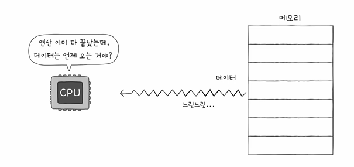
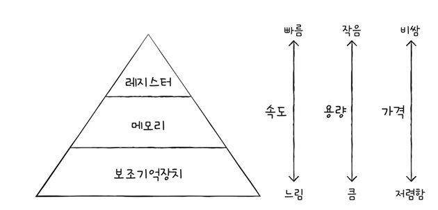

# 들어가며...

- CPU가 메모리에 접근하는 시간은 CPU 연산 속도보다 느리다

# 저장 장치 계층 구조
1. CPU와 가까운 저장 장치는 빠르고, 멀리 있는 저장 장치는 느리다
2. 속도가 빠른 저장 장치는 저장 용량이 작고, 가격이 비싸다

-> 낮은 가격대의 대용량 저장 장치를 원한다면 느린 속도는 감수해야 하고, 빠른 속도의 저장 장치를 원한다면 작은 용량과 비싼 가격은 감수해야 한다

- 저장 장치들은 'CPU에 얼마나 가까운가'를 기준으로 계층적으로 나타낼 수 있음
