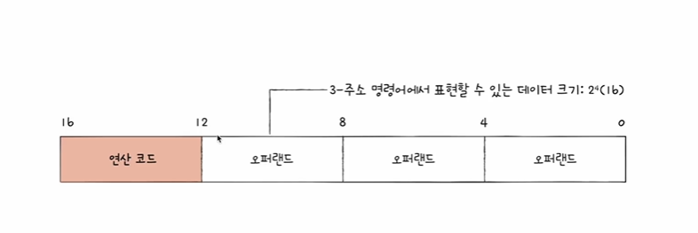
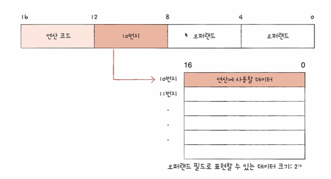

# 명령어의 구조

- 명령어 = 연산코드(수행할 연산) + 오퍼랜드(연산에 사용될 데이터 혹은 연산에 <strong>사용될 데이터가 저장된 위치(주소 필드)</strong>)

# 연산 코드(CPU마다 각기 다른 연상 코드를 가지고 있다)
1. 데이터 전송
2. 산술/논리 연산
3. 제어 흐름 변경
4. 입출력 제어

# 대표적인 연산 코드의 종류(외울 필요 없음, 이해만..)

1. 데이터 전송
- MOVE: 데이터를 옯겨라
- STORE : 메모리에 저장하라
- LOAD(FETCH) : 메모리에서 CPU로 데이터를 가져와라
- PUSH : 스택에 데이터를 저장하라
- POP : 스택의 최상단 데이터를 가져와라

2. 산술/논리 연산
- ADD / SUBSTRACT/ MULTIPLY / DIVIDE : 덧셈 / 뺄셈 / 곱셈 / 나눗셈을 수행하라
- INCREMENT / DECREMENT : 오퍼랜드에 1을 더하라 / 오퍼랜드에 1을 빼라
- AND / OR / NOR : AND / OR / NOT 연산을 수행하라
- COMPARE : 두 개의 숫자 또는 TRUE / FALSE 값을 비교해라

3. 제어 흐름 변경
- JUMP : 특정 주소로 실행 순서를 옮겨라
- CONDITIONAL JUMP : 조건에 부합할 떄 특정 주소로 실행 순서를 옮겨라
- HALT : 프로그램의 실행을 멈춰라
- CALL : 되돌아올 주소를 저장한 채 특정 주소로 실행 순서를 옮겨라
- RETURN : CALL을 호출할 떄 저장했던 주소로 돌아가라

근데,,, 왜 굳이 사용될 데이터가 저장된 위치를 넣는 거죠 라고 묻는다면...??
=> 명령어 내에서 표현할 수 있는 데이터의 크기가 제한되기 떄문
 
오퍼랜드를 값으로 표현할 경우

오퍼랜드를 주소지로 지정할 경우

# 명렁어 주소 지정 방식

1. 유효 주소(effective addresss)
- 연산에 사용할 데이터가 저장된 위치 ex) 10번지, R1 레지스터

2. 명령어 주소 지정 방식(addressing modes)
- 연산에 사용할 데이터가 저장된 위치를 찾는 방법
- 유효 주소를 찾는 방법
- 다양한 명령어 주소 지정 방식들

    1) 즉시 주소 지정 방식(immediate addressing mode)
    - 연산에 사용할 데이터를 오퍼랜드 필드에 직접 명시
    - 가장 간단한 형태의 주소 지정 방식
    - 연산에 사용할 데이터의 크기가 작아질 수 있지만, 빠름
    
    2) 직접 주소 지정 방식(direct addressing mode)
    - 오퍼랜드 필드에 유효 주소 직접적으로 명시
    - 유효 주소를 표현할 수 있는 크기가 연산 코드만큼 줄어듦

    3) 간접 주소 지정 방식(indirect addressing mode)
    - 오처랜드 필드에 유효 주소의 주소를 명시
    - 앞선 주소 지정 방식들에 비해 속도가 느림

    4) 레지스터 주소 지정 방식(register addressing mode)
    - 연산에 사용할 데이터가 저장된 레지스터 명시
    - <strong>메모리에 접근하는 속도보다 레지스터에 접근하는 것이 빠름</strong>(메모리는 cpu 밖에 있지만 레지스터는 cpu 안에 있다)

    5) 레지스터 간접 주소 지정 방식(register indirect addressing mode) 
    - 연산에 사용할 데이터를 메모리에 저장
    - 그 주소를 저장한 레지스터를 오퍼랜드 필드에 명시
    