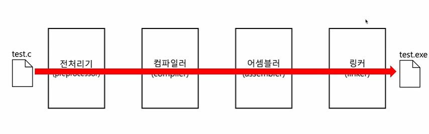

# C 언어 컴파일 과정

- C 언어에서 소스코드는 전처리기, 컴파일러, 어셈블러, 링커에 의해서 각각 전처리, 컴파일, 어셈블, 링킹이라고 하는 과정을 거쳐서 실행파일이 된다

1. 전처리 과정(preprocessing)
- 본격적으로 컴파일하기 전에 처리할 작업들
- 외부에 선언된 다양한 소스 코드, 라이브러리 포함(e.g. #include)
- 프로그래밍의 편의를 위해 작성된 매크로 변환(e.g. #define)
- 컴파일할 영역 명시(e.g. #if, #ifdef, ...)
- 컴파일을 하기 위한 준비의 과정이라고 생각

2. 컴파일 과정(compiling)
- 전처리가 완료 되어도 여전히 소스 코드
- 전처리 완료된 소스 코드를 저급 언어(어셈블리 언어)로 변환

3. 어셈블 과정(assembling)
- 어셈블리어를 기계어로 변환
- 목적 코드(object file)를 포함하는 목적 파일이 됨

4. 목적 파일 vs 실행 파일
- 목적 파일과 실행 파일은 둘 다 기계어로 이루어진 파일
- But, 목적 파일과 실행 파일은 다르다
- 목적 파일은 링킹(linking)을 거친 이후에야 실행 파일이 된다

5. 링킹 과정(linking)
- 각기 다른 목적 코드를 하나의 실행 파일로서 묶어주는 작업(연결
시켜주는 작업)