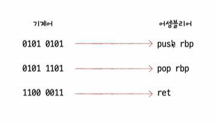

강의를 들어가며...

``` c
개발자가 작성한 소스 코드
# include <studio.h>
int main() {
    printf("Hello, World");
    return 0;
}
``` 
를 실행하면 컴퓨터가 실행해주지만 컴퓨터는 우리가 작성한 소스코드를 이해하지 못한다

=> 우리가 사용하는(C, C++, Java) 같은 언어들은 개발자가 읽고 쓰기 편하게 만들어진 고급 언어로 컴퓨터 내부에서 실행이 될 땐 저급 언어로 변환이 되어서 실행해야 되기 때문이다

# 고급 언어와 저급 언어

- 고급 언어 : 개발자가 이해하기 쉽게 만든 언어
- 저급 언어 : 컴퓨터가 이해하고 실행하는 언어 (기계어, 어셈블리어)



# 컴파일 언어와 인터프리트 언어

1. 컴파일 언어

- 컴파일 언어로 작성된 소스 코드는 컴파일러에 의해서 저급언어로 변환(이 과정을 컴파일)
- 컴파일 결과로 저급언어의 <strong>저급언어의 목적코드</strong>가 생성됩니다
- 컴파일러는 인터프리터와 달리 한줄씩 실행하는 것이 아니라 과정에서 오류는 없는지 사용되지 않는 변수나 최적화할 수 있는 건 없는지를 다 따져보고 소스코드 전체를 목적코드로 통째로 컴파일 한다!!
- 오류가 발생하면 실행을 멈춤(컴파일 에러)

2. 인터프리트 언어
- 인터프리터에 의해 한 줄씩 실행
- 소스 코드 전체가 저급 언어로 변환되기까지 기다릴 필요 없음
- 오류나기 직전까지의 코드는 실행 시켜줌

3. 컴파일 & 인터프리트 과정 살펴보기
- https://godbolt.org/

4. 그렇다고 이 세상 모든 프로그래밍 언어가 전부다 컴파일 언어, 아니면 인터프리트 언어라고 무자르듯 경계가 있는건 아님... 때로는 둘 다 가능한 경우가 있다고... 그냥 이렇게 변환되는 대표적인 방식 두가지가 있다고 말하는듯