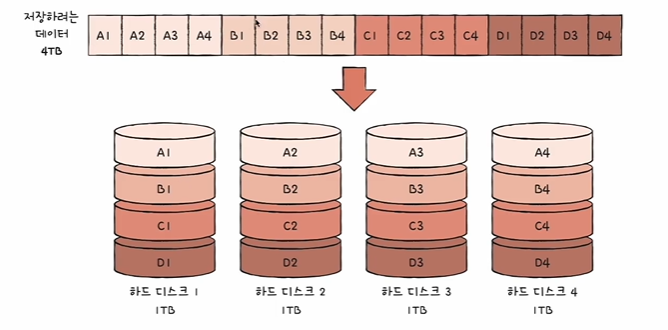
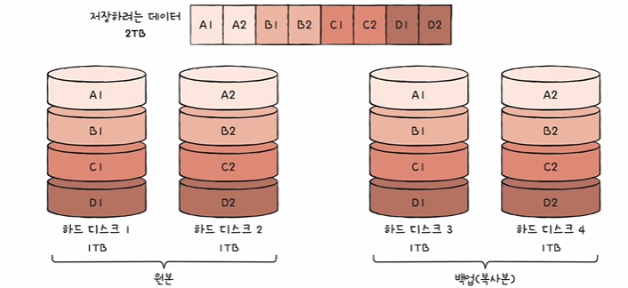
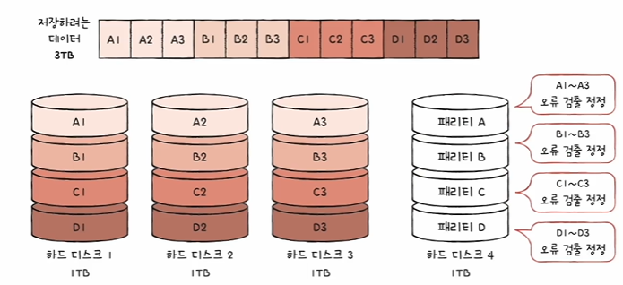
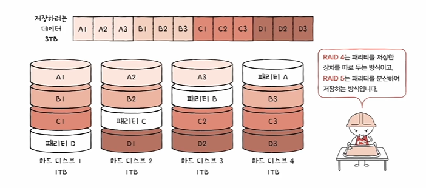
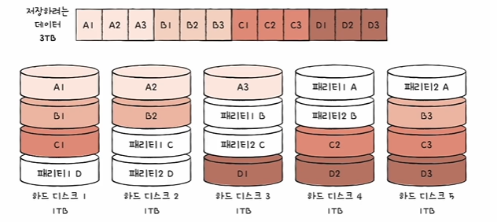

# RAID의 정의

1) RAID(Redundant Array of Independent Disks)
- 하드 디스크와 SSD로 사용하는 기술
- 데이터의 안전성 혹은 높은 성능을 위해 여러 물리적 보조기억장치를 마치 하나의 논리적 보조기억장치처럼 사용하는 기술

2) RAID 레벨
- RAID를 구성하는 기술
- RAID 0, RAID 1, RAID 2, RAID 3, RAID 4, RAID 5, RAID 6
- 그로부터 파생된 RAID 10, RAID 50...

3) RAID의 종류..
    1. RAID 0
    
    - 데이터를 단순히 나누어 저장하는 구성 방식
    - 스트라입(stripe) : 마치 줄무늬처럼 분산되어 저장된 데이터
    - 스트라이팅(striping) : 분산하여 저장하는 것
    - 장점 : 입출력 속도의 향상
    - 단점 : 저장된 정보가 안전하지 않음(하드 디스크 하나가 고장나면 거기에 있는 것을 사용할 수 없다)

    2. RAID 1
    
    - 미러링(mirroring) : 복사본을 만드는 방식
    - 데이터를 쓸 떄 원본과 복사본 두 군데에 씀(느린 쓰기 속도)
    - 단점 : 하드 디스크 개수가 한정되었을 떗 ㅏ용 가능한 용량이 적어짐
    - 복사본이 만들어지는 용량만큼 사용 불가 -> 많은 양의 하드 디스크가 필요 -> 비용 증가
    - 장점 : 완전한 복사본이 있기 때문에 조금 더 안전하게 데이터를 저장할 수 있다
    
    3. RAID 4
    
    - RAID 1처럼 완전한 복사본을 만드는 대신 오류를 검출하고 복구하기 위한 정보를 저장
    - ㅠㅐ리티를 저장한 정치를 이용해 다른 장치들이 오류를 검출하고, 오류가 있다면 복구
    - RAID 1 보다 적은 하드 디스크로도 데이터를 안전하게 보관할 수 있다
    - 단점 : 패리티 디스크의 병목(디스크를 사용할 떄마다 패리티 디스크에도 저장해야하기 떄문에 한 군데에 몰려있으면 여기서 병목현상이 생길 수 있다)

    4. RAID 5
    
    - 패리티 정보를 분산하여 저장하는 방식
    - 병목현상을 완화할 수 있다

    5. RAID 6
    
    - 두 종류의 패리티(오류를 검출하고 복구할 수 있는 수단)
    - RAID 5 보다 안전, 쓰기는 RAID 5보다 느림

- 각 RAID 레벨마다 장단점이 있음
- 어떤 상황에서 무엇을 최우선으로 원하는지에 따라 최적읜 RAID 레벨은 달라질 수 있음
- 각 RAID 레벨의 대략적인 구성과 특징을 아는 것이 중요
