# 보조기억 장치
- 전원이 공급되지 않더라도 저장한 내역을 유지하는데 사용하는 저장장치
- 대표적인 보조기억장치로는 하드디스크와 플레이 메모리가 있습니다

1. 하드 디스크 
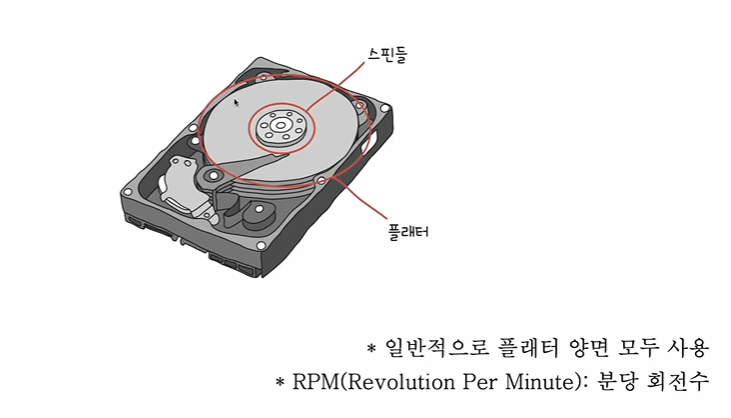
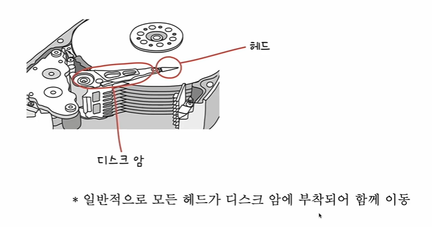
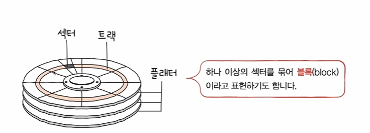
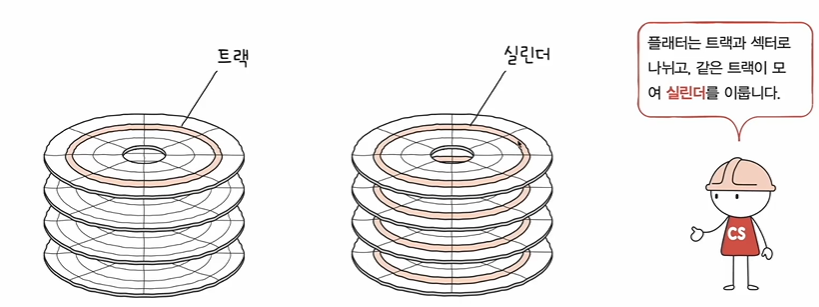
- 자기적인 방식으로 데이터 저장
- 플래터는 여러겹을 사용할 수 있고 양면을 일반적으로 모두 사용한다
- 기본적으로 트랙(track)과 섹터(sector) 단위로 데이터를 저장(섹터의 크기 : 512 바이트 ~ 4096 바이트)
- 트랙 : 플래터를 이루고 있는 동심원을 그리는 저장 단위
- 섹터 : 트랙을 나누었을 떄 그 중에 한 부분
- 실린더 : 여러겹의 플래터 상에서 같은 트랙이 위치한 곳을 모아 연결한 논리적 단위
- 연속된 정보는 한 실렌더에 기록된다
- 데이터 접근 과정
    - 하드 디스크가 저장된 데이터에 접근하는 시간
        - 탐색 시간(seek time) : 접근하려는 데이터가 저장된 트랙까지 헤드를 이동시키는 시간
        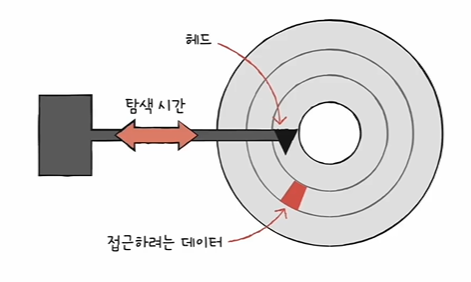
        - 회전 지연(rotational latency) : 헤드가 있는 곳으로 플래터를 회전시키는 시간
        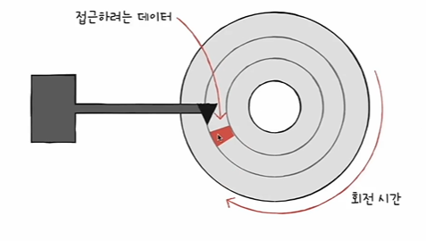
        - 전송 시간(transfer time) : 하드디스크와 컴퓨터 간에 데이터를 전송하는 시간
        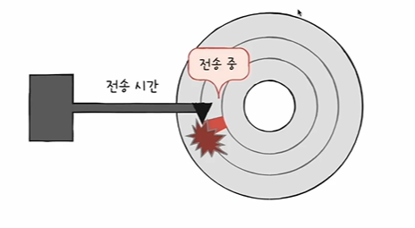
    
    - Jeff Dean - Numbers Every Programmer Should Know
    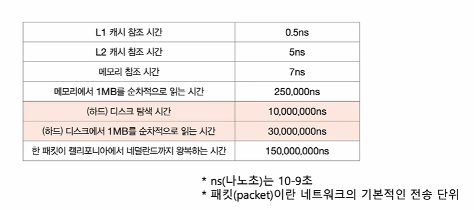
        - ns(나노초)는 10-9초
        - 패킷(packer)이란 네트워크의 기본적인 전송 단위
- 하드 디스크가 직접 동작하는 영상을 보삼...

2. 플래시 메모리
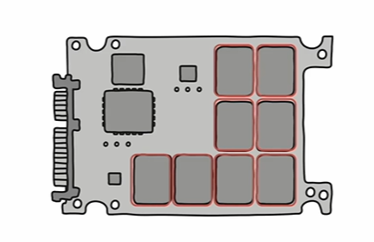
1) 개념
- 전기적으로 데이터를 읽고 쓰는 반도체 기반 저장장치
- 범용성이 넓기에 보조기억장치에만 속한다고 보기는 어려움

2) 종류
- 플래시 메모리의 종류에는 NAND 플래시 메모리와 NOR 플래시 메모리가 있다
- NAND 연산을 수행하는 NAND 게이트와 노어 게이트를 기반으로 만들어진 플래시 뭔말이고... 
- 둘 중에서 오늘날의 대용량 저장장치로 많이 사용되는 플래시는 NAND 플래시 메모리이다

3) 셀(cell)
- 플래시 메모리에서 데이터를 저장하는 가장 작은 단위
- 이 셀이 모이고 모여 수 MB, GB, TB 저장 장치가 된다
- SLC : 한 셀에 1비트를 저장할 수 있는 플래시 메모리(한집에 한명 사는 구조)
    - 한 셀로 두개의 정보 표현
    - 비트의 빠른 입출력(혼자 살떄 더 빠르게 준비하자나)
    - 긴 수명(일정 횟수 이상을 썼다 지웠다 한다면 보조기억장치로써 수명을 다하게 된다...)
    - 용량 대비 고가격

- MLC : 한 셀에 2비트를 저장할 수 있는 플래시 메모리(한집에 두명 사는 구조)
    - 한 셀로 네 개의 정보 표현(대용량화 유리)
    - SLC보다 느린 입출력
    - SLC보다 짧은 수명
    - SLC보다 저렴
    - 시중에서 많이 사용(MLC, TLC, QLC)

- TLC : 한 셀에 3비트를 저장할 수 있는 플래시 메모리
    - 한 셀로 여덟 개의 정보 표현(대용량화 유리)
    - MLC보다 느린 입출력
    - MLC보다 짧은 수명
    - MLC보다 저렴
    - 시중에서 많이 사용(MLC, TLC, QLC)

- QLC : 한 셀에 4비트를 저장할 수 있는 플래시 메모리

4) 플레시 메모리 저장 단위
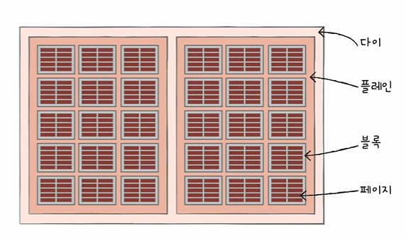
- 셀들이 모여서 페이지(page)
- 페이지들이 모여서 블록(block)
- 블록이 모여서 플레인(plane)
- 플레인이 모여 다이(die)

- 읽기 / 쓰기 단위와 삭제 단위는 다르다
- 읽기와 쓰기는 페이지 단위로 이루어짐
- 삭제는 (페이지보다 큰) 블록 단위로 이루어짐

5) 페이지의 상태
- Free 상태 : 어떠한 데이터도 저장하고 있지 않아 새로운 데이터를 저장할 수 있는 상태
- Valid 상태 : 이미 유료한 데이터를 저장하고 있는 상태
- Invalid 상태 : 유효하지 않은 데이터(쓰레기 값)을 저장하고 있는 상태
- 플레시 메모리는 하드 디스크와 달리 덮어쓰기가 불가능
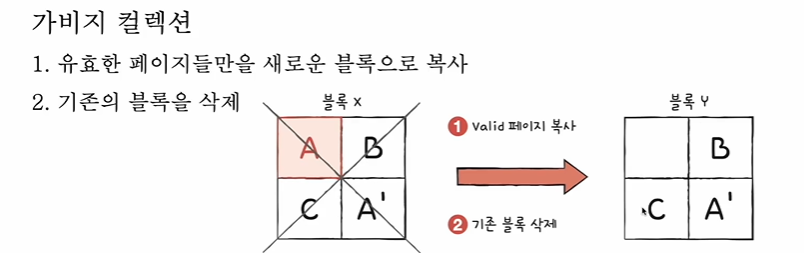