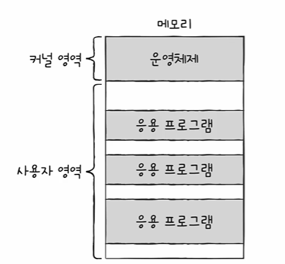
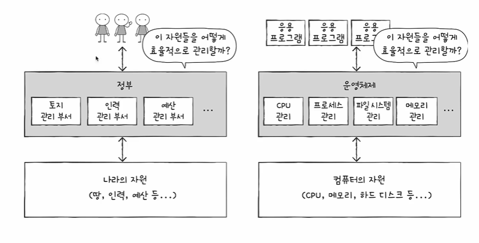
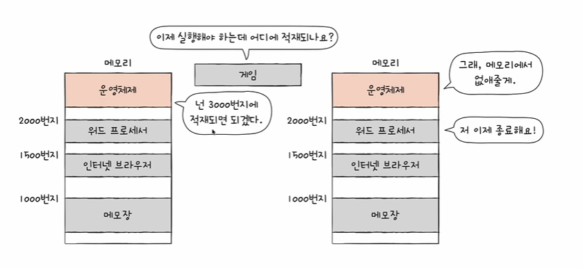

# 들어가며...
- 컴퓨터 부품들은 전기만 공급하면 마법처럼 알아서 작동하는 것이 아님... 운영체제가 필요하겠지
- 운영체제는 무엇이고 개발자는 왜 운영체제를 알아야 하는지에 대해 알아보오자
<br>

# 운영체제란?
- 모든 프로그램은 실행을 위해 자원(리소스)을 필요로 한다
- 프로그램 실행에 있어 <strong>마땅히 필요한 요소</strong>
- 컴퓨터의 네가지 핵심 부품 포함!
```
운영체제는 ??
- 실행할 프로그램에 필요한 자원을 할당하고
- 프로그램이 올바르게 실행되도록 돕는
- 특별한 프로그램
```

- 응용 프로그램(application software) : 사용자가 특정 목적을 위해 사용하는 일반적인 프로그램


- 비어있는 공간에 프로그램을 적재해서 실행하도록 함
- 더 이상 사용하지 않는 프로그램이 있다면 메모리에서 삭제하고 깨끗하게 비워줌
- CPU를 점유해서 어떤 순서로 실행될 것인지를 결정함
- 입출력장치 관리(순서대로 입출력 장치를 사용하도록 제어)


<br>

- 운영체제가 없더라면...
    - 1과 2를 더한 결과를 모니터에 출력하는 간단한 프로그램이라할지라도.....
    1. 프로그램을 메모리에 적재하는 코드
    2. CPU로 하여금 1과 2를 더하게 하는 코드
    3. 모니터에 계산 결과를 출력하는 코드를 다 만들어야 한다
    - 운영체제 덕분에 개발자는 하드웨어를 조작하는 코드를 직접 작성할 필요가 없다!!!

- 그렇다면 알아서 잘 해주는데 우리가 왜 알아야 하느냐??
    - 운영체제는 사용자를 위한 프로그램이 아니라 프로그램을 위한 프로그램이다
    
    - 그렇기에 프로그램을 만드는 개발자는 운영체제를 잘 알아야 한다!!!
    - 운영체제는 프로그램이기 때문에 cpu, 메모리와 같은 하드웨어와 다르고 오류 메세지를 내보내는 등 문제 해결 능력이 있어 개발자와 직접적인 대화를 할 수 있다