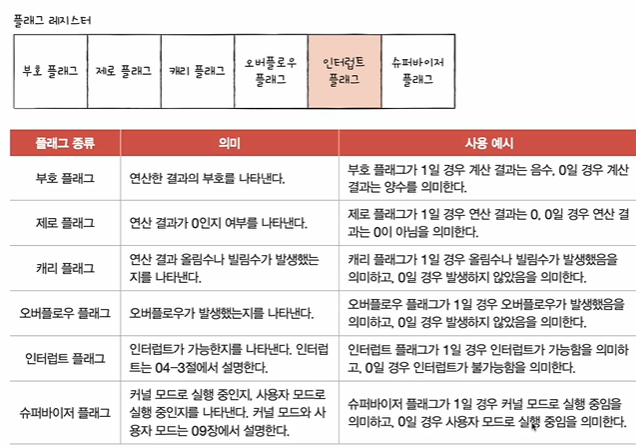

# 둘어가며...
- 커널이란?
- 운영체제의 서비스 종류?
- 시스템 콜(시스템 호출)과 이중모드란?


# 운영체제의 심장, 커널
- 컴퓨터 자원에 접근하고 조작하는 기능 그리고 프로그램이 올바르고 안전하게 실행되게끔 관리해주는 기능이 핵심적인 서비스다
- 이러한 운영체제의 핵심 서비스를 담당하는 부분을 <strong>커널(kernel)</strong> 이라고 한다
- 운영체제라고 하면 커널을 뜻한다고 생각하면 되지만 운영체제에는 속하는데 커널에는 속하지 않는 기능이 있다? => 유저 인터페이스(UI: User Interface) : 사용자와 컴퓨터 간에 상호작용을 하기 위한 통로일 뿐이지 운영체제가 존재하는 목적이나 핵심기능은 아니기때문에 커널에 속하지는 않는다
<br>

# 운영체제의 역할
```
- 사용자가 실행하는 프로그램은 자원(CPU, SSD, 하드디스크)에 직접 접근할 수 있을까? NO

    - 다른 프로그램이 실수로 접근해서 삭제 수정할수도 있자나
    - 그래서 응용 프로그램은 자원에 직접 접근할 수 없다
```
1. 이중모드와 시스템 호출
    - 운영체제는 응용 프로그램들이 자원에 접근하려 할 때 오직 자신을 통해서만 접근하도록 자원을 보호
    
    - 운영체제는 자원 접근을 대행하는 일종의 문지기인 셈
    - 은용 프로그램이 자원에 접근하려면 운영체제에 도움을 요청(= 운영체제의 코드를 실행) 해야 한다
    <br>

    - 이중모드와 시스템 호출
    1. 이중모드
    - CPU가 명령어를 실행하는 모드를 크게 사용자 모드와 커널 모드로 구분하는 방식
    - 사용자 모드
        - 운영체제 서비스를 제공받을 수 없는 실행 모드
        - 커널 영역의 코드를 실행할 수 없는 실행 모드
        - 자원 접근 불가
    - 커널 모드
        - 운영체제의 서비스를 제공받을 수 있는 실행 모드
        - 자원 접근을 비롯한 모든 명령어 실행 가능
    - 플래그의 종류 중에서 슈퍼바이저 플래그가 커널 모드로 실행 중임을 의미하면 커널모드로, 그렇지 않을 경우에는 사용자 모드로 실행된다
    - 그래서 플래그를 확인했을때 커널 모드면 실행해주고 사용자 모드면 실행을 못하도록 막는다
    

    <br>
    - 그렇다면 언제 커널 모드로 바뀌는지 사용자 모드로 바뀌는지 궁금하지 않니??? 👇👇👇👇

    2. 시스템 호출
    - 커널 모드로 전환하여 실행하기 위해 호출
    - 일종의 소프트웨어 인터럽트 : 시스템 호출이 처리되는 방식은 하드웨어 인터럽트 처리 방식과 유사
    
    
    <br>

    - 운영체제 마다 시스템 호출은 정해져 있다
    