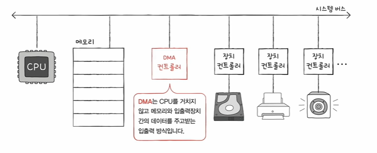

# 프로그램 입출력
- 프로그램 속 명령어로 입출력 장치를 제어하는 방법
- 입출력 명령어로써 장치 컨트롤러와 상호작용
- 메모리에 저장된 정보를 하드 디스크에 백업하는 과정 들여다보기
    1. CPU는 하드 디스크 컨트롤러의 제어 레지스터에 쓰기 명령 내보내기
    - 메모리에 저장된 정보를 하드 디스크에 백업(= 하드 디스크에 새로운 정보 쓰기)
    - 제어 레지스터는 입출력 장치가 해야 되는 동작, 수행할 동작(제어 정보)를 저장하는 레지스터다
    

    2. 하드 디스크 컨트롤러는 하드 디스크 상태 확인 -> 상태 레지스터에 준비 완료 표시
    - 하드디스크가 새롭게 쓰기 작업을 할 수 있는 상태라면 상태 레지스터에 중비완료라고 표시한다
    

    3. CPU는 상태 레지스터를 주기적으로 읽어보며 하드 디스크의 준비여부를 확인
    4. 하드 디스크가 준비되었다면 백업할 메모리의 정보를 데이터 레지스터에 쓰기
    - 아직 백업 작업(쓰기 작업)이 끝나지 않았다면 1번부터 반복, 쓰기가 끝났다면 작업 종료
    

-> CPU가 장치 컨트롤러의 레지스터 값을 읽고 씀으로써 이루어진다

- 프로그램 입출력 방식에는 두가지 방식이 있다(CPU가 장치 컨트롤러의 레지스터 값을 알기 위한 방법)

    1) 메모리 맵 입출력
    - 메모리에 접근하기 위한 주소 공간과 입출력장치에 접근하기 위한 주소 공간을 하나의 주소 공간으로 간주하는 방법
    
    ex) - 516번지: 프린터 컨트롤러의 데이터 레지스터
    - 517번지: 프린터 컨트롤러의 상태 레지스터
    - 518번지: 하드 디스크 컨트롤러의 데이터 레지스터
    - 519번지: 하드 디스크 컨트롤러의 상태 레지스터

    ```
    '517번지를 읽어 들여라' == 프린터 상태 읽기
    '518번지에 a를 써라' == 하드 디스크에 a쓰기
    => 메모리 접근 명령어 == 입출력장치 접근 명령어
    ```

    2) 고립형 입출력
    - 메모리를 위한 주소 공간과 입출력 장치를 위한 주소 공간을 분리하는 방법
    

- 간단 요약
| 메모리 맵 입출력 | 고립형 입출력 |
| -------------- | ------------- |
| 메모리와 입출력장치는 같은 주소 공간 사용 | 메모리와 입출력장치는 분리된 주소 공간 사용 |
|메모리 주소 공간이 축소됨 | 메모리 주소 공간이 축소되지 않음 |
|매모리와 입출력장치에 같은 명령어 사용 가능 | 입출력 전용 명령어 사용 |


# 인터럽트 기반 입출력
- 인터럽트 복습
    - (하드웨어) 인터럽트의 개념 : CPU 사이클의 낭비를 막기 위해서 입출력 장치가 일을 할 동안 다른 일을 할 수 있게 하기 위해서 일종의 알람 같은 개념..
    - 플래그 레지스터 속 인터럽트 비트 : 플래그 레지스터 속에 인터럽트 비트가 활성화가 되면 인터럽트를 받아들인다
    - 인터럽트 요청 신호 : "지금 끼어들어도 되나요?"라고 CPU한테 입출력 장치가 요청을 신호로서 보내주는 것
    - 인터럽트 서비스 루틴 : 인터럽트를 처리하기 위한 특별한 프로그램

- 하드웨어 인터럽트는 장치 컨트롤러에 의해 발생
- 요청 신호를 받으면 그때 가서 봐주면 되기 때문에 조금 더 CPU는 효율적으로 일을 할 수 있다 

- 그렇다면 궁금한 점???? 
<br>
 일반적으로 동시다발적으로 여러 입출력 장치들을 이용할때... (마우스, 모니터, 스피커 같이 사용한다면) 인터럽트의 발생은 어떻게 될 것인가??
    1) 하드퉤어 인터럽트 : 플래그 레지스터 속 인터럽트 비트를 비활성화한 채 인터럽트를 처리하는 경우
    - 현실적으로 모든 인터럽트를 순차적으로 처리할 수 없다
    - 인터럽트 중에서도 더 빨리 처리해야 하는 입터럽트가 있다

    2) 동시다발적인 인터럽트 : 우선순위를 반영한 인터럽트
    
    - NMI가 발생한 경우, 플래그 레지스터 속 인터럽트 속 인터럽트 비트를 활성화한 채 인터럽트를 처리하는 경우
        
    - PIC(Programmable Interrupt Controller) 
        
        - 여러 장치컨트롤러에 연결되어
        - 장치 컨트롤러의 하드웨어 인터럽트의 우선순위를 판단한 뒤
        - CPU에게 지금 처리해야 하는 인터럽트가 무엇인지 판단하는 하드웨어
        - NMI는 우선순위까지 판단하지는 않음
        - 장치 컨트롤러와 CPU 사이에서 어떤 인터롭트를 가장 먼저 처리해야 되는지를 판단

- 지금까지 나온 프로그램 입출력, 인터럽트 기반 입출력의 공통점?
    - 입출력장치와 메모리 간의 데이터 이동은 CPU가 주도하고
    - 이동하는 데이터도 반드시 CPU를 거친다
    - 가뜩이나 바쁜 CPU.. 하드 디스크 백업과 같이 대용량 데이터를 이동한다면..으로 나온것이 DMA 입출력


# DNA 입출력
- DMA(Direct Memory Access)
- CPU를 거치지 않고 입출력장치가 메모리에 직접적으로 접근하는 기능


- DMA 입출력 과정
    1. CPU는 DMA 컨트롤러에 입출력 작업을 명령
    
    2. DMA 컨트롤러는 CPU 대신 장치 컨트롤러와 상호작용하며 입출력 작업을 수행
    
    3. 입출력 작업이 끝나면 DMA 컨트롤러는 인터럽트를 통헤 CPU에 작업이 끝났음을 알림
    
    
    - 결과적으로 CPU는 입출력 작업의 시작과 끝만 관여하여 DMA를 통해서 훨씬 더 효율적으로 시간을 쓰면서 입출력 작업을 할 수 있다
    - 이떄 DMA 컨트롤러는 필요한 경우 메모리에 직접 접근
    - 시스템 버스는 공용 자원이기 때문에 동시에 사용할 수 없다
        1. CPU가 시스템 버스를 이용하지 않을 떄마다 조금씩 시스템 버스 이용
        2. CPU가 일시적으로 시스템 버스를 이용하지 않도록 허락을 구하고 시스템 버스 이용
        

# 입출력 버스
- 이렇게 수많은 입출력 장치와 연결된 장치 컨트롤러들이직접적으로 시스템 버스와 연결되 되어있어도 괜찮을까? NO

- 시스템 버스를 (불필요하게) 두 번 이용하는 DMA 컨트롤러
- 장치 컨트롤러는 직접적으로 시스템 버스에 연결되는것이 아니라 입출력 버스라고 하는 입출력 전용 버스에 연결이 된다


- e.g. PCI 버스, PCI express (PCIe) 버스와 입출력 장치를 연결짓는 슬록 : 슬롯  -> 입출력 버스 -> 시스템 버스
