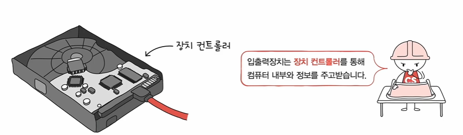
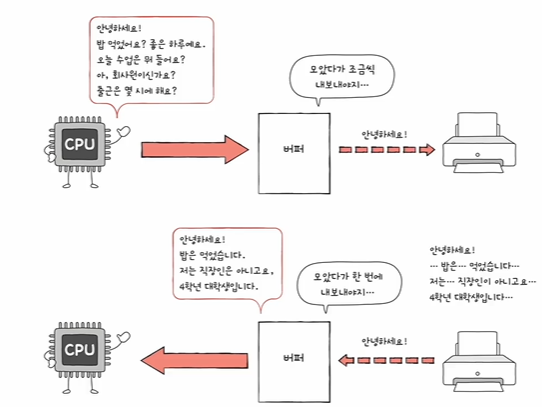

# 입출력장치
- 헤드폰, 마우스, 모니터, 스피커처럼 컴퓨터 외부와 연결되어 컴퓨터 내부와 정보를 주고받을 수 있는 장치
- 입출력 장치는 앞서 학습한 CPU나 메모리보다 다루기 조금 더 까다롭다
    1) 입출력장치에는 종류가 너무 많다
    - 장치가 다양하면 장치마다 속도, 데이터 전송 형식 등도 다양한다
    - 다양한 입출력장치와 정보를 주고받는 방식을 규격화하기 어렵다

    2) 일반적으로 CPU와 메모리의 데이터 전송률은 높지만 입출력장치의 데이터 전송률은 낮다
    - 전송률은... 데이터를 얼마나 빨리 교환할 수 있는지를 나타내는 자료

- 이러한 이유로 입출력 장치는 <strong>장치 컨트롤러를 통해 컴퓨터</strong>와 연결된다

# 장치 컨트롤러의 역할
- CPU와 입출력장치 간의 통신중개
    - 일종의 번역가 역할을 수행
    - 다양한 입출력 장치들로부터 오는 정보를 규격화하기 어렵다는 문제를 어느 정도 해결할 수 있다
- 오류 검출
    - 장치 컨트롤러에 연결된 입출력 장치에 어떤 문제가 있는지 않은지 오류를 검출해주는 역할
- 데이터 버퍼링
    - 버퍼링... 전송률이 높은 장치와 낮은 장치 사이에 주고받는 데이터를 버퍼라는 임시 저장 공간에 저장하여 전송률을 비슷하게 맞추는 방법
    - 전속률을 맞추기 위해서는 버퍼라는 임시 저장 공간에 데이터를 한꺼번에 많이 받아서 조금씩 내보내거나 아니면 조금씩 받은 데이터를 조금씩 모았다가 한꺼번에 내보내는 방식으로 완화한다
    

# 장치 컨트롤러의 구조

- 상태 레지스터와 제어 레지스터는 하나의 레지스터(상태/제어 레지스터)로 사용되기도..
    1) 데이터 레지스터
    - CPU와 입출력장치 사이에 주고받을 데이터가 담기는 레지스터(버퍼)
    - RAM을 사용하기도
    
    2) 상태 레지스터
    - 상태 정보 저장
        - 입출력장치가 입출력 작업을 할 준비가 되었는지
        - 입출력 작업이 완료되었는지
        - 입출력장치에 오류는 없는지 등의 상태 정보
    3) 제어 레지스터
    - 입출력 장치가 수행할 내용에 대한 제어 정보

# 장치 드라이버
- 장치 컨트롤러의 동작을 감지하고 제어하는 프로그램
- 장치 컨트롤러가 입출력장치를 연결하기 위한 하드웨어적인 통로라면,
- 장치 드라이버는 입출력장치를 연결하기 위한 <strong>소프트웨어직인 통로</strong>
- 컴퓨터(실제로는 운영체제임)가 연결된 장치의 드라이버를 인식하고 실행할 수 있다면 컴퓨터 내부와 정보를 주고바을 수 있음
- 반대로 컴퓨터가 정치 ㅈ드라이버를 인식하거나 실행할 수 없다면 그 장치는 컴퓨터 내부와 주고받을 수 없음