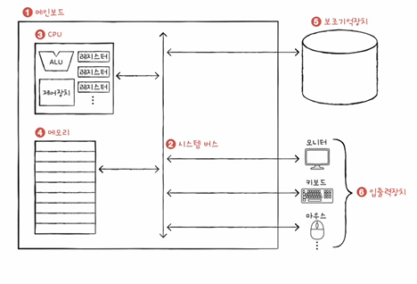
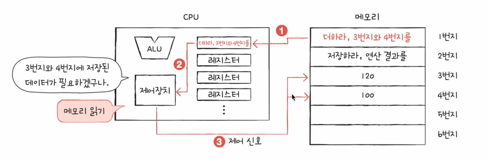
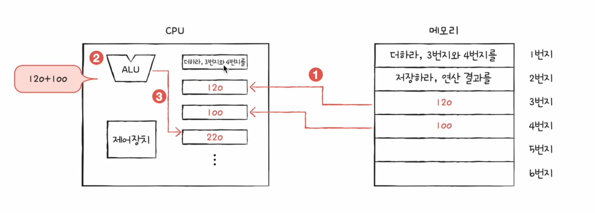
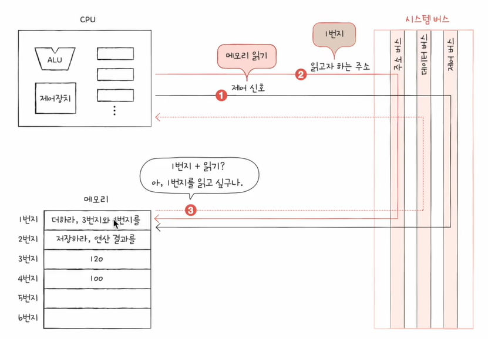

# 컴퓨터 구조를 알아야 하는 이유

1. 문제 해결 능력을 기를 수 있다
2. 성능, 용량, 비용을 고려한 개발을 할 수 있다

# 컴퓨터 구조의 큰 그림

1. 컴퓨터 구조
- 컴퓨터가 이해하는 정보(데이터, 명령어)
    - 데이터
        - 숫자, 문자, 이미지, 동영상과 같은 정적인 정보
        - 컴퓨터와 주고받는 / 내부에 저장된 정보를 데이터라 통칭
        - 0과 1로 숫자를 표현하는 방법
        - 0과 1로 문자를 표현하는 방법
    - 명령어
        - 컴퓨터는 결국 명령어를 처리하는 기계
        - 컴퓨터를 실질적으로 움직이는 정보
        - 데이터는 명령어를 위한 일종의 재료
        - 명령어의 생김새와 동작 방식
- 컴퓨터의 네 가지 핵심 부품(CPU, 메모리(주기억장치의 줄임말), 보조기억장치(usb, SD카드), 입출력장치(마이크, 마우스, 프린터))
    - 컴퓨터의 4가지 핵심 부품을 연결해줄 수 있는 판 : 메인보드(마더 보드)
    - 버스라고 하는 통로를 통해서 연결을 주고 받을 수 있는 데 그 중 제일 중요한 것이 시스템 버스
    

2. 메모리 
- 프로그램이 실행되기 위해서는 메모리에 저장되어 있어야 한다.
- 메모리는 실행되는 프로그램의 명령어와 데이터를 저장한다.
- 메모리에 저장된 값의 위치는 주소로 알 수 있다.

3. CPU
- 메모리에 저장된 명령어를 읽어 들이고, 해석하고, 실행하는 부품
- CPU 내부에는 ALU, 레지스터, 제어장치가 있다...
- ALU : 계산기
- 레지스터 : CPU 내부의 작은 저장장치(임시 저장 장치)
- 제어장치 : 제어 신호를 내보내고, 명령어를 해석하는 장치
- 제어 신호 : 컴퓨터 부품들을 관리하고 작동시키기 위한 전기 신호
    - CPU가 메모리에 저장된 값을 읽고 싶을 땐 메모리를 향해 메모리 읽기라는 제어 신호를 보낸다
    - CPU가 메모리에 어떤 값을 저장하고 싶을 땐 메모리를 향해 메모리 쓰기라는 제어 신호를 보낸다

4. 보조기억장치
- 전원이 꺼져도 보관할 프로그램을 저장하는 부품

5. 입출력장치
- 컴퓨터 외부에 연결되어 컴퓨터 내부와 정보를 교환할 수 있는 부품

6. 메인보드
- 메인보드에 연결된 부품은 버스를 통해 정보를 주고 받음
- 버스는 컴퓨터의 부품끼리 정보를 주고받는 일종의 통로
- 다양한 종료의 버스가 있음
- 컴퓨터의 핵심 부품을 연결하는 버스는 시스템 버스

7. 시스템 버스
- 시스템 버스의 내부 구성
    - 주소 버스 : 주소를 주고받는 통로
    - 데이터 버스 : 명령어와 데이터를 주고받는 통로
    - 제어 버스 : 제어 신호를 주고받는 통로
    