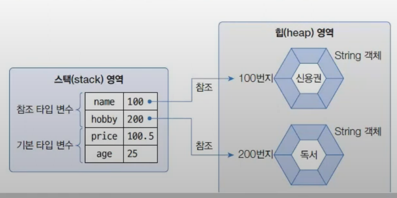
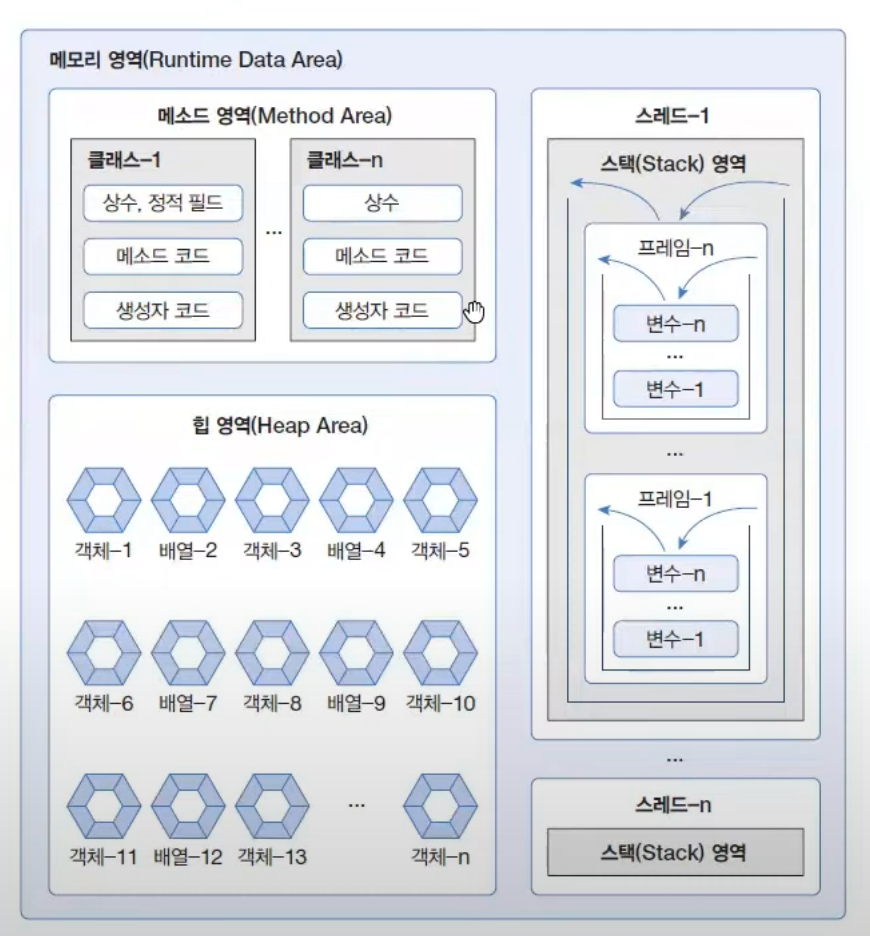

# 2.13 키보드 입력 데이터를 변수에 저장
## Scanner 사용
- 가장 쉬운 방법
- Scanner 타입 변수 선언하여 사용

```java
Scanner scanner = new Scanner(System.in);
String inputData = scanner.nextLine();
```

`scanner.nextLine()` : `Enter` 키 입력 전까지 대기 상태. 지금까지 입력된 모든 내용을 문자열로 읽음

# 5.1 데이터 타입 분류
## 데이터 타입 (Data Type) : 저장되는 값 차이
기본 타입 : 값 자체를 저장
참조 타입 :  객체의 번지를 참조하는 타입
- 객체(object) : 데이터와 메소드로 구성된 덩어리
- 객체 = 데이터 + 메소드

1. 기본 타입
   - 정수 타입 : byte, char, short, int, long
   - 실수 타입: float, double
   - 논리 타입 : boolean
2. 참조 타입
   - 배열 타입
   - 열거 타입
   - 클래스
   - 인터페이스


변수들은 모두 stack이라는 메모리 영역에 생성  
- 기본 타입 변수 : 직접 값을 저장
- 참조 타입 변수 : 힙 메모리 영역의 String 객체 번지를 저장, 번지를 통해 String 객체 참조



# 5.2 메모리 사용 영역
1. 메소드 영역 : 자바 코드가 저장되는 부분, 바이트 코드 파일을 읽은 내용이 저장되는 영역
2. 힙 영역 : 객체 저장
3. 스택 영역 : 변수 생성


# 5.3 참조 타입 변수의 ==, != 연산
- ==, != 변수의 값이 같은지 아닌지 조사 -> 참조형의 경우 번지를 비교
- 동일한 값을 가지고 있다하더라도, 번지가 다르기 때문에 arr1==arr2는 false 반환
- 다른 객체에 들어가 있는 데이터가 같을 뿐..! 같은 번지가 아니다~
```java
    public static void main(String[] args){
        int[] arr1;
        int[] arr2;
        int[] arr3;

        arr1 = new int[] {1, 2, 3};
        arr2 = new int[] {1, 2, 3};
        arr3 = arr2;
        
        System.out.println(arr1 == arr2); // false
        System.out.println(arr2 == arr3); // true
    }
```

# 5.4 null과  NullPointerException
`null` : 아직 참조 타임 변수가 번지를 저장하고 있지 않다는 뜻
- 초기 값으로 사용할 수 있음 (기본 타입의 경우 불가능)
- null로 초기화된 참조 변수는 스택 영역에 생성 (힙에는 생성 X)
- 스택 영역에 null이 저장되어 있기 때문에 비교 연산 (==, !=) 가능

## NullPointerException
변수가 null인 상태에서 객체의 데이터나 메소드를 사용할 때 발생하는 예외

- 데이터를 사용하려는 경우
```java
int[] intArray = null; // 객체를 생성하지 않음
intArray[0] = 10; // 참조하는 객체 데이터를 대입하려고 함 => 객체가 없으므로 예외 발생
```

- 메소드를 사용하려는 경우
```java
String str = null; // 객체를 생성하지 않음
System.out.println(str.length()); // 참조하는 객체의 메소드를 사용하려고 함 => 예외 발생
```

쓰레기 수집기 (Garbage Collector)
- 자바는 더 이상 참조되지 않는 객체를 자동으로 제거
- 객체를 제거하는 방법은 객체의 모든 참조를 없애는 것!