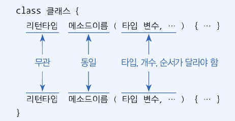
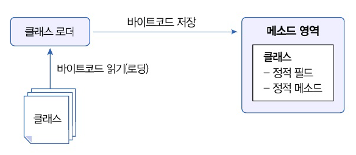

# 6.8 메소드 선언과 호출
## 가변 길이 매개변수
가변길이 매개변수를 가지는 메소드 선언 방법
```java
int sum(int ...values){
}
```

- Computer 클래스 선언
```java
public class Computer {
    // 가변길이 매개변수를 갖는 메소드 선언
    int sum(int ...values) {
        int sum = 0;
        
        for (int i = 0; i < values.length; i++) {
            sum += values[i];
        }
        return sum;
    }
}
```

- Computer 클래스의 메소드 사용
  - 가변길이의 경우 배열 입력해도 된다!
```java
public class ComputerExample {
    public static void main(String[] args) {
        Computer myCom = new Computer();

        int result1 = myCom.sum(1, 2, 3);
        System.out.println("result1: " + result1);

        int result2 = myCom.sum(1, 2, 3, 4, 5);
        System.out.println("result2: " + result2);

        int[] values = {1, 2, 3, 4, 5};
        int result3 = myCom.sum(values);
        System.out.println("result3: " + result3);
    }
}

```

```java
result1: 6
result2: 15
result3: 15
```

return 문 : 메소드의 실행을 강제 종류하고 호출한 곳으로 돌아간다!

## 메소드 오버로딩
- 메소드의 이름은 같음! 매개변수의 타입, 개수, 순서다 다른 메소드를 선언하는 것  
- 다양한 매개값을 처리하기 위함


```java
public class Calculator {
    // 정사각형
    double areaRect(double width){
        return width * width;
    }
    // 직사각형
    double areaRect(double width, double height){
        return width * height;
    }
}
```

# 6.9 인스턴스 멤버
- 필드 vs 메소드 : 선언 방법에 따라 차이
  - 인스턴스(instance) 멤버 : 객체에 소속된 멤버. 객체를 셍상헤애민 사용할 수 있는 멤버
  - 정적(static) 멤버 : 클래스에 고정된 멤버. 객체 없이도 사용할 수 있는 멤버

## this 키워드
객체 내부에서 인스턴스 멤버에 접근하기 위해 사용

# 6.10 정적 멤버
- 메소드 영역의 클래스에서 고정적으로 위치하는 멤버
- 객체를 생성할 필요 없이 클래스를 통해 바로 사용이 가능
- 자바 : 클래스 로더 이용해서 클래스를 메소드 영역에 저장하고 사용



## 정적 멤버 선언
- 필드와 메소드 모두 정적 멤버 가능
- static 키워드 추가

```java
// 정적 필드 선언
static double pi = 3.14159;

// 정적 메소드
static int plus(int x, int y){
    return x + y;
}
```

## 정적 블록
- 초기화 작업이 복잡한 경우 사용
- 클래스가 메모리로 로딩될 때 자동스올 실행
```java
static {
}
```

+) 생성자에서 초기화를 하지 않는 정적 필드  
- 정적 필드 : 객체 생성 없이도 사용할 수 있음 -> 생성자에서 초기화 작업하지 않음
- 생성자는 객체 생성 후 실행되기 때문

+) 인스턴스 멤버 사용 불가
- 객체 없이도 실행되기 때문
- 객체 자신의 참조인 this도 사용 불가
- 인스턴스 멤버를 사용하고 싶다면 참조변수로 접근
- main 메소드도 정적 메소드라 동일한 규칙 적용
```java
public class ClassName {
    // 인스턴스 필드와 메소드 선언
    int field1;
    void method1(){}

    // 정적 필드와 메소드 선언
    static int field2;
    static void method3(){}
  
  static {
        field1 = 10; // 컴파일 에러
        method1(); // 컴파일 에러
        field2 = 10;
        method2();
    }
```