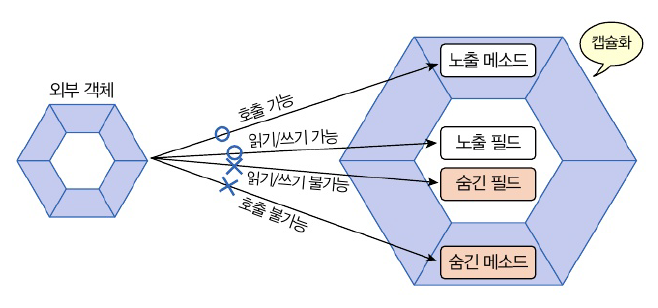
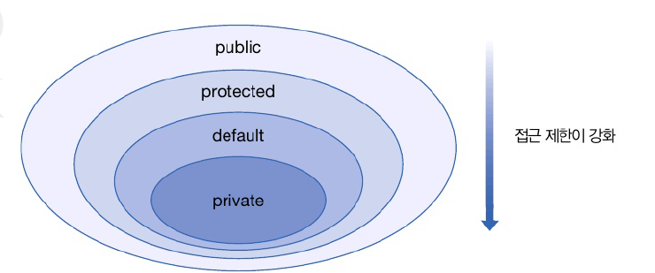
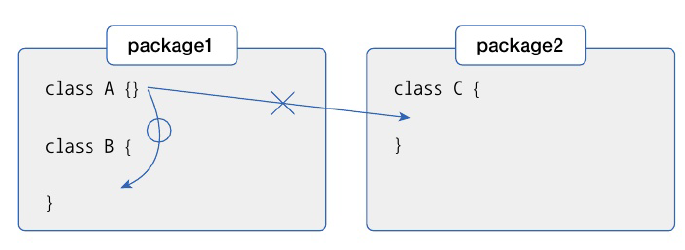
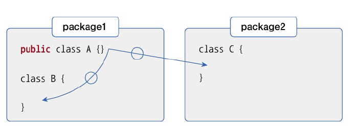

# 6.11 final 필드와 상수
값을 변경하는 거을 막고 읽기만 허용해야하는 경우 사요

## final 필드
- 초기값이 저장되면 최종값이되어 프로그래 실행도중 실행 불가
- 초기값 설정하지 않으면 컴파일 에러 발생

초기값 설정 방법 
1. 필드 선언 시에 초기값 대입 << 이게 제일 간단
2. 생성자에서 초기값 대입


## 상수
- 불변의 값
- 선언 시, 정적 블록에서 초기화 가능
- **대문자 작성이 관례, 혼합 이름의 경우 언더바 사용**

```java
static fianl 타입 상수;
static {
    상수 = 초기값;
}
```

# 6.13 접근 제한자
- 객체의 필드 외부 변경, 메소드 호출을 막아야 하는 경우 발생 for 무결성 유지
  - 무결성 유지 : 중요한 필드와 메소드가 외부로 노출하지 않도록 함




|  접근 제한자   |       제한 대상       |          제한 범위          |
|:---------:|:-----------------:|:-----------------------:
|  public   | 클래스, 필드, 생성자, 메소드 |           없음            |
| protected |   필드, 생성자, 메소드    | 같은 패키지이거나, 자식 객체만 사용 가능 |
| (default) | 클래스, 필드. 생성자, 메소드 |         같은 패키지          |
|  private  |    필드, 생성자,메소드    |          객체 내부          |


## 클래스의 접근 제한
- public, default
- public 접근 제한자 생략 시 default 적용

### default
- 같은 패키지 사용 가능, 다른 패키지 사용 불가능



### public
- 같은 패키지, 다른 패키지 모두 사용 가능




## 생성자의 접근 제한
- public, default, private

| 접근 제한자  |    생성자     |           설명            |
|:-------:|:----------:|:-----------------------:
| public  |  클래스(...)  | 모든 패키지에서 생성자 호출, 생성 가능  |
|         |  클래스(...)  | 같은 패키지에서만 생성자 호출, 생성 가능 |
| private |  클래스(...)  | 클래스 내부에서만 생성자 호출, 생성 가능 |


## 필드와 메소드 접근 제한
- public, default, private
  | 접근 제한자  |    생성자     |           설명            |
  |:-------:|:----------:|:-----------------------:
  | public  |  필터 / 메소드(...)  | 모든 패키지에서 필터 읽고 변경 가능, 메소드 호출 가능  |
  |         |  필터 / 메소드(...)  | 같은 패키지에서만 필터 읽고 변경 가능, 메소드 호출 가능 |
  | private |  필터 / 메소드(...)  | 클래스 내부에서만 필터 읽고 변경 가능, 메소드 호출 가능 |