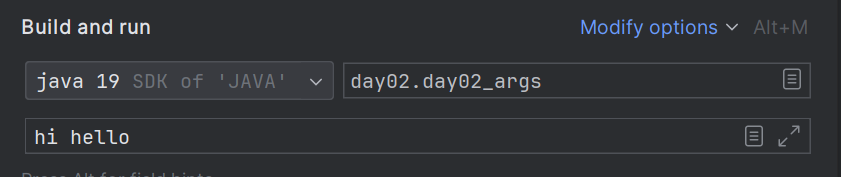

# 5.11 main() 메소드의 String[] 매개변수 용도
main 메소드 선언시 String[] 매개변수의 용도
- 메소드 실행시 매개변수 값을 가지고 로직 실행
- 외부로부터 매개변수 값을 받기 위함

### 인텔리제이 Java 프로그램 args 설정하여 실행
1. Edit Configurations 클릭
2. 실행할 파일과 파라미터 입력



```java
package java_06.java_240602;

public class day02_args {
    public static void main(String[] args) {
        if (args.length != 2) {
            System.out.println("입력값이 부족합니다.");
            System.exit(0); // 프로그램 강제 종료
        }

        String strNum1 = args[0];
        String strNum2 = args[1];

        int num1 = Integer.parseInt(strNum1);
        int num2 = Integer.parseInt(strNum2);

        System.out.println(num1 + num2);
    }
}

```

# 5.12 열거 (Enum 타입)
- 한정된 값을 갖는 타입
  - 요일 : 월, 화, 수, 목, 금, 토, 일
  - 계절 : 봄, 여름, 가을, 겨울
- 열거 타입 이름으로 소스 파일 생성 후 한정된 값을 코드로 정의
- Camel 스타일
- 값을 변경하지 않기 때문에 상수와 유사 => 대문자로 작성

```java
public class day03_enum {
    public static void main(String[] args) {
        // 열거 타입 변수 선언
        Week today = null;
        today = Week.SUNDAY;


        // 열거값 비교
        if (today == Week.SUNDAY) {
            System.out.println("눈 감기전까지는 일요일이야");
        } else {
            System.out.println("즐거우실까요?");
        }
    }
}
```