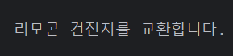

# 8.6 정적 메소드
- 정적 메소드 선언 가능
- 구현 객체 없이 인터페이스 만으로 호출 가능
- public을 생략하더라도 자동으로 컴파일 과정에서 붙는다!!
- 주의점 
  - 상수 필드를 제외한 추상 메소드, 디폴트 메소드, private 메소드 등을 호출할 수 없음
  - 구현 객체가 필요한 인스턴스 메소드이기 때문

```java
    // 정적 메소드 - RemoteControl.chageBattery 로 접근 가능
    static void chageBattery() {
        System.out.println("리모콘 건전지를 교환합니다.");
    }
```

- 실행 결과
```java

```

# 8.7 private 메소드
- 인터페이스의 상수 필드, 추상 메솓, 디폴트 메소드, 정적 메소드 -> public 접근 제한
- private 선언도 가능
- private 메소드 : 구현 객체가 필요한 메소드
  - 디폴트 메소드 안에서만 호출이 가능
- private 정적 메소드 : 구현 객체가 필요 없는 메소드
  - 디폴트 메소드, 정적 메소드 안에서도 호출 가능
- private 메소드의 용도 : 디폴트와 정적 메소드 들의 중복 코드를 줄이기 위함

- Service

```java
package java_07.java_240712;

public interface Service {
    // 디폴트 메소드
    default void defaultMethod1() {
        System.out.println("defaultMethod1 종속 코드");
        defaultCommon();
    }

    default void defaultMethod2() {
        System.out.println("defaultMethod2 종속 코드");
        defaultCommon();
    }

    // private 메소드
    private void defaultCommon() {
        System.out.println("defaultMethod 중복 코드A");
        System.out.println("defaultMethod 중복 코드B");
    }

    // 정적 메소드
    static void staticMethod1() {
        System.out.println("staticMethod1 종속 코드");
        staticCommon();
    }

    static void staticMethod2() {
        System.out.println("staticMethod2 종속 코드");
        staticCommon();
    }

    // private 정적 메소드
    private static void staticCommon() {
        System.out.println("staticMethod 중복 코드C");
        System.out.println("staticMethod 중복 코드D");
    }
}

```

- ServiceImpl

```java
package java_07.java_240712;

public class ServiceImpl implements Service {
}

```

```java
package java_07.java_240712;

public class ServiceExample {
    public static void main(String[] args) {
        // 인터페이스 변수 선언과 구현 객체 대입
        Service service = new ServiceImpl();

        // 디폴트 메소드 호출
        service.defaultMethod1();
        System.out.println();
        service.defaultMethod2();
        System.out.println();

        // 정적 메소드 호출
        Service.staticMethod1();
        System.out.println();
        Service.staticMethod2();
        System.out.println();
    }
}

```

- 결과 확인
```java
defaultMethod1 종속 코드
defaultMethod 중복 코드A
defaultMethod 중복 코드B

defaultMethod2 종속 코드
defaultMethod 중복 코드A
defaultMethod 중복 코드B

staticMethod1 종속 코드
staticMethod 중복 코드C
staticMethod 중복 코드D

staticMethod2 종속 코드
staticMethod 중복 코드C
staticMethod 중복 코드D

```