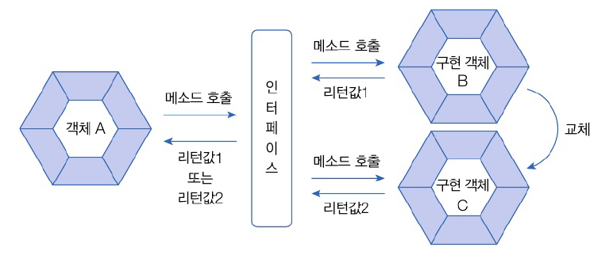

# 8.10 타입 변환
- 인터페이스와 구현 클래스간 발생
- 인터페이스 변수에 구현 객체를 대입하면 구현 객체는 인터페이스 타입으로 자동 타입 변환
- 인터페이스 타입을 구현 클래스 타입으로 변환 시킬 수 있음. 강제 타입 변환

## 자동 타입 변환
- 부모 클래스가 인터페이스를 구현하고 있다면 인터페이스 타입으로 자동 타입 변환 가능

  


## 강제 타입 변환


- 캐스팅 기호 사용하여 인터페이스 타입을 구현 클래스 타입으로 변환시키는 것
- 구현 객체가 인터페이스 타입으로 자동 변환되면, 인터페이스에 선언된 메소드만 선언니 가능
- 타입 변환 후에 다른 메소드를 호출하고 싶다면 강제 타입 변환 필요

  
  


# 8.11 다형성
- 인터페이스를 통해 다형성 구현하는 경우 > 상속으로 다형성을 구현하는 경우
- 객체B와 객체 C 중 어느 객체가 인터페이스에 대입되었느냐에 따라 호출 결과 달라질 수 있음 -> 다형성 구현



- 메소드 재정의 + 자동 타입 변환 => 다형성
  - 인터페이스의 추상 메소드 구현 클랜스에서 재정의
  - 재정의 되는 내용은 구현 클래스 마다 다름
  - 구현 객체는 인터페아스 타입으로 자동 평환
  - 인터페이스 호출 시 구현 객체의 재정된 메소드가 호출 되어 다양한 실행 결과

## 필드의 다형성
- 필드 타입으로 타이어 인터페이스를 선언하면 필드값으로 여러 객체 대입 가능
- 객체에서 인터페이스에 선언된 메소드만 사용하며로 어떤 구현 객체가 대입되어도 상관 X


- Tire

```java
package java_07.java_240719;

public interface Tire {
    // 추상 메소드
    void roll();
}

```
- HKTire

```java
package java_07.java_240719;

public class HKTire implements Tire{
    // 추상 메소드 재정의
    @Override
    public void roll(){
        System.out.println("한국 타이어가 굴러갑니다.");
    }
}

```
- KHTire

```java
package java_07.java_240719;

public class KHTire implements Tire{
    // 추상 메소드 재정의
    @Override
    public void roll(){
        System.out.println("금호 타이어가 굴러갑니다.");
    }
}

```
- Car

```java
package java_07.java_240719;

public class Car {
    // 필드
    Tire tire1 =  new HKTire();
    Tire tire2 = new HKTire();

    // 메소드
    void run(){
        // 인터페이스에 선언된 추상메소드 호출
        tire1.roll();
        tire2.roll();
    }
}

```
- CarExample

```java
package java_07.java_240719;

public class CarExample {
    public static void main(String[] args) {
        // 자동화 객체 생성
        Car myCar = new Car();

        // run() 메소드 실행
        myCar.run();

        // 타이터 객체 교체
        myCar.tire1 = new KHTire();
        myCar.tire2 = new KHTire();

        // run() 메소드 실행(다형성: 실행 결과가 다름)
        myCar.run();
    }
}

```
- 실행 결과
```java
한국 타이어가 굴러갑니다.
한국 타이어가 굴러갑니다.
금호 타이어가 굴러갑니다.
금호 타이어가 굴러갑니다.

```

## 매개변수의 다형성
- 매개변수 타입을 인터페이스로 선언하면 메소드 호출 시 다양한 구현 객체 대입 가능


- Vehicle 인터페이스를 매개변수로 가지는 drive() 메소드 선언
- drive() 호출 시 인터페이스를 구현하는 모든 객체를 매개값으로 줄 수 있음
  - 구현 객체에 따라 실행 결과가 다르게 나옴!


- Vehicle

```java
package java_07.java_240719;

public interface Vehicle {
    // 추상 메소드
    void run();
}

```
- Driver

```java
package java_07.java_240719;

public class Driver {
    // 구현 객체가 대입될 수 있도록 매개변수를 인터페이스 타입으로 선언
    void drive(Vehicle vehicle) {
        vehicle.run(); // 인터페이스 메소드 호출
    }
}

```
- Bus

```java
package java_07.java_240719;

public class Bus implements Vehicle{
    @Override
    public void run() {
        System.out.println("버스가 달립니다.");
    }
}

```
- Taxi

```java
package java_07.java_240719;

public class Taxi implements Vehicle{
    @Override
    public void run() {
        System.out.println("택시가 달립니다.");
    }
}

```
- DriverExample

```java
package java_07.java_240719;

public class DriverExample {
    public static void main(String[] args) {
        // Driver 객체 생성
        Driver driver= new Driver();

        // Vehicle 구현 객체 생성
        Bus bus = new Bus();
        Taxi taxi = new Taxi();

        // 매개값으로 구현 객체 대입(다형성: 실향결과가 다름)
        driver.drive(bus); // 자동 타입 변환 -> 오버라이딩 메소드 호출 -> 다형성
        driver.drive(taxi);
    }
}

```
- 실행 결과
```java
버스가 달립니다.
택시가 달립니다.
```

# 8.12 객체 타입 확인
- `instanceof` 사용하여 인터페이스 변수에 대입된 객체를 확인

---
- 매개변수가 특정 구현 객체인 경우에만 강제 타입 변환하는 코드
  - 캐스팅 연산자로 변환 or Java 12 이후 바로 변환 가능

```java
// 버스인 경우에만 추가 메소드가 실행된다!
public static void ride(Vehicle vehicle) {
  // 방법 1 : 체크와 변환 따로
  if (vehicle instanceof Bus) {
      Bus bus = (Bus) vehicle;
      bus.checkFare();
  }
  
  // 방법 2 : 체크와 변환 한번에
  if (vehicle instanceof Bus bus) {
    bus.checkFare();
  }
}
```

# 8.13 봉인된 인터페이스
- 무분별한 자식 인터페이스 생성을 방지하기 위해 사용

---
- 특정 인터페이스만 허용하고 봉인하는 인터페이스
  - `permits` 을 상속 가능한 자식 인터페이스 지정
```java
// InerfaceB만 자식 인터페이스 가능
public sealed interface InterfaceA permits InerfaceB {}
```

- 봉인된 인터페이스를 상속한 인터페이스는 봉인du부 선택
- 봉인을 해제하려면 `non-sealed` 키워드 사용 -> 자식 인터페이스 만들 수 있음

```java

public non-sealed interface InterfaceB extends InterfaceA {}
```