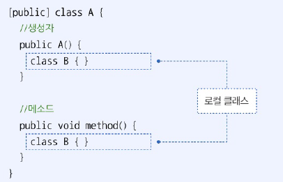
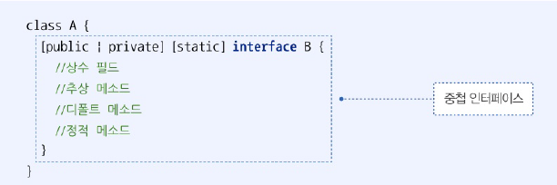

# 9.3 정적 멤버 클래스
- static 키워드와 함께 A 클래스의 멤버로 선언된 B 클래스

```java
public class A {
    public static class B{ // 정적 멤버 클래스
    }
}
```

- 접근 제한자에 따른 정적 멤버 클래스의 접근 범위

| 구분                        | 접근 범위                        |
|:--------------------------|:-----------------------------|
| public static class B {}  | 다른 패키지에서 B 클래스를 사용할 수 있다.    |
| static class B {}         | 같은 패키지에서만 B 클래스를 사용할 수 있다.   |
| private static class B {} | A 클래스 내부에서만 B 클래스를 사용할 수 있다. |

- A 클래스 내부에서 사용
- A 클래스 외부에서 A와 함께 사용되는 경우 많음 -> 주로 default / public 접근제한
- B 객체는 A 클래스 내부 어디든 객체를 생성할 수 있음
- A 클래스 외부에서 B 객체를 생성하려면 A 객체 생성 없이 A 클래스로 접근하여 B 객체 생성할 수 있다.

```java
package java_07.java_240726.ex01;

public class A {
    // 인스턴스 멤버 클래스
    static class B {}

    // 인스턴스 필드 값으로 B 객체 대입
    B field1 =  new B();

    // 정적 필드 값으로 B 객체 대입
    static B field2 = new B();

    // 생성자
    A() {
        B b = new B();
    }

    // 인스턴스 메소드
    void method1() {
        B b = new B();
    }

    // 정적 메소드
    static void method2() {
        B b = new B();
    }
}

```

```java
package java_07.java_240726.ex01;

public class AExample {
    public static void main(String[] args) {
        // B 객체 생성
        A.B b = new A.B();
    }
}

```

- 정적 멤버 클래스 B 내부에는 일반 클래스와 같이 필드, 생성자, 메소드 선언이 올 수 있다.

```java
package java_07.java_240726.ex02;

public class A {
    // 정적 멤버 클래스
    static class B {
        // 인스턴스 필드
        int field1 = 1;

        // 정적 필드
        static int field2 = 2;

        // 생성자
        B() {
            System.out.println("B 생성자 실행");
        }

        // 인스턴스 메소드
        void method1() {
            System.out.println("B method1 실행");
        }

        // 정적 메소드
        static void method2() {
            System.out.println("B method2 실행");
        }
    }
}

```

```java
package java_07.java_240726.ex02;

public class AExample {
    public static void main(String[] args) {
        // B 객체 생성 및 인스턴스 필드 및 메소드 사용
        A.B b = new A.B();
        System.out.println(b.field1);
        b.method1();

        // B 클래스의 정적 필드 및 메소드 사용
        System.out.println(A.B.field2);
        A.B.method2();
    }
}

```

```java
B 생성자 실행
1
B method1 실행
2
B method2 실행
```

# 9.4 로컬 클래스
- 생성자 또는 메소드 내부에서 아래와 같이 선언된 클래스



- 로컬 클래스는 생성자와 메소드가 실행될 동안에만 객체를 생성할 수 있다.

```java
package java_07.java_240726.ex03;

public class A {
    // 생성자
    A() {
        // 로컬 클래스 선언
        class B {}

        // 로컬 객체 생성
        B b = new B();
    }

    // 메소드
    void method() {
        // 로컬 클래스 선언
        class B {}

        // 로컬 객체 생성
        B b = new B();
    }
}

```

- 로컬 클래스 B 내부에는 필드, 생성자, 메소드 선언, 정적 필드와 정적 메소드 선언 가능

```java
package java_07.java_240726.ex05;

public class A {
    // 메소드
    void useB() {
        // 로컬 클래스
        class B {
            // 인스턴스 필드
            int field1 = 1;

            // 정적 필드
            static int field2 = 2;

            // 생성자
            B() {
                System.out.println("B 생성자 실행");
            }

            // 인스턴스 메소드
            void method1() {
                System.out.println("B method1 실행");
            }

            // 정적 메소드
            static void method2() {
                System.out.println("B method2 실행");
            }
        }

        // 로컬 객체 생성
        B b = new B();

        // 로컬 객체와 인스턴스 필드의 메소드 사용
        System.out.println(b.field1);
        b.method1();

        // 로컬 클래스의 정적 필드와 메소드 사용
        System.out.println(B.field2);
        B.method2();
    }
}

```

```java
package java_07.java_240726.ex05;

public class AExample {
    public static void main(String[] args) {
        // A 객체 생성
        A a = new A();

        // A 메소드 호출
        a.useB();
    }
}

```

```java
B 생성자 실행
1
B method1 실행
2
B method2 실행
```

- 로컬 변수 : 생성자 또는 메소드의 매개변수 또는 내부에서 선언된 변수
  - 로컬에서 사용하는 경우 final 특성을 갖게 되어 수정 불가능
  - 로컬 클래스 내부에서 값을 변경하지 못하도록 제한하기 때문
  - 로컬 변수에 final 명시하지 안하도 상관 없음!

# 9.5 바깥 멤버 접근
- 중첩 클래스는 바깥 클래스에 접곤할 수 있음
- 접근 제한이 있을 수 있음

## 바깥 클래스의 멤버 접근 제한
- 정적 멤버 클래스 내부에서는 바깥 클래스의 필드와 메소드 사용 시 제한
  - 정적 멤버 클래스 -> 바깥 객체 없어도 사용 가능해야 하므로 바깥 클래스의 정적 인스턴스 필드와 메소드에 사용 X

| 구분          | 바깥 클래스의 사용가능한 멤버      |
|:------------|:----------------------|
| 인스턴스 멤버 클래스 | 바깥 클래스의 모든 필드와 메소드    |
| 정적 멤버 클래스   | 바깥 클래스의 정적 필드와 정적 메소드 |

## 바깥 클래스의 객체 접근
- 중첩 클래스 내부에서 this는 중컵 클래스의 객체
- 중첩 클래스 내부에서 바깥 클래스의 객체를 얻으려면 바깥 클래스 이름에 this 붙이기

```java
package java_07.java_240726.ex06;

public class A {
    // A의 인스턴스 필드
    String field = "A field";

    // A의 인스턴스 메소드
    void method() {
        System.out.println("A method");
    }

    // 인스턴스 멤버 클래스
    class B {
        // B 인스턴스 필드
        String field = "B field";

        // B 인스턴스 메소드
        void method() {
            System.out.println("B method");
        }

        // B 인스턴스 메소드
        void print() {
            // B 객체의 필드의 메소드 사용
            System.out.println(this.field);
            this.method();

            // A 객체의 필드와 메소드 사용
            System.out.println(A.this.field);
            A.this.method();
        }
    }

    // A의 인스턴스 메소드
    void useB() {
        B b = new B();
        b.print();
    }
}

```

```java
package java_07.java_240726.ex06;

public class AExample {
    public static void main(String[] args) {
        // A 객체 생성
        A a = new A();

        // A 메소드 호출
        a.useB();
    }
}

```

```java
B field
B method
A field
A method

```

# 9.6 중첩 인터페이스
- 클래스의 멤버로 선언된 인터페이스
- 인터페이스를 클래스 내부에 선언 하는 이유 : 클래스와 긴밀한 관계를 맺는 구현 객체를 만들기 위해서
- 접근 제한 : public (외부 접근 허용) / private (해당 클래스 내부만) / X (같은 패키지 내만)
- static 키워드 추가해 정적으로 사용 가능 (객체 없이 사용 가능)
- UI 프로그램의 이벤트 처리 목적으로 사용 ex) 버튼 클릭시 이벤트 처리
- setter 추가 -> 외부에서도 구현 객체를 필드에 저장할 수 있도록



```java
package java_07.java_240726;

public class Button {
    // 정적 멤버 인터페이스. 중첩 인터페이스 선언
    public static interface ClickListener {
        // 추상 메소드
        void onClick();
    }

    // 중첩 인터페이스 타입으로 필드와 Setter 선언
    // 필드
    private ClickListener clickListener;

    // 메소드
    public void setClickListener(ClickListener clickListener) {
        this.clickListener = clickListener;
    }

    // Button 클릭시 실행하는 메소드 선언
    public void click() {
        this.clickListener.onClick();
    }
}

```

```java
package java_07.java_240726;

import java_07.java_240726.ex07.Button;

public class ButtonExample {
  public static void main(String[] args) {
    // Ok 버튼 객체 생성
    Button btnOk = new Button();

    // Ok 버튼 클릭 이벤트 처리할 구현 클래스
    class OkListener implements Button.ClickListener {
      @Override
      public void onClick() {
        System.out.println("ok 버튼을 클릭했습니다.");
      }
    }

    // Ok 버튼 객체에 ClickListener 구현 객체 주입
    btnOk.setClickListener(new OkListener());

    // Ok 버튼 클릭하기
    btnOk.click();


    // Cancel 버튼 객체 생성
    Button btnCancel = new Button();

    // Cancel 버튼 클릭 이벤트를 처리할 구현 클래스
    class CancelListener implements Button.ClickListener {
      @Override
      public void onClick() {
        System.out.println("Cancel 버튼을 클릭했습니다.");
      }
    }

    // Cancel 버튼 객체에 ClickListener 구현 객체 주입
    btnCancel.setClickListener(new CancelListener());

    // Cancel 버튼 클릭하기
    btnCancel.click();
  }
}

```

```java
ok 버튼을 클릭했습니다.
Cancel 버튼을 클릭했습니다.
```

# 9.7 익명 객체
- 이름 없는 객체
- 명시적으로 클래스를 선언하지 않음 -> 쉽게 객체를 생성할 수 있음
- 필드값, 로컬 변수값, 매개변수값으로 주로 사용
- 클래스를 상속하거나 인터페이스 구현해야만 생성 가능
  - 클래스 상속으로 생성시 익명 자식 객체
  - 인터페이스 구현으로 생성시 익명 구현 객체

## 익명 자식 객체
- 부모 클래스를 상송박아 생성
- 부모 타입의 필드, ㄹ컬 변수, 매개변우싀 값으로 대입 가능

```java
new 부모생성자(매개값, ...) {
    // 필드
    // 메소드
}
```

- 중괄호 블록 안의 필드와 메소드: 익명 자식 객체가 가져야할 멤버, 중괄호 블록 안에서만 사용 가능
- 익명 자식 객체는 부모 타입에 대입되므로 부모 타입에서 선언된 멤버만 접근 가능
- 중괄호 블록 -> 주로 부모 메소드 재정의 하는 코드

```java
package java_07.java_240726;

public class Tire {
    public void roll() {
        System.out.println("일반 타이어가 굴러갑니다.");
    }
}

```

```java
package java_07.java_240726;

import java_07.java_240726.ex07.Tire;

public class Car {
  // 필드에 Tire 객체 대입
  private Tire tire1 = new Tire();

  // 필드에 익명 자식 객체 대입
  private Tire tire2 = new Tire() {
    @Override
    public void roll() {
      System.out.println("익명 자식 Tire 객체 1이 굴러갑니다.");
    }
  };

  // 메소드 (필드 이용)
  public void run1() {
    tire1.roll();
    tire2.roll();
  }

  // 메소드(로컬 변수 이용)
  public void run2() {
    // 로컬 변수에 익명 자식 객체 대입
    Tire tire = new Tire() {
      @Override
      public void roll() {
        System.out.println("익명 자식 Tire 객체 2가 굴러갑니다.");
      }
    };
    tire.roll();
  }

  // 메소드 (매개뱐수 이용)
  public void run3(Tire tire) {
    tire.roll();
  }
}

```

```java
package java_07.java_240726;

import java_07.java_240726.ex07.Car;
import java_07.java_240726.ex07.Tire;

public class CarExample {
  public static void main(String[] args) {
    // Car 객체 생성
    Car car = new Car();

    // 익명 자식 객체가 대입된 필드 사용
    car.run1();

    // 익명 자식 객쳋가 대입된 로컬변수 사용
    car.run2();

    // 익명 자식 객체가 대입된 매개변수 사용
    car.run3(new Tire() {
      @Override
      public void roll() {
        System.out.println("익명 자식 Tire 객체 3이 굴러갑니다.");
      }
    });
  }
}

```

```java
일반 타이어가 굴러갑니다.
익명 자식 Tire 객체 1이 굴러갑니다.
익명 자식 Tire 객체 2가 굴러갑니다.
익명 자식 Tire 객체 3이 굴러갑니다.
```

## 익명 구현 객체
- 인터페이스를 구현하여 생성
- 인터페이스 타입의 필드, 로컬변수, 매개변수의 값으로 대입할 수 있음
- 안드로이드와 같은 UI 플그램에서 이벤트를 처리하는 객체로 사용

```java
new 인터페이스() {
    // 필드
    // 메소드
}
```

- 중괄호 블록안의 필드와 메소드 : 익명 구현 객체가 가져야 할 멤버. 중괄호 블록 안ㅇ서만 사용 가능
- 익명 구현 객체는 인터페이스 타입에 대입 -> 인터페이스 타입에 선언된 멤버만 접근할 수 있음
- 중괄호 블록 안에는 주로 인터페이스의 추상 메소드를 재정의

```java
package java_07.java_240726.ex07;

public interface RemoteControl {
    // 추상 메소드
    void turnOn();
    void turnOff();
}

```

```java
package java_07.java_240726.ex07;

public class Home {
    // 필드에 익명 구현 객체 대입
    private RemoteControl rc = new RemoteControl() {
        @Override
        public void turnOn() {
            System.out.println("TV를 켭니다.");
        }

        @Override
        public void turnOff() {
            System.out.println("TV를 끕니다.");
        }
    };

    // 메소드(필드 이용)
    public void use1() {
        rc.turnOn();
        rc.turnOff();
    }

    // 메소드(로컬 변수 이용)
    public void use2() {
        // 로컬 변수에 익명 구현 객체 대입
        RemoteControl rc = new RemoteControl() {
            @Override
            public void turnOn() {
                System.out.println("에어컨을 켭니다.");
            }

            @Override
            public void turnOff() {
                System.out.println("에어컨을 끕니다.");
            }
        };
        rc.turnOn();
        rc.turnOff();
    }

    // 메소드(매개변수 이용)
    public void use3(RemoteControl rc){
        rc.turnOn();
        rc.turnOff();
    }
}

```

```java
package java_07.java_240726.ex07;

public class HomeExample {
    public static void main(String[] args) {
        // Home 객체 새엇ㅇ
        Home home = new Home();

        // 익명 구현 객체가 대입된 필드 사용
        home.use1();

        // 익명 구현 객체가 대입된 로컬 변수 사용
        home.use2();

        // 익명 구현 객체가 대입된 매개변수 사용
        home.use3(new RemoteControl() {
            @Override
            public void turnOn() {
                System.out.println("난방을 켭니다.");
            }

            @Override
            public void turnOff() {
                System.out.println("난방을 끕니다.");
            }
        });
    }
}

```

```java
TV를 켭니다.
TV를 끕니다.
에어컨을 켭니다.
에어컨을 끕니다.
난방을 켭니다.
난방을 끕니다.
```