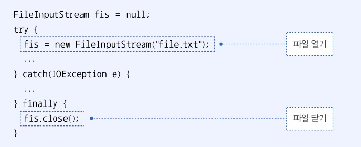

# 11.3 예외 종류에 따른 처리
- 다중 catch 사용하여 발생하는 예외에 따라 예외 처리 코드 다르게 작성 가능
- catch 블록의 예외 클래스 -> try 블록에서 발생된 예외의 종류. 예외에 따라 catch 블록 선택되어 실행
- catch 블록이 여러개여도 단 하나만 실행
  - try 블록에서 동시 다발적으로 예외가 발생하지 않음
  - 하나의 예외 발생 시 즉시 실행을 멈추고 catch 블록으로 이동하기 때문

```java
package java_08.java_240802;

public class ExceptionHandlingExample {
    public static void main(String[] args) {
        String[] array = {"100", "1oo"};

        for (int i=0; i <=array.length; i++) {
            try {
                int value = Integer.parseInt(array[i]);
                System.out.println("array[" + i + "]: "+ value);
            } catch (ArrayIndexOutOfBoundsException e) {
                System.out.println("배열 인덱스가 초과됨 " + e.getMessage());
            } catch (NumberFormatException e) {
                System.out.println("숫자로 변환할 수 없음: " + e.getMessage());
            }
        }
    }
}

```

```java
array[0]: 100
숫자로 변환할 수 없음: For input string: "1oo"
배열 인덱스가 초과됨 Index 2 out of bounds for length 2
```

- 처리해야 할 예외 클래스들이 상속 관계에 있을 때는 하위 클래스 catch 블록 먼저 작성
  - catch 블록은 위에서 부터 차례대로 검사하기 때문


- 두 개 이상의 예외를 하나의 catch 블록으로 동일하게 처리하고 싶은 경우

```java
package java_08.java_240802;

public class ExceptionHandlingExample2 {
    public static void main(String[] args) {
        String[] array = {"100", "1oo", null, "200"};

        for (int i=0; i <=array.length; i++) {
            try {
                int value = Integer.parseInt(array[i]);
                System.out.println("array[" + i + "]: "+ value);
            } catch (ArrayIndexOutOfBoundsException e) {
                System.out.println("배열 인덱스가 초과됨 " + e.getMessage());
            } catch (NullPointerException | NumberFormatException e) {
                // 하나로 처리하고 싶은 경우  |로 묶어줌
                System.out.println("데이터에 문제가 있음: " + e.getMessage());
            }
        }
    }
}

```

```java
array[0]: 100
데이터에 문제가 있음: For input string: "1oo"
데이터에 문제가 있음: Cannot parse null string
array[3]: 200
배열 인덱스가 초과됨 Index 4 out of bounds for length 4

```

# 11.4 리소스 자동 닫기
- 리소스 : 데이터를 제공하는 객체
  - 사용하기 위해 열어야(open)하며 사용 끝난 후 닫아야(close)함
  - 리소스 사용 중 예외 발생 시 안전하게 닫는 것이 중요

1. finally 블록 이용
- finally 블록을 이용해 예외 발생 여부와 상관 없이 항상 close
- 

2. try-with-resources 블록 이용
- 예외 발생 여부와 상관없이 리소스를 자동으로 닫아줌
- try 블록에 리소스 여는 코드 작성 -> 실행 완료 or 예외 발생시 close() 메소드 호룿ㄹ
- 사용하기 위한 조건
  - 리소스는 `java.lang.AutoColseable` 인터페이스를 구현해 `close()` 메소드 재정의 해야 함
  - 복수 개의 리소스를 사용해야 한다면 세미콜론으로 구분
  - Java 8 이전에서는 try 괄호 안에서 리소스 변수 선언해야 했지만, Java 9 이후부터는 리소스 변수 사용 가능

```java
package java_08.java_240802;

public class MyResource implements AutoCloseable {
    private String name;

    public MyResource(String name) {
        this.name = name;
        System.out.println("[My Resource(" + name + ") 열기]");
    }

    public String read1() {
        System.out.println("[My Resource(" + name + ") 읽기]");
        return "100";
    }
    public String read2() {
        System.out.println("[My Resource(" + name + ") 읽기]");
        return "abc";
    }

    @Override
    public void close() throws Exception {
        System.out.println("[My Resource(" + name + ") 닫기]");
    }
}

```

```java
package java_08.java_240802;

public class TryWithResourceExample {
    public static void main(String[] args) {
        try (MyResource res = new MyResource("A")) {
            String data = res.read1();
            int value = Integer.parseInt(data);
        } catch (Exception e) {
            System.out.println("예외 처리: " + e.getMessage());
        }

        System.out.println();

        try (MyResource res = new MyResource("A")) {
            String data = res.read2();
            // NumberFormatException 발생
            int value = Integer.parseInt(data);
        } catch (Exception e) {
            System.out.println("예외 처리: " + e.getMessage());
        }

        System.out.println();

        MyResource res1 = new MyResource("A");
        MyResource res2 = new MyResource("B");
        try (res1; res2) {
            String data1 = res1.read1();
            String data2 = res2.read1();
        } catch (Exception e) {
            System.out.println("예외 처리: " + e.getMessage());
        }
    }
}

```

```java
[My Resource(A) 열기]
[My Resource(A) 읽기]
[My Resource(A) 닫기]

[My Resource(A) 열기]
[My Resource(A) 읽기]
[My Resource(A) 닫기]
예외 처리: For input string: "abc"

[My Resource(A) 열기]
[My Resource(B) 열기]
[My Resource(A) 읽기]
[My Resource(B) 읽기]
[My Resource(B) 닫기]
[My Resource(A) 닫기]
```

# 11.5 예외 떠넘기기
- 메소드 호출한 곳으로 예외를 떠넘길 수 있음
- 메소드 선언부 끝에 `throws` 사용
- 떠넘길 예외 클래스를 쉼표로 구분하여 나열
- 이 메소드를 호출하는 곳에서 예외를 받아 처리해야 함

```java
package java_08.java_240802;

public class ThrowsExample1 {
    public static void main(String[] args) {
        // 호출한 곳에서 처리
        try {
            findClass();
        } catch (ClassNotFoundException e) {
            System.out.println("예외 처리: " + e.toString());
        }
    }

    public static void findClass() throws ClassNotFoundException {
        Class.forName("java.lang.String2");
    }
}

```

```java
예외 처리: java.lang.ClassNotFoundException: java.lang.String2
```

- 나열해야 할 예외 클래스가 많은 경우 Exception 또는 Throwable 만으로 모든 예외 떠넘길 수 있음
- main 메소드에서 떠넘기는 경우 JVM이 예외 처리 -> 예외 내용 콘솔에 출력하는 것으로 예외 처리

```java
package java_08.java_240802;

public class ThrowsExample2 {
    public static void main(String[] args) throws Exception{
        findClass();
    }

    public static void findClass() throws ClassNotFoundException {
        Class.forName("java.lang.String2");
    }
}

```

```java
Exception in thread "main" java.lang.ClassNotFoundException: java.lang.String2
	at java.base/jdk.internal.loader.BuiltinClassLoader.loadClass(BuiltinClassLoader.java:641)
	at java.base/jdk.internal.loader.ClassLoaders$AppClassLoader.loadClass(ClassLoaders.java:188)
	at java.base/java.lang.ClassLoader.loadClass(ClassLoader.java:521)
	at java.base/java.lang.Class.forName0(Native Method)
	at java.base/java.lang.Class.forName(Class.java:390)
	at java.base/java.lang.Class.forName(Class.java:381)
	at java_08.java_240802.ThrowsExample2.findClass(ThrowsExample2.java:9)
	at java_08.java_240802.ThrowsExample2.main(ThrowsExample2.java:5)
```


# 11.6 사용자 정의 예외
- 표준 라이브러리에 존재하지 않아 직접 예외 클래스를 정의해서 사용하는 예외

## 사용자 정의 예외
- 일반 예외(컴파일러가 체크)와 실행 예외(컴파일러가 체크X)로 선언 가능
  - 일반 예외 : Exception의 자식클래스로 선언
  - 실행 예외 : RuntimeException의 자식클래스로 선언
- 기본 생성자와 예외 메시지를 입력받는 생성자를 선언
  - 예외 메시지는 부모 생성자 매개값으로 전달 -> 예외 객체 공통 메소드인 getMessage의 리턴값으로 사용하기 위함

```java
package java_08.java_240802;

public class InsufficientException extends Exception {
    // 두 개의 생성자 선언
    public InsufficientException() {}
    
    public InsufficientException(String message) {
        super(message);
    }
}

```

## 예외 발생 시키기
- throw 객체와 함께 예외 객체를 제공
- 대부분 메소드 호출한 곳에서 예외 처리하고도록 throws 키워드 사용

```java
package java_08.java_240802;

public class Account {
    private long balance;

    public Account() {}

    public long getBalance() {
        return balance;
    }

    public void deposit(int money) {
        balance += money;
    }

    public void withdraw(int money) throws InsufficientException {
        if (balance < money) {
            throw new InsufficientException("잔고 부족: " + (money - balance) + " 모자람");
        }
        balance -= money;
    }
}

```

```java
package java_08.java_240802;

import java_07.java_240726.ex02.A;

public class AccountExample {
    public static void main(String[] args) {
        Account account = new Account();
        // 예금하기
        account.deposit(10000);
        System.out.println("예금액: " + account.getBalance());

        // 출금하기
        try {
            account.withdraw(30000);
        } catch (InsufficientException e) {
            // 에러 처리 코드와 함께 withdraw() 메소드 호출
            String message = e.getMessage();
            System.out.println(message);
        }
    }
}

```

```java
예금액: 10000
잔고 부족: 20000 모자람

```