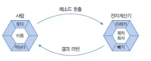
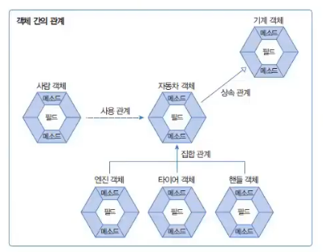
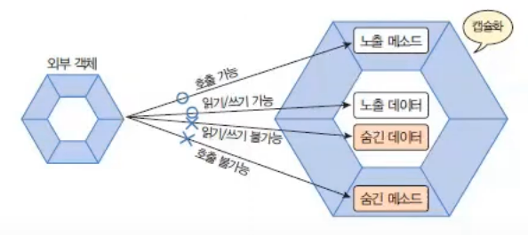

# 6. 클래스
# 6.1 객체 지향 프로그래밍 (OOP : Object Oriented Programming)
- 객체를 만들고, 객체들을 하나씩 조립해서 완성된 프로그램을 만드는 기법

## 객체 (Object)
- 물리적으로 존재하거나 개념적인 것 중에서 다른 것과 식별 가능한 것
- 속성(필드, Field)과 동작(메소드, method)으로 구성
- 자동차 -> 속성 : 기종, 색상 동작 : 달린다, 멈춘다

객체 모델링 (Object modeling)  
- 현실 세계의 객체를 소프트웨어 객체로 설계하는 것
- 현실 세계의 대표 속성과 동작을 소프트웨어 객체의 필드와 메소드로 정의하는 과정

## 객체의 상호작용
- 객체들은 다른 객체와 상호작용하면서 동작한다.
- 상호작용 수단 : 메소드 -> 객체가 다르 ㄴ객체의 기능을 이용할 때 메소드 호출
- 사람이 계산기로 계산하는 과정



## 객체 간의 관계

  

1. 집합 관계
- 완성품과 부품의 관계
- 자동차 - 엔진 / 타이어 / 핸들
2. 사용 관계
- 다른 객체의 필드를 읽고 변경하거나 호출하는 관계
- 사람 - 자동차
3. 상속 관계
- 부모로부터 내용을 물려받는 것
- 기계 : 부모 객체 - 자동차 : 자식 객체

## 객체 지향 프로그래밍의 특징
1. 캡슐화  
  
- 객체의 데이터와 동작을 하나로 묶고 실제 구현 내용을 외부에 감추는 것 -> 외부의 잘못된 사용 방지
- 외부 객체는 객체 내부 구조를 알 수 없음. 객체가 제공하는 필드와 메서드만 이용 가능
- 접근 제한자 사용하여 노출 여부 결정

2. 상속
- 부모 객체가 가지고 있는 필드와 메소드를 자식 객체에게 물려주어 자식 객체가 사용할 수 있도록 하는 것
- 코드의 재사용성 높임 -> 중복 코딩 X
- 유지 보수 시간을 최소화 -> 부모 객체의 필드와 메소드 수정 시 자식 객체에도 적용

3. 다형성
- 사용 방법은 동일하지만 실행 결과가 다양하게 나오는 성질
- 구성하는 객체에 따라 프로그램 실행 성능이 다르게 나올 수 있음
- 오버라이딩, 오버로딩

# 6.2 객체와 클래스
- 클래스 : 객체의 설계도
- 인스턴스 : 클래스로부터 생성된 객체
- 인스턴스화 : 클래스로부터 개체를 만드는 과정 


# 6.3 클래스 선언
- 복수개의 클래스 선언 가능
- 소스파일명과 동일한 클래스만 공개 클래스 선언 가능
  - 이유가 궁금해서 GPT에게 물어봤슴다
  - 명확한 식별 : 외부에서 접근시 소스 파일명과 클래스명이 일치하면 파일 시스템에서 쉽게찾을 수 있기 때문
  - 컴파일러의 효율성 : 클래스 로딩과 관련된 작업 효율적 처리 가능 -> 컴파일 시간 줄이고 오류 방지
  - 코드 관리 및 유지 보수, 몇몇 규칙 및 일관성

```java
package java_2406.java_240606; // 패키지 선언

// 클래스 선언
public class day03_PublicClass {
}

// 클래스 선언
class newClass {
}
```

## 클래스의 두 가지 용도
- 자바 프로그램 : 하나의 실행 클래스와 여러 개의 라이브러리 클래스들로 구성  

1. 라이브러리 (library) : 실행할 수 없으며 다른 클래스에서 이용하는 클래스

```java
package java_2406.java_240606;

public class Student {
}
```
2. 실행 클래스(main) : 메소드를 가지고 있는 실행 가능한 클래스

```java
package java_2406.java_240606;

public class StudentExample {
    public static void main(String[] args) {
        Student s1 = new Student();
        System.out.println("Student 객체 참조합니다.");
    }
}
```

## 클래스의 구성 요소
1. 필드 : 객체의 데이터가 저장되는 곳
2. 생성자 : 객체 생성 시 초기화 역할 담당 -> new 연산자
3. 메소드 : 객체의 동작으로 호출 시 생성하는 블록 -> 객체 내부의 함수