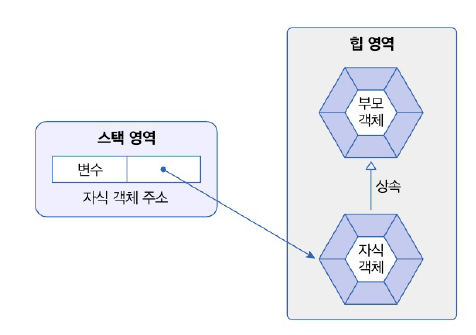
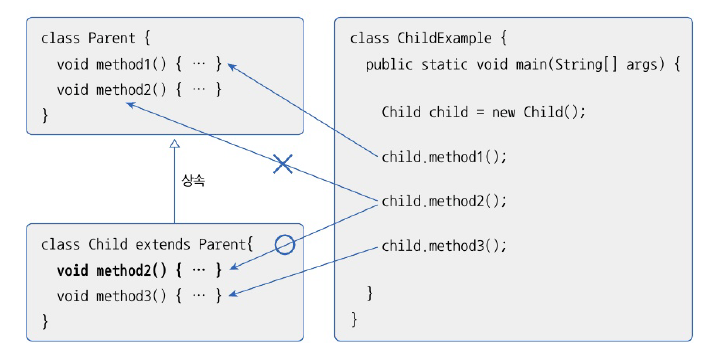
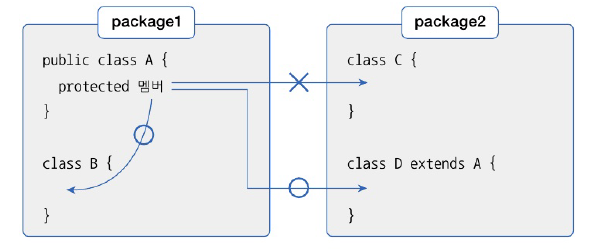

# 7.3 부모 생성자 호출
- 자식 객체 생성시 부모 객체가 먼저 생성된 다음에 자식 객체 생성

### 부모 생성자 호출 과정
  
- 모든 객체 생성자를 호출해야만 생성
- 부모 생성자는 자식 생성자 맨 첫 줄에 숨겨져 있는 super() 호출
  - super()
    - 컴파일 과정에서 자동 추가
    - 부모 클래스에 기본 생성자가 없다면 자식 생성자 선언에서 컴파일 에러 발생

```java
// 자식 생성자 선언
public 자식클래스(){
    super();
}
```

#### 예제
- 부모 클래스

```java
package java_2406.java_240627;

public class Phone {
    // 필드 선언
    public String model;
    public String color;

    // 기본 생성자 선언
    public Phone() {
        System.out.println("Phone 생성자 실행");
    }
}

```

- 자식 클래스

```java
package java_2406.java_240627;

public class SmartPhone extends Phone {
    // 자식 생성자 선언
    public SmartPhone(String model, String color) {
        super(); // 생략 가능 -> 컴파일 시 자동 추가
        this.model = model;
        this.color = color;
        System.out.println("SmartPhone(String model, String color) 생성자 실행됌");
    }
}
```

- 사용 예제

```java
package java_2406.java_240627;

public class SmartPhoneExample {
    public static void main(String[] args) {
        // SmartPhone 객체 생성
        SmartPhone myPhone = new SmartPhone("갤럭시", "블루");

        // Phone으로부터 상속 받은 필드 읽기
        System.out.println("모델: " + myPhone.model);
        System.out.println("색상: " + myPhone.color);
    }
}

```

- 결과
```java
Phone 생성자 실행
SmartPhone(String model, String color) 생성자 실행됌
모델: 갤럭시
색상: 블루
```

# 7.4 메소드 재정의
- 매소드 오버라이딩 : 상속된 메소드를 자식 클래스에서 재정의하는 것
- 부모 메소드는 숨겨지고, 자식 메소드가 우선적으로 사용



메소드 오버라이딩 규칙  
1. 부모 메소드의 선언부(리턴 타입, 메소드 이름, 매개변수)와 동일해야 한다.
2. 접근 제한을 더 강하게 오버라이딩할 수 없다.(public -> private으로 변경 불가)
3. 새로운 예외를 throws 할 수 없다

- 부모 클래스

```java
package java_2406.java_240627;

public class Calculator {
    // 메소드 선언
    public double areaCircle(double r) {
        System.out.println("Calculator 객체의 areaCircle() 실행");
        return 3.1459 * r * r;
    }
}

```

- 자식 클래스

```java
package java_2406.java_240627;

public class Computer extends Calculator {
    // 메소드 오버라이딩
    @Override // 컴파일시 저오학히 오버라이딩이 되었는지 체크 (생략가능)
    public double areaCircle(double r) {
        System.out.println("Computer 객체의 areaCircle 실행");
        return Math.PI * r * r;
    }
}

```
- 비교 예제

```java
package java_2406.java_240627;

public class ComputerExample {
    public static void main(String[] args) {
        int r = 10;

        Calculator calculator = new Calculator();
        System.out.println("원 면적: " + calculator.areaCircle(r));
        System.out.println();

        Computer computer = new Computer();
        System.out.println("원 면적 : " + computer.areaCircle(r));
    }
}

```

- 결과
  - Calculator를 상속 받았지만 areaCircle 메소드 오버라이딩
  - Computer의 areaCircle 실행시 오버라이딩된 값으로 실행
```java
Calculator 객체의 areaCircle() 실행
원 면적: 314.59000000000003

Computer 객체의 areaCircle 실행
원 면적 : 314.1592653589793
```

## 부모 메소드 호출
- 메소즈 재정의시 중복된 내용을 자식 메소드도 가지고 있어야 함
  - 1줄만 추가하더라도 이전의 코드 다시 작성해야 함
- 공동 처리 기법 
  - 자식 내 부모 메소드 호출
  - supter 키워드, 도트(.) 연산자 사용
  - 자식 메소드의 중복 작업 내용을 없애는 효과
```java
// 자식클래스에서 아래와 같이 작성해주면 된다!
super.메소드();
```

# 7.5 final 클래스와 final 메소드
## final 클래스
- 클래스 선언 시 final 키워드 -> 최종 클래스. 더 이상 상속 X
- final 클래스 : 부모 클래스가 될 수 없어 자식 클래스 만들 수 없음

```java
public final class 클래스 {}
```

## final 메소드
- 메소드 선언시 final 키워드 -> 최종적인 메소드. 오버라이딩 불가
- 부모 클래스를 상속해 자식 클래스 선언 -> 부모 클래스에 선언된 final 메소드는 자식 클래스에서 재정의 불가


# 7.6 protected 접근 제한자
protected   
- 같은 패키지에서는 접근 가능
- 다른 패키지의 경우 자식 클래스만 접근 허용



