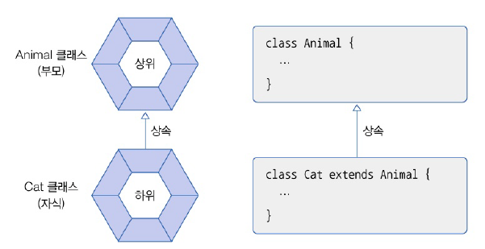
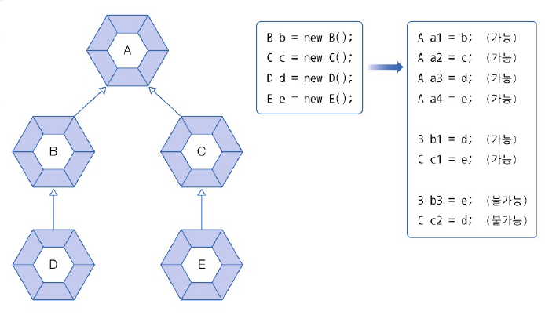
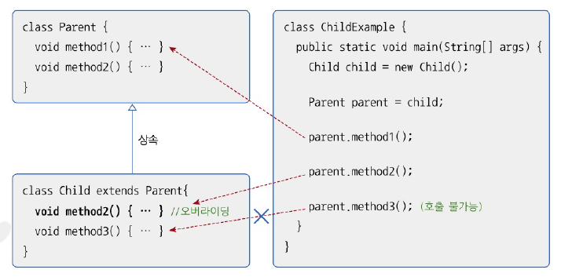
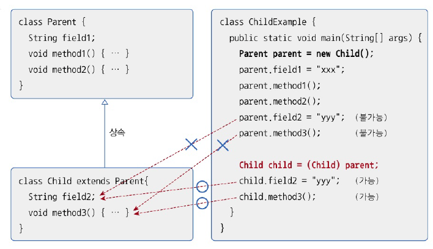

# 7.7 타입 변환
- 클래스의 타입 변환 -> 상속 관계에 있는 클래스에서 발생

## 자동 타입 변환
- 자식은 부모의 특징과 기능을 상속 받음 -> 동일하게 취급될 수 있음
  

- 고양이는 동물에 속한다 == 고양이는 동물이다
  

```java
Cat cat = new Cat(); // Animal animal = new Cat(); 도 가능
Animal animal = cat;

cat == animal // true
```

- 상속 계층에서 상위 타입이라면 자동 타입 변환
  

```java
package java_2406.java_240628;

class A {
}

class B extends A {
}

class C extends A {
}

class D extends B {
}

class E extends C {
}

public class PromotionExample {
    public static void main(String[] args) {
        B b = new B();
        C c = new C();
        D d = new D();
        E e = new E();

        // 자동 타입 변환 : 상속 관계에 있음
        A a1 = b;
        A a2 = c;
        A a3 = d;
        A a4 = e;

        B b1 = d;
        C c1 = e;

        // 컴파일 에러 : 상속 관계에 있지 않음
//        B b3 = e;
//        C c2 = d;
    }
}

```

- 부모 타입으로 자동 타입 변환 -> 부모 클래스의 필드와 메소드만 접근 가능
- 변수는 자식 객체를 참조 -> 변수로 접근 가능한 멤버는 부모 클래스 멤버로 한정
- 자식 클래스에서 오버라이딩된 메소드 -> 부모 메소드 X 오버라이딩된 메소드가 호출



## 강제 타입 변환
- 캐스팅 연산자로 부모 타입을 자식 타입으로 강제 타입 변환
- 자식 타입에서 선언된 필드와 메소드 사용해야 하는 경우 사용

```java
Parent parent = new Child(); // 자동 타입 변환
Child child = (Child) parent; // 강제 타입 변환
```


# 7.8 다형성
- 사용 방법은 동일하지만 실행 결과가 다양하게 나오는 성질
- 자동 타입 변환 + 메소드 오버라이딩 -> 다형성

## 필드 다형성
- 필드 타입은 동일하지만, 대입되는 객체가 달라져 결과가 다양하게 나오는 경우
- 사용 방법은 동일함

예제  
- Tire를 상속받은 한국타이어, 금호타이어가 roll 메소드 오버라이딩
- 대입되는 객체에 따라 print 되는 값이 달라짐


- Tire

```java
package java_2406.java_240628;

public class Tire {
    // 메소드 선언
    public void roll() {
        System.out.println("회전합니다.");
    }
}
```

- HankookTire

```java
package java_2406.java_240628;

public class HankookTire extends Tire {
    // 메소드 재정의 (오버라이딩)
    @Override
    public void roll() {
        System.out.println("한국 타이어가 회전합니다.");
    }
}
```

- KumhoTire

```java
package java_2406.java_240628;

public class KumhoTire extends Tire {
    // 메소드 재정의 (오버라이딩)
    @Override
    public void roll() {
        System.out.println("금호 타이어가 회전합니다.");
    }
}

```
- Car

```java
package java_2406.java_240628;

public class Car {
    // 필드 선언
    public Tire tire;

    // 메소드 선언
    public void run() {
        // tire 필드에 대입된 객체의 roll() 메소드 호출
        tire.roll();
    }
}

```
- CarExample

```java
package java_2406.java_240628;

public class CarExample {
    public static void main(String[] args) {
        // Car 객체 생성
        Car myCar = new Car();

        // Tire 객체 장착
        myCar.tire = new Tire();
        myCar.run();

        // HankookTire 객체 장착
        myCar.tire = new HankookTire();
        myCar.run();

        // KumhoTire 객체 장착
        myCar.tire = new KumhoTire();
        myCar.run();
    }
}

```

- 결과
```java
회전합니다.
한국 타이어가 회전합니다.
금호 타이어가 회전합니다.
```