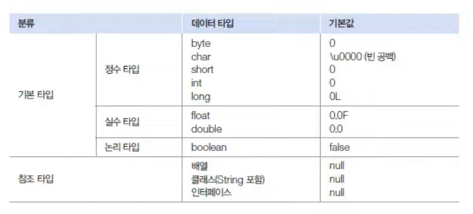
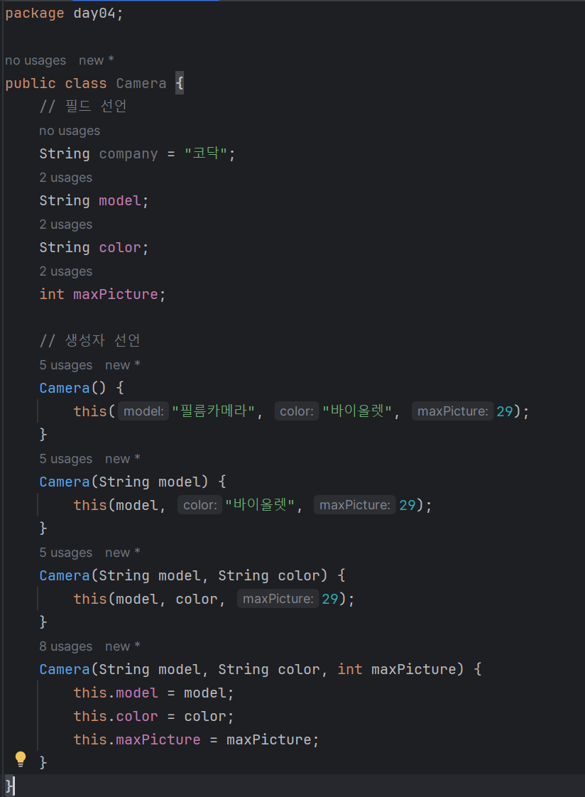

# 6.6 필드 선언과 사용
## 필드와 (로컬) 변수의 차이점
- (로컬) 변수 : 생성자와 메소드 블록에서 선어. 생성자와 메소드 호출 시에만 생성 및 사용
- 필드 : 클래스 블록에서 선언. 객체 내부에 존재. 객체 내외부에서 사용 가능

## 필드 타입별 기본값
- 필드는 초기 값을 제공하지 않는 경우 객체 생성시 자동으로 기본값으로 초기화



# 6.7 생성자 선언과 호출
## 생성자 호출
new 연산자 : 객체를 생성한 후 생성자를 호출해 객체를 초기화 -> 생성자 성공적 실행하면 객체의 주소 리턴
객체 초기화 : 필드 초기화를 하거나 메소드 호출해 객체를 사용할 준비를 하는 것

```java
클래스 변수 = new 클래스(); // 생성자 호출
```
## 기본 생성자
클래스에 생성자 선언이 없는 경우 바이트 코드에 자동적으로 추가되는 코드

- 소스 파일
```java
public class Car {
    
}
```

- 바이트 코드 파일
```java
public class Car {
    public Car() { } // 기본 생성자 자동으로 추가
}
```

## 필드 초기화
- 객체마다 동일한 값 -> 필드 선언시 초기값 대입
- 객체마다 다른 값 -> 생성자에서 필드를 초기화

```java
package java_240607;

public class Korean {
    // 필드 선언
    String nation = "대한민국"; // 한국인을 저장하므로 국가 지정
    String name;
    String ssn;

    // 생성자 선언 -> 이름과 주민번호는 생성자에서 초기화
    public Korean(String name, String ssn) {
        this.name = name;
        this.ssn = ssn;
    }
}
```

## 생성자 오버로딩
매개변수를 달리하는 생성자를 여러개 선언하는 것

- 매개변수의 수만 다르고 필드 초기화 내용이 비슷한 생성자의 경우 아래와 같이 중복을 줄일 수 있음
- 초기화 내용이 다르다면 각각 생성해 주어야함 !!

```java
package java_240607;

public class Camera {
    // 필드 선언
    String company = "코닥";
    String model;
    String color;
    int maxPicture;

    // 생성자 선언
    Camera() {
        this("필름카메라", "바이올렛", 29);
    }

    Camera(String model) {
        this(model, "바이올렛", 29);
    }

    Camera(String model, String color) {
        this(model, color, 29);
    }

    Camera(String model, String color, int maxPicture) {
        this.model = model;
        this.color = color;
        this.maxPicture = maxPicture;
    }
}
```
- 최고의 툴 인텔리제이! 헷갈리지 않게 이렇게 보여줍니다.

