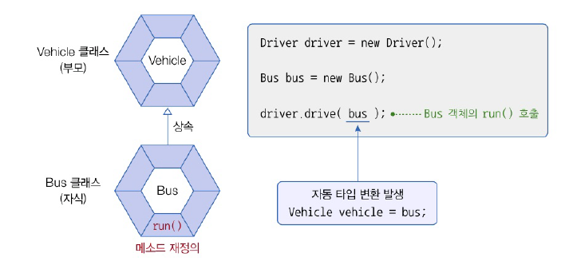

## 매개변수 다형성
- 메소드가 클래스 타입의 매개변수를 가지고 있을 경우
  - 호출할 때 동일한 타입의 객체를 제공
  - 자식 객체를 제공할 수도 있음



예제  
- Vehicle 을 상속 + 오버라이딩 하는 클래스 bus, taxi 생성
- Vehicle을 매개변수로 받는 Driver 생성
  - Vehicle의 자식 객체인 bus와 taxi도 적용 가능
  - 메소드를 사용하는 경우 오버라이딩된 메소드 사용 !

---

- Vehicle 
```java
package java_240704;

public class Vehicle {
    // 메소드 선언
    public void run() {
        System.out.println("차량이 달립니다.");
    }
}

```
- Bus
```java
package java_240704;

public class Bus extends Vehicle{
    // 메소드 재정의
    @Override
    public void run(){
        System.out.println("버스가 달립니다.");
    }
}

```
- Taxi
```java
package java_240704;

public class Taxi extends Vehicle{
    // 메소드 재정의
    @Override
    public void run(){
        System.out.println("택시가 달립니다.");
    }
}


```
- Driver
```java
package java_240704;

public class Driver {
    // 메소드 선언 (클래스 타입의 매개변수를 가지고 있음)
    public void drive(Vehicle vehicle){
        veichle.run();
    }
}

```
- DriverExample
```java
package java_240704;

public class DriverExample {
    public static void main(String[] args) {
        // Driver 객체 생성
        Driver driver = new Driver();

        // 매개값으로 Bus 객체를 제공하고 driver() 메소드 호출
        Bus bus = new Bus();
        driver.drive(bus);

        // 매개값으로 Taxi 객체를 제공하고 driver() 메소드 호출
        Taxi taxi = new Taxi();
        driver.drive(taxi);
    }
}

```

- 결과
```java
버스가 달립니다.
택시가 달립니다.

```