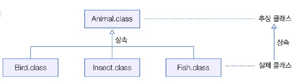

# 7.9 객체 타입 확인
- 변수가 참조하는 객체의 타입을 확인하고자 할 때
- 객체 `instanceof` 타입
  - 좌항의 객체가 우항의 타입인 경우 : true
  - 좌항의 객체가 우항의 타입이 아닌 경우 : false

```java
import java_240606.Student;

Parent parent1 = new Parent();
Parent parent2 = new Child();

// 전통적인 방식
if (parent1 instanceof Child) {
    Child child = (Child) parent1;
    System.out.println("child의 이름: " + child.getName());
}

// java 12부터 사용 가능한 방식
if (parent1 instanceof Child child) {
    System.out.println("child의 이름: " + child.getName());
}

if (parent2 instanceof Child child) {
    System.out.println("child의 이름: " + child.getName());
} 
```

- `parent instanceof Child`
  - 전통적인 사용
  - 타입 체크와 타입 캐스팅을 별도로 수행해야 함
- `parent instanceof Child child`
  - 타입 체크와 타입 캐스팅을 한 번에 수행
  - 코드가 더 간결하고 명확해진다!

---
- 실행 결과
  - parent2만 참조하는 객체가 Child이므로 마지막 문장만 수행된다!

# 7.10 추상 클래스
- 실체 클래스 : 객체를 생성할 수 있는 클래스
- 추상 클래스 : 실체 클래스들의 공통적인 필드나 메소드를 추출해서 선언한 클래스
  - 추상 글래스는 실체 클래스의 부모 역할
  - 실체 클래스는 추상 클래스를 상송해서 공통적인 필드나 메소드 물려받을 수 있음
  - 실체 클래스의 공통되는 필드와 메소드 추출하여 생성 -> new 연산자 사용하여 직접 객체 생성 X
  - extends 뒤에만 올 수 있음



## 추상 클래스 선언
- abstract 키워드
- 필드, 메소드 선언 가능. 생성자 반드시 존재 해야 함

```java
public abstract class 클래스명 {
    // 필드
    // 생성자
    // 메소드
}
```

- 예제
  - 추상 클래스의 Phone의 메소드를 상속받아서 사용


--- 
- Phone
```java
package java_240705;

public abstract class Phone {
    // 필드 선언
    String owner;
    
    // 생성자 선언
    Phone(String owner) {
        this.owner = owner;
    }
    
    // 메소드 선언
    void turnOn() {
        System.out.println("폰 전원을 켭니다.");
    }
    
    void turnOff() {
        System.out.println("폰 전원을 끕니다.");
    }
}
```

- SmartPhone
```java
package java_240705;

public class SmartPhone extends Phone{
    // 생성자 선언
    SmartPhone(String owner) {
        // Phone 생성자 호출
        super(owner);
    }
    // 메소드 선언
    void internetSearch() {
        System.out.println("인터넷 검색을 합니다.");
    }
}

```

- PhoneExample
```java
package java_240705;

public class PhoneExample {
    public static void main(String[] args) {
        SmartPhone smartPhone = new SmartPhone("홍길동");

        smartPhone.turnOn();
        smartPhone.internetSearch();
        smartPhone.turnOff();
    }
}

```
- 결과
```java
폰 전원을 켭니다.
인터넷 검색을 합니다.
폰 전원을 끕니다.
```

## 추상 메소드와 재정의
- 자식 클래스에서 메소드 재정의 가능
- 추상 클래스에 추상 메소드 선언 가능
  - 실행 내용이 자식 클래스 마다 다르므로 통일하여 작성 불가능
```java
public abstract class Animal {
    // 추상 메소드
    abstract void sound();
}
```