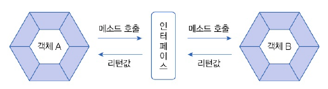
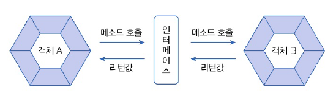
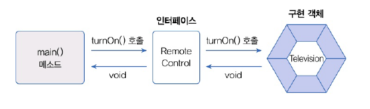
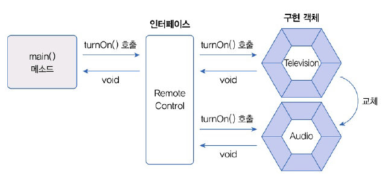
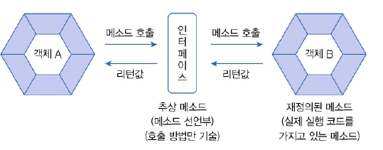

# 08. 인터페이스
# 8.1 인터페이스 역할
- 두 객체를 연결하는 역할
- 객체의 교체 발생 시 인터페이스에서 처리
- 인터페이스를 통해 다형성을 구현



# 8.2 인터페이스와 구현 클래스 선언
## 인터페이스 선언
- class 키워드 대신 interface 키워드 사용
- 접근 제한자 : default, public

```java
public interface 인터페이스명 {
    // public 상수 필드
    // public 추상 메소드
    // public 디폴트 메소드
    // public 정적 메소드
    // private 메소드
    // private 정적 메소드
}
```

## 구현 클래스 선언


- 객체 A가 인터페이스의 추상 메소드 호출 -> 인터페이스는 객체 B의 메소드 실행
- 객체 B에 인터페이스에 선언된 추상 메소드와 동일한 선언부를 가진 (재정의된) 메소드 필요
  - 객체 B : 구현한(implement) 객체
  - 인터페이스에 정의된 추상 메소드 대한 실행 내용이 구현(작성)되어 있기 때문
  - implements 키워드는 해당 클래스가 인터페이스를 통해 사용할 수 있다는 표시
  - 인터페이스의 추상 메소드를 재정의한 메소드가 있다는 뜻

---
- 예제
- 인터페이스에서는 추상 메소드만 정의
- 구현 클래스에서 그에 대한 내용을 재정의한다!



- RemoteControl
```java
package java_240706;

public interface RemoteControl {
    // public 추상 메소드
    public void turnOn();
}

```

- Television
```java
package java_240706;

public class Television implements RemoteControl {
    // 인터페이스에 선언된 추상 메소드 재정의
    @Override
    public void turnOn() {
        System.out.println("TV를 켭니다.");
    }
}
```

## 변수 선언과 구현 객체 대입
- 참조 타입. 인테페이스 객체에 null 대입 가능 (객체를 참조하고 있지 않다는 의미)

```java
RemoteControl rc;
RemoteControl rc = null;
```

- 구현 객체 사용시 인터페이스 변수에 구현 객체 대입
- RemoteControlExample
```java
package java_240706;

public class RemoteControlExample {
    public static void main(String[] args) {
        RemoteControl rc;
        rc =  new Television();
        rc.turnOn();
    }
}
```

- 실행 결과
```java
TV를 켭니다.
```


- 추가 예제  
  - 구현 객체가 두개인 경우



---
- Audio
```java
package java_240706;

public class Audio implements RemoteControl{
    @Override
    public void turnOn() {
        System.out.println("Audio를 켭니다.");
    }
}
```

- RemoteControlExample
  - 객체의 교체 발생
```java
package java_240706;

public class RemoteControlExample {
    public static void main(String[] args) {
        RemoteControl rc;
        rc =  new Television();
        rc.turnOn();
        
        rc = new Audio();
        rc.turnOn();
    }
}
```

- 실행 결과
```java
TV를 켭니다.
Audio를 켭니다.
```

## 8.3 상수 필드
- 인터페이스에 선언된 필드는 모두 public static final 특성을 갖음
- 컴파일 과정에서 자동적으로 붙음
- 불변의 상수 필드를 멤버로 가질 수 있음

```java
public interface RemoteControl {
    int MAX_VOLUME = 10;
}
```

```java
public class RemoteControlExample {
  public static void main(String[] args) {
    System.out.println(RemoteControl.MAX_VOLUME);
  }
}
```

## 8.4 추상 메소드
- 리턴 타입, 메소드명, 매개변수만 기술되고 중괄호를 붙이지 않음



```java
void turnOn(); // 메소드 선언부만 작성
```
