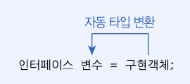
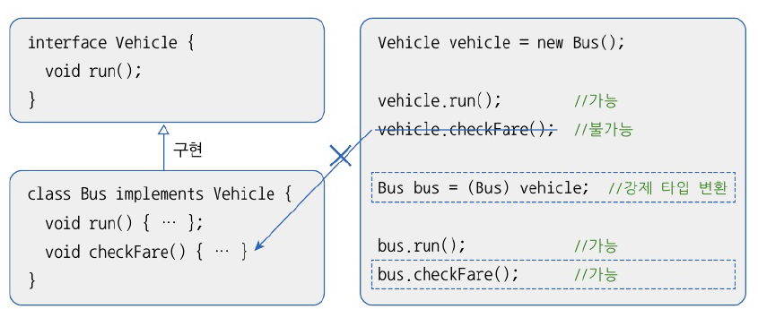

# 8.10 타입 변환
- 인터페이스와 구현 클래스간 발생
- 인터페이스 변수에 구현 객체를 대입하면 구현 객체는 인터페이스 타입으로 자동 타입 변환
- 인터페이스 타입을 구현 클래스 타입으로 변환 시킬 수 있음. 강제 타입 변환

## 자동 타입 변환
- 부모 클래스가 인터페이스를 구현하고 있다면 인터페이스 타입으로 자동 타입 변환 가능

  

## 강제 타입 변환

- 캐스팅 기호 사용하여 인터페이스 타입을 구현 클래스 타입으로 변환시키는 것
- 구현 객체가 인터페이스 타입으로 자동 변환되면, 인터페이스에 선언된 메소드만 선언니 가능
- 타입 변환 후에 다른 메소드를 호출하고 싶다면 강제 타입 변환 필요

  
  

# 8.11 다형성
- 인터페이스를 통해 다형성 구현하는 경우 > 상속으로 다형성을 구현하는 경우
- 객체B와 객체 C 중 어느 객체가 인터페이스에 대입되었느냐에 따라 호출 결과 달라질 수 있음 -> 다형성 구현

- 메소드 재정의 + 자동 타입 변환 => 다형성
  - 인터페이스의 추상 메소드 구현 클랜스에서 재정의
  - 재정의 되는 내용은 구현 클래스 마다 다름
  - 구현 객체는 인터페아스 타입으로 자동 평환
  - 인터페이스 호출 시 구현 객체의 재정된 메소드가 호출 되어 다양한 실행 결과
