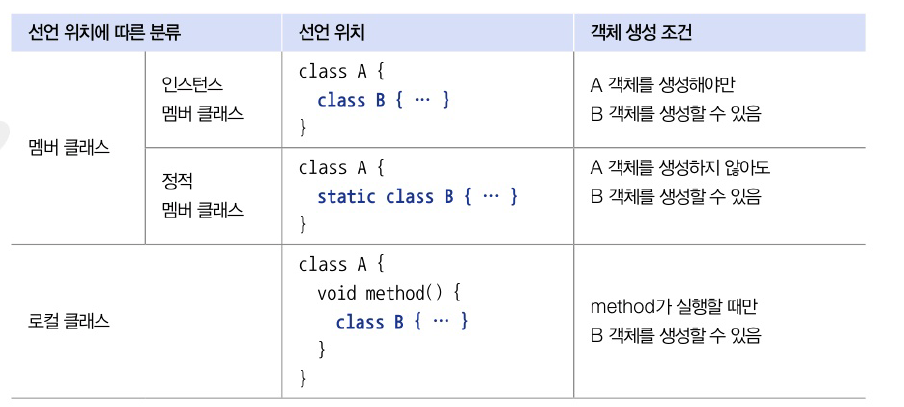

# 9. 중첩 선언과 익명 객체
# 9.1 중첩 클래스
- 클래스가 여러 클래스와 관계를 맺는 경우 독립적으로 선언하는 것이 좋음
- 특정 클래스만 맺을 경우에는 `중첩 클래스`로 선언하는 것이 유지보수에 도움

**중첩 클래스 (Nested Class)**  
- 클래스 내부에 선언한 클래스
- 클래스의 멤버를 쉽게 사용할 수 있음
- 외부에는 중첩 관계 클래스를 감춤 -> 코드의 복잡성 줄일 수 있음
- 선언 위치에 따라 분류
  - 멤버 클래스 : 클래스의 멤버로서 선언되는 중첩 클래스
  - 로컬 클래스 : 메소드 내부에서 선언되는 중첩 클래스




- 중첩 클래스도 하나의 클래스 -> 컴파일 시 바이트코드 파일(.class) 별도로 생성


# 9.2 인스턴스 멤버 클래스
- 클래스의 멤벌로 선언된 클래스

```java
public class A {
    public class B { // 인스턴스 멤버 클래스
    }
}
```

- 접근 제한자에 따른 인스턴스 멤버 클래스의 접근 범위
- 인스턴스 멤버 클래스 B는 주로 A 클래스 내부에 사용 -> private 접근 제한인이 일반적
- B 객체는 A 클래스 내부 어디에서나 생서알 수 없음. 인스턴스 필드값, 생성자, 인스턴스 메소드에서 생성 가능
- A 객체가 있어야 B 객체도 생성할 수 있기 때문

| 구분              | 접근 범위                        |
|:----------------|:-----------------------------|
| public class B  | 다른 패키지에서 B 클래스를 사용할 수 있다.    |
| class B         | 같은 패키지에서만 B 클래스를 사용할 수 있다.   |
| private class B | A 클래스 내부에서만 B 클래스를 사용할 수 있다. |


```java
package java_240725;

public class A {
    // 인스턴스 멤버 클래스
    class B {}

    // 인스턴스 필드 값으로 B 객체 대입
    B field = new B();

    // 생성자
    A() {
        B b = new B();
    }

    // 인스턴스 메소드
    void method() {
        B b = new B();
    }
}

```

- B 객체를 A 클래스 외부에 생성하려면 default 또는 public 접근 제한을 가져야 함
- A객체를 생성한 다음 B 객체 생성해야 한다!
```java
package java_240725;

public class AExample {
    public static void main(String[] args) {
        // A 객체 생성
        A a = new A();

        // B 객체 생성
        A.B b = a.new B();
    }
}

```

---
- 인스턴스 멤버 클래스 내부에는 일반클래스와 같이 필드, 생성자 메소드 선언이 올 수 있음
- 정적 필드와 정적 메소드는 JAVA17부터 선언 가능

```java
package java_240725;

public class A2 {
  // 인스턴스 멤버 클래스
  class B2 {
    // 인스턴스 필드
    int field1 = 1;

    // 정적 필드 - JAVA 17부터 허용
    static int field2 = 2;

    // 생성자
    B2() {
      System.out.println("B2 생성자 실행");
    }

    // 인스턴스 메소드
    void method1() {
      System.out.println("B2 method2 실행");
    }

    // 정적 메소드 - JAVA 17부터 허요
    static void method2() {
      System.out.println("B2 method2 실행");
    }
  }
  // 인스턴스 메소드
  void useB() {
    // B 객체 생성 및 인스턴스 필드 및 메소드 사영
    B2 b2 = new B2();
    System.out.println(b2.field1);
    b2.method1();

    // B 클래스의 정적 필드 및 메소드 사용
    System.out.println(B2.field2);
    B2.method2();
  }
}
```

```java
package java_240725;

public class A2Example {
    public static void main(String[] args) {
        // A 객체 생성
        A2 a2 = new A2();

        // A 인스턴스 메소드 호출
        a2.useB();
    }
}

```

- 실행 결과
```java
1
B2 method2 실행
2
B2 method2 실행
```