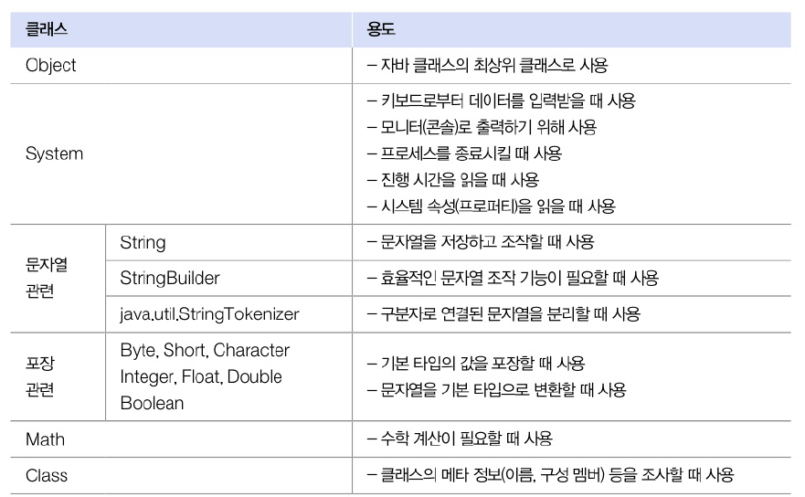
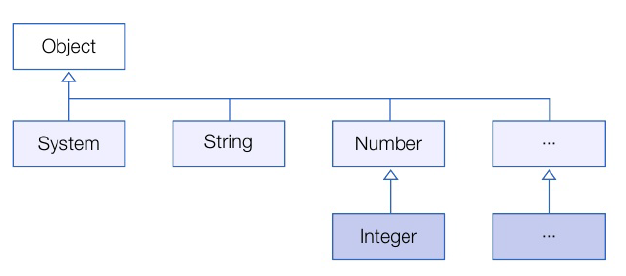
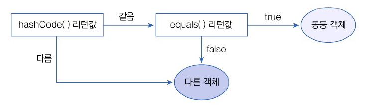

# 12. java.base 모듈
# 12.2 java.base 모듈
- 모든 모듈이 의존하는 기본 모듈
- 모듈 중 유일하게 requires하지 않아도 사용할 수 있음

**java.base 모듈의 주요 패키지와 용도**

| 패키지      | 용도                                     |
|:---------|:---------------------------------------|
| java.lang | 자바 언어의 기본 클래스를 제공                      |
| java.util | 자료 구조와 관련된 컬렉션 클래스를 제공                 |
| java.text | 날짜 및 숫자를 원하는 형태의 문자열로 만들어주는 포맷 클래스를 제공 |
| java.time | 날짜 및 시간을 조작하거나 연산하는 클래스를 제공            |
| java.io  | 입출력 스트림 클래스를 제공                        |
| java.net | 네트워크 통신과 관련된 클래스를 제공                   |
| java.nio | 데이터 저장을 위한 Buffer 및 새로운 입출력 클래스 제공     |


- java.lang은 자바 언어의 기본적인 클래스를 담고 있는 페이지
- 이 패키지에 있는 클래스와 인터페이스는 import 업싱 사용 가능



# 12.3 Object 클래스
- 클래스 선언시 extends 키워드로 다른 클래스를 상속하지 않으면 암시적으로 java.lang.Objecr 클래스 상속
- 자바의 모든 클래스는 Object의 자식이거나 자손 클래스



- Object가 가진 주요 메소드
  - 모든 객체에서 사용 가능

| 메소드                        | 용도                  |
|:---------------------------|:--------------------|
| boolean equals(Object obj) | 객체의 번지를 비교하고 결과를 리턴 |
| int hashCode()             | 객체의 해시코드를 리턴        |
| String toString()          | 객체 문자 정보를 리턴        |


## 객체 동등 비교
- 자동 타입 변환에 의해 모든 객체가 매개값으로 대입될 수 있다.
- `equals()` 메소드는 비교연산자인 ==과 동일한 결과 리턴
  - 두 객체 동일 true 리턴, 그렇지 않으면 false 리턴
- 재정의 하여 동등 비교용으로 사용
- 동등 비교 : 객체가 달라도 내부의 데이터가 같은지 비교

```java
package java_2408.java_240808;

public class Member {
    public String id;

    public Member(String id) {
        this.id = id;
    }

    // Object의 equals() 메소드 재정의
    @Override
    public boolean equals(Object obj) {
        // obj가 Member 타입인지 검사하고 타입 변환 후 target 변수에 대입
        if (obj instanceof Member target) {
            // id 문자열이 같은지 비교
            if (id.equals(target.id)) {
                return true;
            }
        }
        return false;
    }
}
```

## 객체 해시 코드
- 객체를 식별하는 정수
- `hashCode()` 메소드 : 객체의 메모리 번지를 이용해 해시코드 생성. 객체마다 다른 정수값을 리턴
- 두 객체 동등한지 비교할 때 주로 사용
- 객체의 데이터를 기준으로 재정의하여 새로운 정수값을 리턴하도록 하는 것이 일반적
- 내부 데이터가 동일하다면 같은 정수값을 이턴
- 자바는 `hashCode()`와 `equals()` 메소드 같이 사용하는 경우가 많음
  - `hashCode()`가 리턴하는 정수값이 같은지 확인
  - 그 다음 `equals()` 메소드가 true를 리턴하는지 확인하여 판단



```java
package java_2408.java_240808;

public class Student {
    private int no;
    private String name;

    public Student(int no, String name) {
        this.no = no;
        this.name = name;
    }

    public int getNo() {
        return no;
    }

    public String getName() {
        return name;
    }

    /**
     * Object의 hashCode() 메소드를 재정의
     * 학생 번호 + 이름 해시코드 = 새로운 해시코드
     * 번호와 이름이 같으면 동일한 해시코드 생성
     */
    @Override
    public int hashCode() {
        int hashCode = no + name.hashCode();
        return hashCode;
    }

    /**
     * Object의 equals 재정의
     * Student 객체인지 확인, 학생 번호와 이름이 같으면 true 리턴
     */
    @Override
    public boolean equals(Object obj) {
        if (obj instanceof Student target) {
            if (no == target.getNo() && name.equals(target.getName())) {
                return true;
            }
        }
        return false;
    }
}

```

- HashSet : 동등 객체를 중복 저장하지 않음
  - hashCode()와 equals() 메소드를 이용하여 동등 객체 판단

## 레코드 선언
- 데이터 전달을 위한 DTO 작성 시 반복적으로 사용되는 코드를 줄이기 위해 레코드 도입
- record를 class 키워드 대신에 사용
  - 변수의 타입과 이름을 이용하여 private final 필드가 자동 생성
  - 생성자 및 Getter 메소드가 자동으로 추가
  - 메소드를 재정의한 코드도 자동으로 추가. hashCode(), equals(), toString()

```java
package java_2408.java_240808.ex01;

public record Member(String id, String name, int age) {
}

```

```java
package java_2408.java_240808.ex01;

public class MemberExample {
    public static void main(String[] args) {
        Member m = new Member("winter", "눈송이", 25);

        // Getter 메소드 호출
        System.out.println(m.id());
        System.out.println(m.name());
        System.out.println(m.age());
        System.out.println(m.toString());
        System.out.println();

        Member m1 = new Member("winter", "눈송이", 25);
        Member m2 = new Member("winter", "눈송이", 25);
        System.out.println("m1.hashCode(): " + m1.hashCode());
        System.out.println("m2.hashCode(): " + m2.hashCode());
        System.out.println("m1.equals(m2): " + m1.equals(m2));
    }
}

```