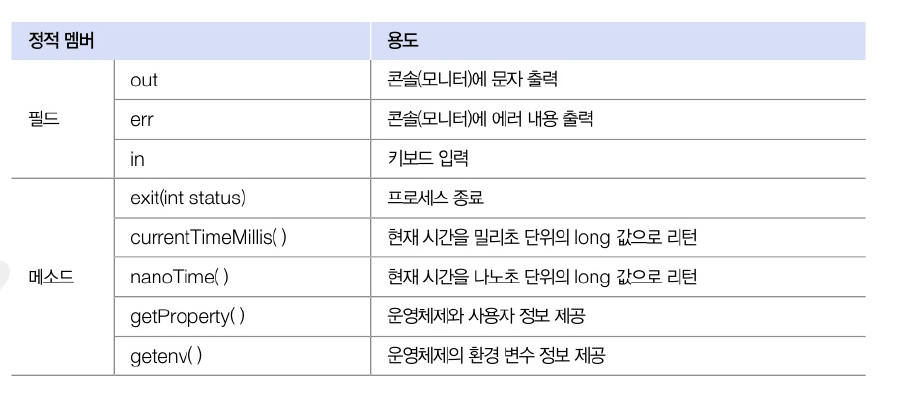
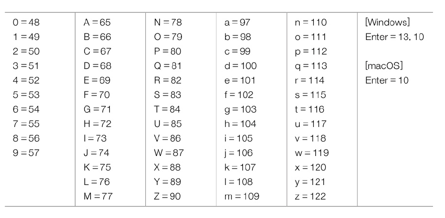
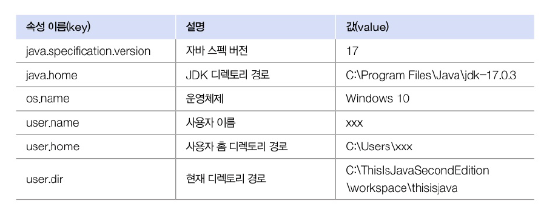
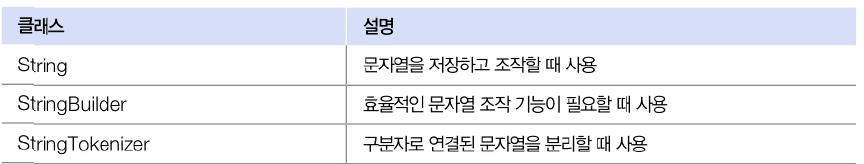
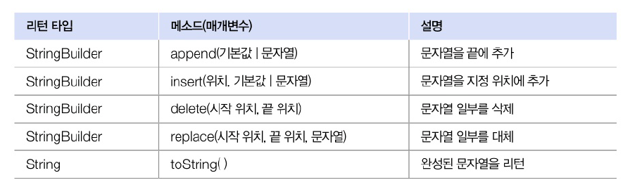
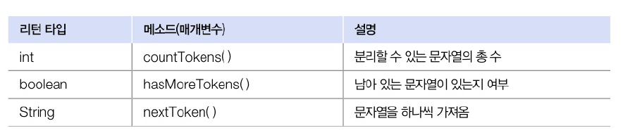
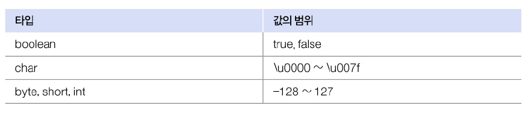
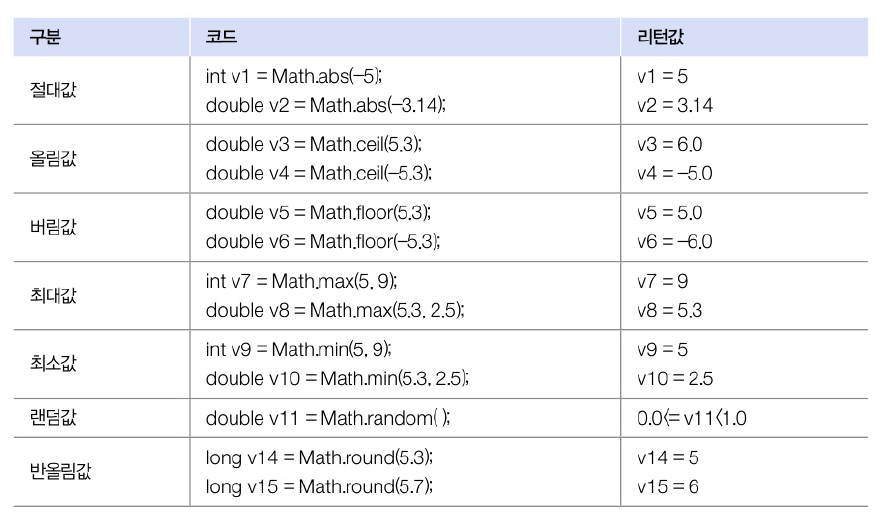
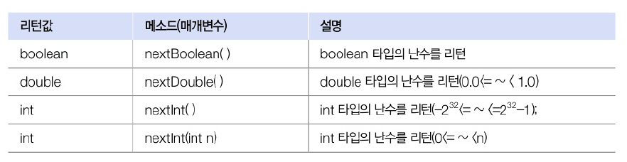

# 12.4 System 클래스
- 운영 체제의 일부 기능을 용할 수 있음



## 키보드 입력
- in 필드 이용해 `read()`메소드 호출 : 입력된 키의 코드값을 얻을 수 잇음
- enter 키 누르기 전가지 대기 상태. 누른 후 하나씩 읽기 시작
- IOException 예외 처리 필요

```java
int keyCode = System.in.read();
```



## 프로세스 종료
- 실행 중인 프로그램을 관리하는 프로세스 종료
  - 정상 종료 : 0
  - 비정사 종료 : 1 또는 -1

```java
System.exit(Int status);
```

## 진행 시간 읽기
- 프로그램 처리 시간을 측정하는데 사용
- 프로그램 처리 시작할 때 한 번. 끝날 때 한 번 읽어 처리시간 구함
- `currentTimeMils()` : 1/1000 초 단위로 진행된 시간을 리턴
- `nanoTime()` : 1/10^9초 단위로 진행된 시간을 리턴

## 시스템 프로퍼티 읽기
- 자바 프로그램이 시작될 때 자동 설정되는 시스템의 속성
  - 운영체제 종류 및 사용자 정보, 자바 버전 등의 기본 사양 정보



# 12.5 문자열 클래스



## StringBuilder
- String
  - 내부 문자열 수정할 수 없음
  - 다른 문자열을 결합하면 -> 변경 X. 새로운 객체 생성
  - 이전 객체는 버려지기 때문에 효율성이 좋지 않음
- StringBuilder
  - 잦은 문자열 변경 작업에 적합
  - 내부 버퍼(데이터를 저장하는 메모리)에 문자열 저장해둔 후 그 안에서 추가, 수정, 삭제 작업
  - 새로운 객체를 만들지 않고도 문자열 조작 가능
  - StringBuilder 다시 리턴 -> 메소드 체이닝(연이어 다른 메소드 호출) 사용 가능



## StringTokenizer 클래스
- 문자열을 구분자를 기준으로 분리할 때 사용




# 12.6 포장 클래스
- 기본 타입의 값을 갖는 객체
- 포장하고 있는 기본 타입의 값을 변경할 수 없음.
- 객체를 생성하는 데 목적이 있음

## 박싱과 언박싱
- 박싱 : 기본 타입 -> 포장 객체
- 언박싱 : 포장 객체 -> 기본 타입

```java
Integer obj = 100; // 박싱
int value = obj; // 언박싱

int value = obj + 50; // 언박싱 후 연산
```

## 문자열을 기본 타입으로 변환
- 문자열을 기본 타입 값으로 변환할 때도 사용 
- 대부분의 포장 클래스에는 `parse+기본타입` 명으로 되어 있는 정적 메소드
  - 문자열을 해당 기본 타입 값으로 변환

## 포장 값 비교
- 포장 객체는 내부 값 비교로 == 와 != 연산자 사용 불가
- 포장 객체의 번지를 비교하기 때문. `equals` 사용하기
- 공유되는 포장 객체 범위 for 효율적 사용




# 12.7 수학 클래스
- 수학 계산에 사용할 수 있는 메소드
- 모두 정적 메소드 -> Math 클래스로 바로 사용 가능



- `random()` 메소드 : 0.0과 1.0 사이의 double 타입 난수
- 난수를 얻는 방법
  - Random() : 현재 시간을 이용하여 종자값을 자동 설정
  - Random(long seed) : 주어진 종자값
- 종자값(seed) : 난수를 만드는 알고리즘에 사용되는 값. 종자값이 같으면 같으 난수 얻음



```java
package java_2408.java_240809;

import java.util.Arrays;
import java.util.Random;

public class RandomExample {
  public static void main(String[] args) {
    // 선택번호
    int[] selectNumber = new int[6]; // 선택번호 6개가 저장될 배열 생성
    Random random = new Random(3); // 선택번호를 얻기 위한 Random 객체 생성
    System.out.print("선택번호: ");
    // 선택번호 6개를 얻어 배열에 저장
    for (int i = 0; i < 6; i++) {
      selectNumber[i] = random.nextInt(45) + 1;
      System.out.print(selectNumber[i] + " ");
    }
    System.out.println();

    // 당첨번호
    int[] winningNumber = new int[6]; // 당첨번호 6개가 저장될 배열 생성
    random = new Random(5); // 당첨번호 얻기 위한 Random 객체 생성
    System.out.print("당첨번호: ");
    // 당첨번호 6개를 얻어 배열에 저장
    for (int i = 0; i < 6; i++) {
      winningNumber[i] = random.nextInt(45) + 1;
      System.out.print(winningNumber[i] + " ");
    }
    System.out.println();

    // 당첨여부
    Arrays.sort(selectNumber);
    Arrays.sort(winningNumber);
    boolean result = Arrays.equals(selectNumber, winningNumber); // 배열 항목 비교
    System.out.print("당첨여부: ");
    if (result) {
      System.out.println("1등에 당첨되셨습니다.");
    } else {
      System.out.println("당첨되지 않았습니다.");
    }
  }
}

```

```java
선택번호: 15 21 16 17 34 28 
당첨번호: 18 38 45 15 22 36 
당첨여부: 당첨되지 않았습니다.

```