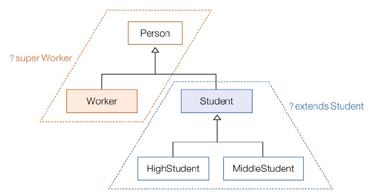

# 13. 제네릭
# 13.1 제네릭이란?
- 다양한 내용물을 저장해야 하는 경우 특정 클래스 타입으로 선언할 수 없음
- Object로 선언 가능
  - 모든 클래스의 최상위 부모 클래스이므로 자동 타입 변환 되어 대입 가능
  - 하지만, 어떤 객체가 대입되어 있을지 확실하지 X. 강제 타입 변환이 필요할 수 있음
- 저장한 내용물의 타입을 미리 알려주고, 읽을 때 어떤 타입으로 제공할지 알려주는 것

## 제네릭(Generic)
- 결정되지 않은 타입을 파리미터로 처리
- 실제 사용할 때 파라미터를 구체적인 타입으로 대체시키는 기능

```java
public class Box <T> {
    public T content; // 결정되지 않은 content 타입을 타입파라미터로 정의
}
```

- <T> : T라는 타입 파라미터임을 뜻하는 기호
- Box 클래스는 T가 무엇인지 모르지만 Box 객체가 생성될 시점에 다른 타입으로 대체된다는 것을 알고 있음
- 필요한 대로 대체하여 사용하면 된다
- T는 단지 이름이기 때문에 A-Z 사용 가능
- 주의할 점: 타입 파라미터를 대체하는 타입은 **클래스 및 인터페이스**라는 것. 기본 타입은 해당 X

```java
// 문자열
Box<String> box = new Box<String>();
box.content = "안녕하세요";
String content = box.content; // 강제 타입 변화 필요 없이 바로 얻을 수 있음

// 숫자
Box<Integer> box = new Box<String>();
box.content = 100;
String content = box.content; // 강제 타입 변화 필요 없이 바로 얻을 수 있음
```

# 13.2 제네릭 타입
- 결정되지 않은 타입을 파라미터로 가지는 클래스와 인터페이스
- 선언부에 <> 부호가 붙고, 그 사이에 타입 파라미터들이 취치
- 타입 파라미터 : 일반적으로 대문자 알파벳 한 글자로 표현
- 외부에서 제네릭 타입을 사용하려면 구체적인 타입 지정해야 함. 지정X시 Object 타입으로 압묵적 사용

---
클래스 타입 예제

```java
package java_2408.java_240822;

// 제네릭 타입
public class Product<K, M> { // 타입 파라미터로 K와 M 정의
    // 필드. 타입 파라미터를 필드 타입으로 사용
    private K kind;
    private M modiel;

    // 메소드. 타입 파라미터를 리턴 타입과 매개 변수 타입으로 사용
    public K getKind() {
        return this.kind;
    }

    public M getModiel() {
        return this.modiel;
    }

    public void setKind(K kind) {
        this.kind = kind;
    }

    public void setModiel(M modiel) {
        this.modiel = modiel;
    }
}

```

```java
package java_2408.java_240822;

public class Tv {
}

```

```java
package java_2408.java_240822;

public class Car {
}

```

```java
package java_2408.java_240822;

import java_2408.java_240822.ex01.Car;
import java_2408.java_240822.ex01.Product;
import java_2408.java_240822.ex01.Tv;

public class GenericExample {
    public static void main(String[] args) {
        // K는 Tv로 대체, M은 String으로 대체
        Product<Tv, String> product1 = new Product<>();

        // Setter 매개값은 반드시 Tv와 String을 제공
        product1.setKind(new Tv());
        product1.setModiel("스마트Tv");

        // Getter 리턴값은 Tv와 String이 됨
        Tv tv = product1.getKind();
        String tvModel = product1.getModiel();

        // K는 Car로 대체, M은 String으로 대체
        Product<Car, String> product2 = new Product<>();

        // Setter 매개값은 반드시 Car와 String을 제공
        product2.setKind(new Car());
        product2.setModiel("스마트Tv");

        // Getter 리턴값은 Car와 String이 됨
        Car car = product2.getKind();
        String carModel = product2.getModiel();
    }
}

```

---
인터페이스 예제

```java
package java_2408.java_240822.ex02;

public interface Rentable<P> { // 타입 파라미터 P 지정
    P rent(); // P를 리턴 타입으로 사용
}

```

```java
package java_2408.java_240822.ex02;

public class Home {
    public void turnOnLight() {
        System.out.println("전등을 켭니다.");
    }
}

```

```java
package java_2408.java_240822.ex02;

public class Car {
    public void run() {
        System.out.println("자동차가 달립니다.");
    }
}

```

```java
package java_2408.java_240822.ex02;

public class HomeAgency implements Rentable<Home> { // 타입 파라미터 Home으로 대체
    @Override
    public Home rent() {
        return new Home();
    }
}

```

```java
package java_2408.java_240822.ex02;

public class CarAgency implements Rentable<Car> {
    @Override
    public Car rent() {
        return new Car(); // 리턴 타입 반드시 Car여야 함
    }
}

```

```java
package java_2408.java_240822.ex02;

public class GenericExample {
    public static void main(String[] args) {
        HomeAgency homeAgency = new HomeAgency();
        Home home = homeAgency.rent();
        home.turnOnLight();

        CarAgency carAgency = new CarAgency();
        Car car = carAgency.rent();
        car.run();
    }
}

```

# 13.3 제네릭 메소드
- 타입 파라미터를 가지고 있는 메소드
- 타입 파라미터가 메소드 선언부에 정의된다는 점에서 제네릭 타입과 차이가 있음
- 제네릭 메소드는 리천 차입 앞에 <> 기호 추가하고 타입파라미터를 정의한 뒤 리턴 타입과 매개 변수 타입에서 사용

```java
package java_2408.java_240822.ex03;

public class Box<T> {
    // 필드
    private T t;

    // Getter
    public T get() {
        return t;
    }

    // Setter
    public void set(T t) {
        this.t = t;
    }
}

```

```java
package java_2408.java_240822.ex03;

public class GenericExample {
    // 제네릭 메소드
    public static <T> Box<T> boxing(T t) { // 타입 파라미터 T 정의
        Box<T> box = new Box<T>();
        box.set(t);
        return box;
    }

    public static void main(String[] args) {
        // 제네릭 메소드 호출
        Box<Integer> box1 = boxing(7);
        int intValue = box1.get();
        System.out.println(intValue);

        // 제네릭 메소드 호출
        Box<String> box2 = boxing("이재현");
        String strValue = box2.get();
        System.out.println(strValue);
    }
}

```

```java
7
이재현
```
# 13.4 제한된 타입 파라미터
- 타입 파라미터를 대체하는 구체적인 타입 제한할 필요가 있음
- 모든 타입으로 대체할 수 없고, 특정 타입과 자식 또는 구현 관계에 있는 타입만 대체할 수 있는 타입 파라미터
- 클래스, 인터페이스 모두 가능. 인터페이스라고 implements 사용하지 X

```java
// 타입 파라미터가 Number로 제한 -> Number가 가지고 있는 메소드도 사용 가능
public <T extends Number> boolean compare(T t1, T t2){
    double v1 = t1.doubleValue();
    double v2 = t2.doubleValue();
    return (v1 == v2)
}
```

# 13.5 와일드카드 타입 파라미터


- 매개값이나 리턴 타입으로 사용할 때 ?(와일드카드) 사용할 수 있음
- 범위에 있는 모든 타입으로 대체할 수 있다는 표시

```java
// Student와 자식 클래스만 가능하도록
리턴타입 메소드명(제네릭타입<? extends Student> 변수) {}

// Worker와 부모 클래스인 Person만 가능하도록
리턴타입 메소드명(제네릭타입<? super Worker> 변수) {}

// 어떤 타입이든 가능하도록
리턴 타입 메소드명(제네릭타입<?> 변수)
```
---

```java
package java_2408.java_240822.ex04;

public class Person {
}

class Worker extends Person {
}

class Student extends Person {
}

class HighStudent extends Student {
}

class MiddleStudent extends Student {
}

```

```java
package java_2408.java_240822.ex04;

public class Applicant<T> {
    public T kind;

    public Applicant(T kind) {
        this.kind = kind;
    }
}

```

```java
package java_2408.java_240822.ex04;

public class Cource {
    // 모든 사람이라면 등록
    public static void registerCourse1(Applicant<?> applicant) {
        System.out.println(applicant.kind.getClass().getSimpleName()
                + "이(가) Course1을 등록함");
    }

    // 학생만 등록
    public static void registerCourse2(Applicant<? extends Student> applicant) {
        System.out.println(applicant.kind.getClass().getSimpleName()
                + "이(가) Course2을 등록함");
    }

    // 직장인 및 일반인만 등록 가능
    public static void registerCourse3(Applicant<? super Worker> applicant) {
        System.out.println(applicant.kind.getClass().getSimpleName()
                + "이(가) Course3을 등록함");
    }
}

```

```java
package java_2408.java_240822.ex04;

public class GenericExample {
    public static void main(String[] args) {
        // 모든 사람이 신청 가능
        Cource.registerCourse1(new Applicant<Person>(new Person()));
        Cource.registerCourse1(new Applicant<Worker>(new Worker()));
        Cource.registerCourse1(new Applicant<Student>(new Student()));
        Cource.registerCourse1(new Applicant<HighStudent>(new HighStudent()));
        Cource.registerCourse1(new Applicant<MiddleStudent>(new MiddleStudent()));
        System.out.println();

        // 학생만 신청 가능
//        Cource.registerCourse2(new Applicant<Person>(new Person()));
//        Cource.registerCourse2(new Applicant<Worker>(new Worker()));
        Cource.registerCourse2(new Applicant<Student>(new Student()));
        Cource.registerCourse2(new Applicant<HighStudent>(new HighStudent()));
        Cource.registerCourse2(new Applicant<MiddleStudent>(new MiddleStudent()));
        System.out.println();

        // 직장인 및 일반인만 신청 가능
        Cource.registerCourse3(new Applicant<Person>(new Person()));
        Cource.registerCourse3(new Applicant<Worker>(new Worker()));
//        Cource.registerCourse3(new Applicant<Student>(new Student()));
//        Cource.registerCourse3(new Applicant<HighStudent>(new HighStudent()));
//        Cource.registerCourse3(new Applicant<MiddleStudent>(new MiddleStudent()));
        System.out.println();
    }
}

```

```java
Person이(가) Course1을 등록함
Worker이(가) Course1을 등록함
Student이(가) Course1을 등록함
HighStudent이(가) Course1을 등록함
MiddleStudent이(가) Course1을 등록함

Student이(가) Course2을 등록함
HighStudent이(가) Course2을 등록함
MiddleStudent이(가) Course2을 등록함

Person이(가) Course3을 등록함
Worker이(가) Course3을 등록함
```