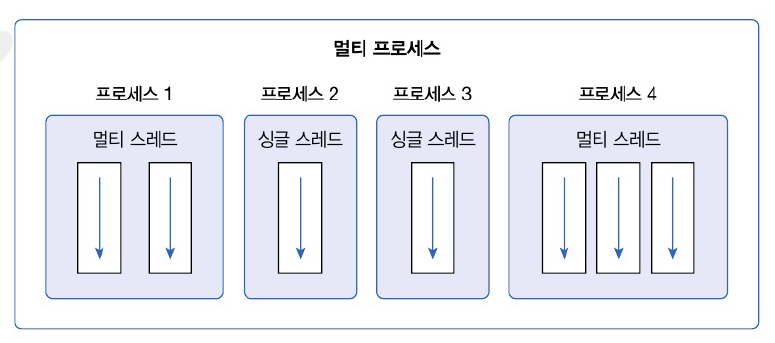
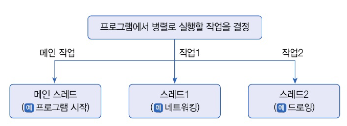
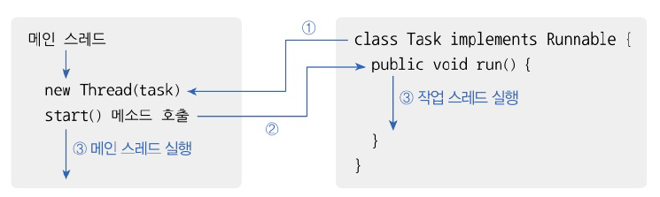
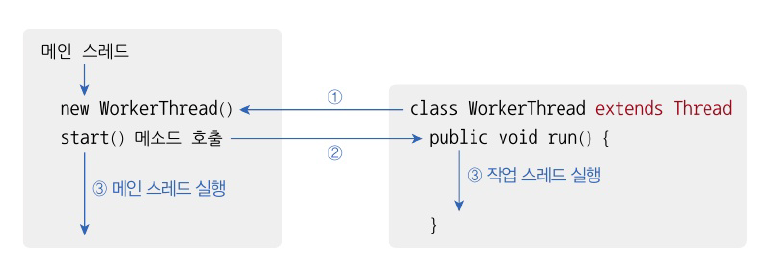

# 14. 멀티 스레드
# 14.1 멀티 스레드 개념
- 운영체제는 실행 중인 프로그램을 프로세스로 관리
- 멀티 태스킹은 두 가지 이상의 작업을 동시에 처리하는 것
- 운영 체제는 멀티 프로세스를 생성해서 처리
- 멀티 프로세스 =/= 멀티 태스킬
  - 하나의 프로세스 내에서 멀티 태스킹 가능 



- 스레드 : 코드의 실행 흐름. 프로세스 내에 스레두가 두 개 -> 두 개의 실행 흐름
- 멀티 프로세스 : 프로그램 단위의 멀티 태스킹
  - 서로 독립적. 하나의 프로세스에서 오류가 발생해도 다른 프로세스에 영향을 미치지 않음
- 멀티 스레드 : 프로그램 내부에서의 멀티 태스킹
  - 프로세스 내부에서 생성. 하나의 스레드가 예외를 발생시키면 프로세스 종료 -> 다른 스레드에 여향을 미침
  - 이 때문에 멀티 스레드 사용시 예외 처리를 잘 해야함
  - 데이터를 분할해서 병렬로 처리하는 곳, 안드로이드 앱에서 네트워크 통신을 위해 사용하기도
  - 다수의 클라이언트 요청을 처리하는 서버를 개발할 때에도 사용

# 14.2 메인 스레드
- 모든 자바 프로그램은 메인 스레드가 main() 메소드 실행하면서 시작
- 메인 스레드는 main() 메소드의 첫 코드부터 순차적으로 실행
- main() 메소드의 마지막 코드를 실행하거나 return 문을 만나면 실행 종료
- 메인 스레드는 필요에 따라 추가 작업 스레드를 만들어 실행시킬 수 있음


- 싱글 스레드는 메인 스레드 종료시 프로세스 종료
- 멀티 스레드에서는 실행중인 스레드가 하나라도 있다면 프로세스는 종료되지 않음
- 메인 스레드가 작업 스레드보다 먼저 종료되더라도 작업 스레드 실행 중이라면 프로세스 종료 X

# 14.3 작업 스레드 생성과 실행


- 멀티 스레드로 실행하는 프로그램을 개발하려면
  - 몇개의 작업을 병렬로 실행할지 결정하고
  - 각 작업별로 스레드를 생성해야함
- 자바 프로그램은 메인 스레드가 방드시 존재 -> 메인 작업 이외에 추가적인 작업 수만큼 스레드 생성하면 됨
- 자바는 작업 스레드를 객체로 관리하므로 클래스 필요
- Thread 클래스로 직접 객체 생성 가능, 하위 클래스로 만들어 생성 가능

## Thread 클래스로 직접 생성
- `java.lang` 패키지에 있는 Thread 클래스로부터 작업 스레드 객체를 직접 생성하려면 `Runnable` 구현 객체를 매개값으로 갖는 생성자 호출
- `Runnable` : 스레드가 작업을 실행할 때 사용하는 인터페이스
  - run() 메소드 정의되어 있음 -> 구현 클래스는 run()을 재정의하여 스레드가 실행할 코드를 가지고 있어야 함
- Runnable 구현 클래스 : 작업 내용의 정의한 것 -> 스레드에게 전달 해야함
  - Runnable 구현 객체 생성 후 Thread 생성자 매개값으로 Runnable 객체를 전달
- 명시적인 구현 클래스를 작성하지 않고 Thread 생성자를 호출할 때 Runnable 익명 구현 객체를 매개값으로 사용할 수 있음. 많이 사용되는 방법
- 작업 스레드 객체 생성 후 실행시 start() 메소드 호출 
- 작업 스레드는 매개값으로 받은 Runnable의 run() 메소드 실행하며 작업 처리




- 0.5초 주기로 비프음 발생시키며 동시에 프린팅

```java
package java_2408.java_240823;

import java.awt.*;

public class BeepPrintExample {
    public static void main(String[] args) {
        // 작업 스레드 생성
        Thread thread = new Thread(new Runnable() {
            @Override
            public void run() {
                // 작업 스레드가 실행하는 코드
                Toolkit toolkit = Toolkit.getDefaultToolkit();
                for (int i = 0; i < 5; i++) {
                    toolkit.beep();
                    try {
                        Thread.sleep(500);
                    } catch (Exception e) {
                    }
                }
            }
        });
        thread.start(); // 작업 스레드 실행

        // 메인 스레드 실행 하는 코드
        for (int i = 0; i < 5; i++) {
            System.out.println("띵");
            try {
                Thread.sleep(500);
            } catch (Exception e) {
            }
        }
    }
}
```

## Thread 자식 클래스로 생성
- Thread의 자식 개체로 만드는 것 
- Thread 클래스를 상속한 다음 run() 메소드를 재정의하여 스레드가 실행할 코드를 작성하고 객체를 생성
- 명시적인 자식 클래스를 정의하지 않고 Thread 익명 자식 객체를 사용할 수도 있음. 자주 사용되는 방법



# 14.4 스레드 이름
- 스레드는 자신의 이름을 가지고 있음
- 메인 스레드 : main / 작업 스레드 : Thread-n (자동 설정)
- 다른 이름으로 설정하고 싶은 경우 setName() 메소드 사용
- 스레드 이름은 디버깅 시 어떤 스레드가 작업하는지 조사 목적으로 주로 사용
- 어떤 스레드 실행 중인지 확인 -> currentThread()로 스레드 객체의 참조 얻고 getName() 메소드 출력

```java
package java_2408.java_240823;

public class ThreadNameExample {
    public static void main(String[] args) {
        Thread mainThread = Thread.currentThread(); // 이 코드 실행하는 스레드 객체 참조 얻기
        System.out.println(mainThread.getName() + " 실행");

        for (int i = 0; i < 3; i++) {
            Thread threadA = new Thread() {
                @Override
                public void run() {
                    // getName 메소드: Thread의 인스턴스 메소드로 스레드 이름 리턴
                    System.out.println(getName() + " 실행");
                }
            };
            threadA.start();
        }

        Thread chatThread = new Thread() {
            @Override
            public void run() {
                System.out.println(getName() + " 실행");
            }
        };
        chatThread.setName("chat-thread"); // 작업 스레드 이름 변경
        chatThread.start();
    }
}

```

```java
main 실행
Thread-0 실행
Thread-2 실행
Thread-1 실행
chat-thread 실행
```