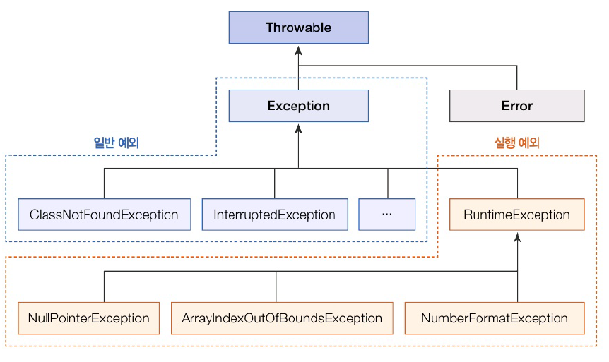
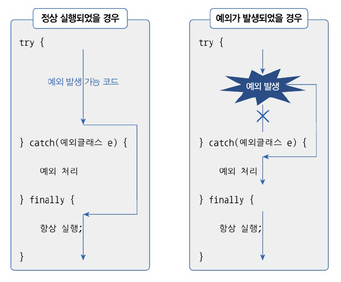

# 11. 예외 처리
# 11.1 예외와 예외 클래스
- 예외 (exception) : 잘못된 사용 또는 코딩으로 인한 오류
  - 예외 처리를 통해 실행 상태를 유지할 수 있다.
  - 일반 예외 (Exception) : 컴파일러가 예외 처리 코드 여부를 검사하는 예외
  - 실행 예외 (Runtime Exception) : 컴파일러가 예외 처리 코드 여부를 검사하지 않는 예외
- 예외 발생 -> 예외 클래스로부터 객체 생성. 예외 처리시 사용
- 모든 예외는 Throwable 상속받아 만들어진다.
- 실행 예외는 Runtime Exception와 그 자식 클래스
- 자바는 예외 클래스를 표준 라이브러리로 제공
- 


# 11.2 예외 처리 코드
- 예외 발생 시 프로그램의 갑작스러운 종료를 막고 정상 실행 유지할 수 있도록 처리하는 코드
- try-catch-finally 블록
- 생성자 내부와 메소드 내부에 작성
- 
- try 블록에서 예외 발생 X -> finally 블록만 실행
- try 블록에서 예외 발생 O -> catch 블록 -> finally 블록 실행
- finally블록
  - 옵션. 생략 가능
  - catch 블록에서 메소드 종료(return문)하더라도 항상 실행 !!

---
1. e.getMessage() : 예외가 발생한 이유만 리턴
2. e.toString() : 예외의 종류도 리천
3. e.printStackTrace() : 예외가 어디서 발생했는지 추적한 내용까지 출력

```java
package java_240801;

public class ExceptionHandlingExample {
    public static void printLength(String data) {
        try {
            int result = data.length(); // data가 null인 경우 NullPointerException 발생
            System.out.println("문자 수: " + result);
        } catch (NullPointerException e) {
            // 예외 정보를 얻는 3가지 방법
            System.out.println("1번-------------------");
            System.out.println(e.getMessage());
            System.out.println("2번-------------------");
            System.out.println(e.toString());
            System.out.println("3번-------------------");
            e.printStackTrace();
        } finally {
            System.out.println("[마무리 실행]\n");
        }
    }

    public static void main(String[] args) {
        System.out.println("[프로그램 시작]\n");
        printLength("ThisIsJava");
        printLength(null);
        System.out.println("[프로그램 종료]\n");
    }
}

```

```java
[프로그램 시작]

문자 수: 10
[마무리 실행]

1번-------------------
Cannot invoke "String.length()" because "data" is null
2번-------------------
java.lang.NullPointerException: Cannot invoke "String.length()" because "data" is null
3번-------------------
[마무리 실행]

[프로그램 종료]

java.lang.NullPointerException: Cannot invoke "String.length()" because "data" is null
	at java_240801.ExceptionHandlingExample.printLength(ExceptionHandlingExample.java:6)
	at java_240801.ExceptionHandlingExample.main(ExceptionHandlingExample.java:24)

```