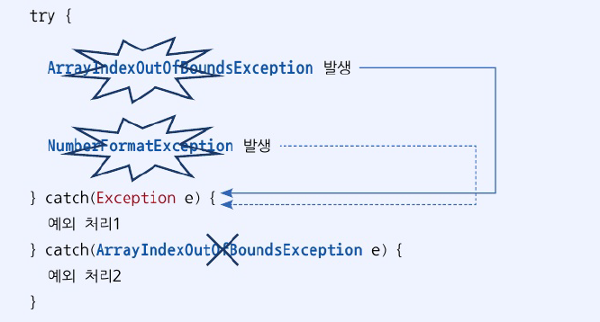
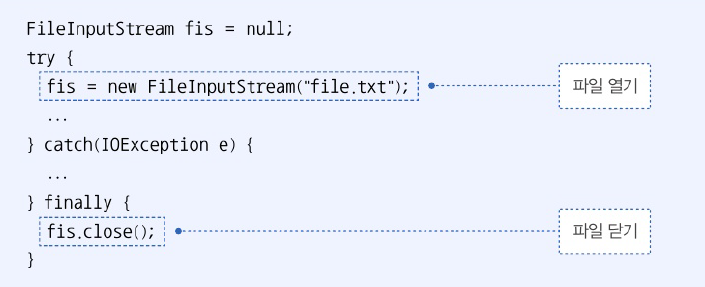

# 11.3 예외 종류에 따른 처리
- 다중 catch 사용하여 발생하는 예외에 따라 예외 처리 코드 다르게 작성 가능
- catch 블록의 예외 클래스 -> try 블록에서 발생된 예외의 종류. 예외에 따라 catch 블록 선택되어 실행
- catch 블록이 여러개여도 단 하나만 실행
  - try 블록에서 동시 다발적으로 예외가 발생하지 않음
  - 하나의 예외 발생 시 즉시 실행을 멈추고 catch 블록으로 이동하기 때문

```java
package java_240802;

public class ExceptionHandlingExample {
    public static void main(String[] args) {
        String[] array = {"100", "1oo"};

        for (int i=0; i <=array.length; i++) {
            try {
                int value = Integer.parseInt(array[i]);
                System.out.println("array[" + i + "]: "+ value);
            } catch (ArrayIndexOutOfBoundsException e) {
                System.out.println("배열 인덱스가 초과됨 " + e.getMessage());
            } catch (NumberFormatException e) {
                System.out.println("숫자로 변환할 수 없음: " + e.getMessage());
            }
        }
    }
}

```

```java
array[0]: 100
숫자로 변환할 수 없음: For input string: "1oo"
배열 인덱스가 초과됨 Index 2 out of bounds for length 2
```

- 처리해야 할 예외 클래스들이 상속 관계에 있을 때는 하위 클래스 catch 블록 먼저 작성
  - catch 블록은 위에서 부터 차례대로 검사하기 때문



- 두 개 이상의 예외를 하나의 catch 블록으로 동일하게 처리하고 싶은 경우

```java
package java_240802;

public class ExceptionHandlingExample2 {
    public static void main(String[] args) {
        String[] array = {"100", "1oo", null, "200"};

        for (int i=0; i <=array.length; i++) {
            try {
                int value = Integer.parseInt(array[i]);
                System.out.println("array[" + i + "]: "+ value);
            } catch (ArrayIndexOutOfBoundsException e) {
                System.out.println("배열 인덱스가 초과됨 " + e.getMessage());
            } catch (NullPointerException | NumberFormatException e) {
                // 하나로 처리하고 싶은 경우  |로 묶어줌
                System.out.println("데이터에 문제가 있음: " + e.getMessage());
            }
        }
    }
}

```

```java
array[0]: 100
데이터에 문제가 있음: For input string: "1oo"
데이터에 문제가 있음: Cannot parse null string
array[3]: 200
배열 인덱스가 초과됨 Index 4 out of bounds for length 4

```

# 11.4 리소스 자동 닫기
- 리소스 : 데이터를 제공하는 객체
  - 사용하기 위해 열어야(open)하며 사용 끝난 후 닫아야(close)함
  - 리소스 사용 중 예외 발생 시 안전하게 닫는 것이 중요

1. finally 블록 이용
- finally 블록을 이용해 예외 발생 여부와 상관 없이 항상 close
- 

2. try-with-resources 블록 이용
- 예외 발생 여부와 상관없이 리소스를 자동으로 닫아줌
- try 블록에 리소스 여는 코드 작성 -> 실행 완료 or 예외 발생시 close() 메소드 호룿ㄹ
- 사용하기 위한 조건
  - 리소스는 `java.lang.AutoColseable` 인터페이스를 구현해 `close()` 메소드 재정의 해야 함
  - 복수 개의 리소스를 사용해야 한다면 세미콜론으로 구분
  - Java 8 이전에서는 try 괄호 안에서 리소스 변수 선언해야 했지만, Java 9 이후부터는 리소스 변수 사용 가능

