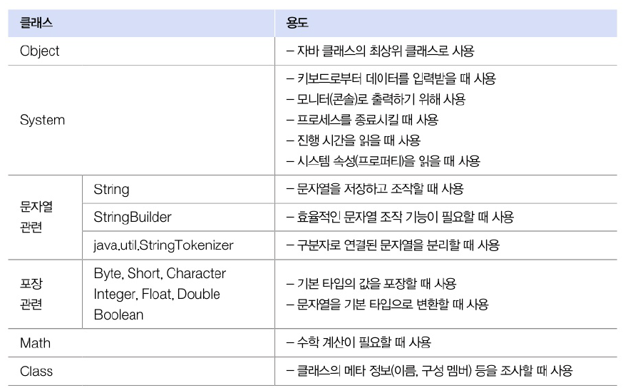
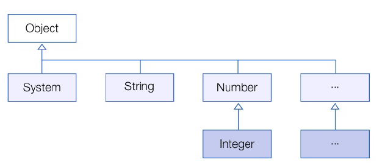
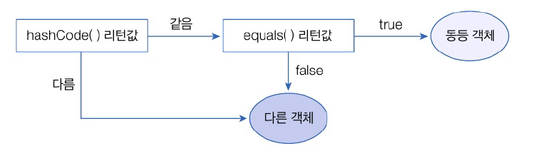

# 12. java.base 모듈
# 12.2 java.base 모듈
- 모든 모듈이 의존하는 기본 모듈
- 모듈 중 유일하게 requires하지 않아도 사용할 수 있음

**java.base 모듈의 주요 패키지와 용도**

| 패키지      | 용도                                     |
|:---------|:---------------------------------------|
| java.lang | 자바 언어의 기본 클래스를 제공                      |
| java.util | 자료 구조와 관련된 컬렉션 클래스를 제공                 |
| java.text | 날짜 및 숫자를 원하는 형태의 문자열로 만들어주는 포맷 클래스를 제공 |
| java.time | 날짜 및 시간을 조작하거나 연산하는 클래스를 제공            |
| java.io  | 입출력 스트림 클래스를 제공                        |
| java.net | 네트워크 통신과 관련된 클래스를 제공                   |
| java.nio | 데이터 저장을 위한 Buffer 및 새로운 입출력 클래스 제공     |

- java.lang은 자바 언어의 기본적인 클래스를 담고 있는 페이지
- 이 패키지에 있는 클래스와 인터페이스는 import 업싱 사용 가능

# 12.3 Object 클래스
- 클래스 선언시 extends 키워드로 다른 클래스를 상속하지 않으면 암시적으로 java.lang.Objecr 클래스 상속
- 자바의 모든 클래스는 Object의 자식이거나 자손 클래스

- Object가 가진 주요 메소드
  - 모든 객체에서 사용 가능

| 메소드                        | 용도                  |
|:---------------------------|:--------------------|
| boolean equals(Object obj) | 객체의 번지를 비교하고 결과를 리턴 |
| int hashCode()             | 객체의 해시코드를 리턴        |
| String toString()          | 객체 문자 정보를 리턴        |

## 객체 동등 비교
- 자동 타입 변환에 의해 모든 객체가 매개값으로 대입될 수 있다.
- equals() 메소드는 비교연산자인 ==과 동일한 결과 리턴
  - 두 객체 동일 true 리턴, 그렇지 않으면 false 리턴
- 재정의 하여 동등 비교용으로 사용
- 동등 비교 : 객체가 달라도 내부의 데이터가 같은지 비교

## 객체 해시 코드
- 객체를 식별하는 정수
- hashCode() 메소드 : 객체의 메모리 번지를 이용해 해시코드 생성. 객체마다 다른 정수값을 리턴
- 두 객체 동등한지 비교할 때 주로 사용
- 객체의 데이터를 기준으로 재정의하여 새로운 정수값을 리턴하도록 하는 것이 일반적
- 내부 데이터가 동일하다면 같은 정수값을 이턴
- 자바는 hashCode()와 equals() 메소드 같이 사용하는 경우가 많음
  - hashCode()가 리턴하는 정수값이 같은지 확인
  - 그 다음 equals() 메소드가 true를 리턴하는지 확인하여 판단

