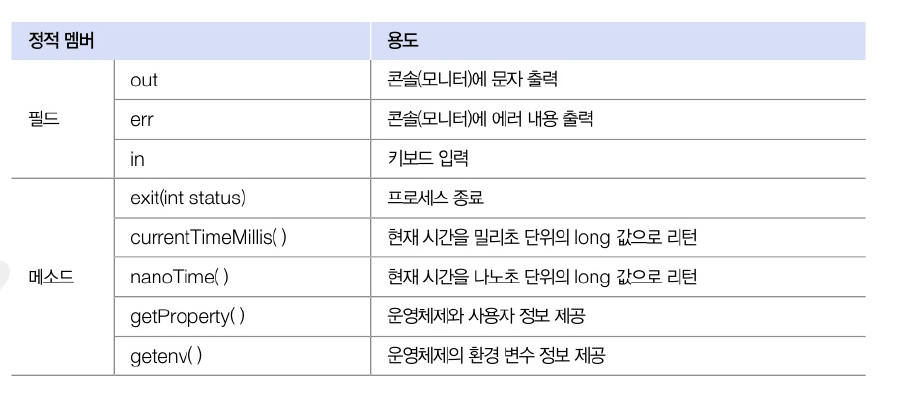
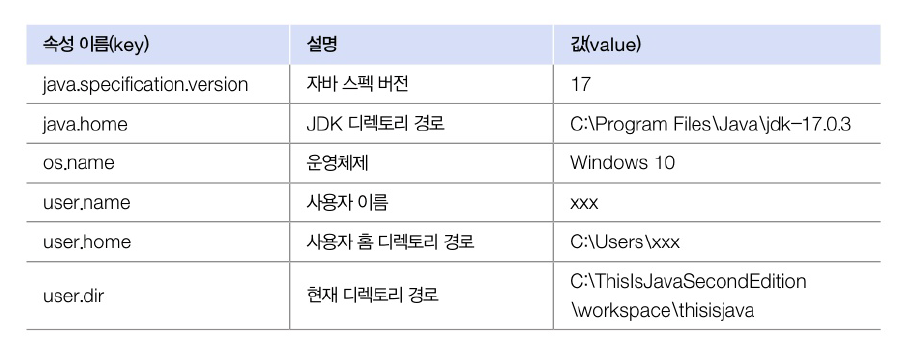

# 12.4 System 클래스
- 운영 체제의 일부 기능을 용할 수 있음



## 키보드 입력
- in 필드 이용해 `read()`메소드 호출 : 입력된 키의 코드값을 얻을 수 잇음
- enter 키 누르기 전가지 대기 상태. 누른 후 하나씩 읽기 시작
- IOException 예외 처리 필요

```java
int keyCode = System.in.read();
```


## 프로세스 종료
- 실행 중인 프로그램을 관리하는 프로세스 종료
  - 정상 종료 : 0
  - 비정사 종료 : 1 또는 -1

```java
System.exit(Int status);
```

## 진행 시간 읽기
- 프로그램 처리 시간을 측정하는데 사용
- 프로그램 처리 시작할 때 한 번. 끝날 때 한 번 읽어 처리시간 구함
- `currentTimeMils()` : 1/1000 초 단위로 진행된 시간을 리턴
- `nanoTime()` : 1/10^9초 단위로 진행된 시간을 리턴

## 시스템 프로퍼티 읽기
- 자바 프로그램이 시작될 때 자동 설정되는 시스템의 속성
  - 운영체제 종류 및 사용자 정보, 자바 버전 등의 기본 사양 정보

