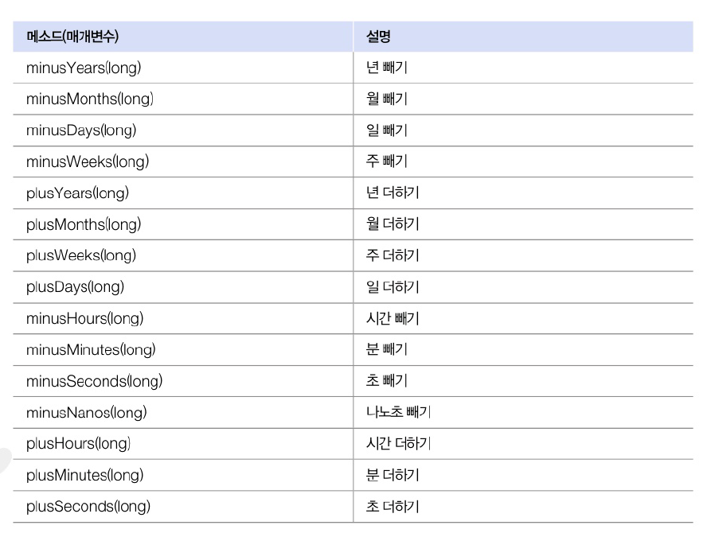
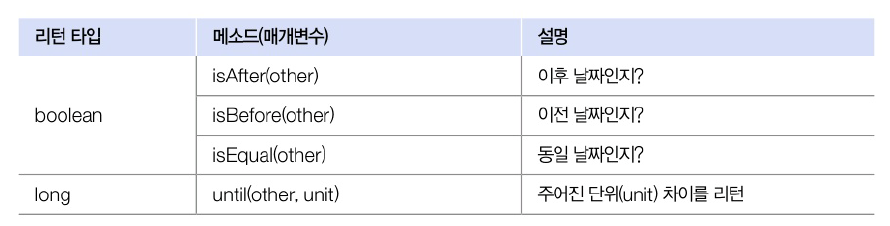
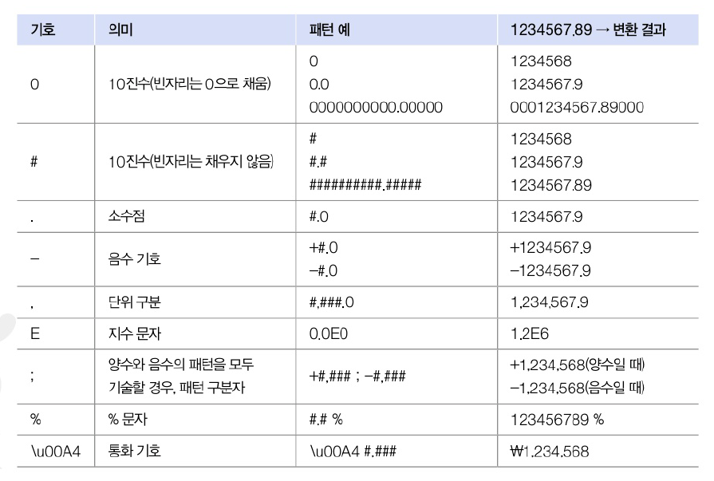
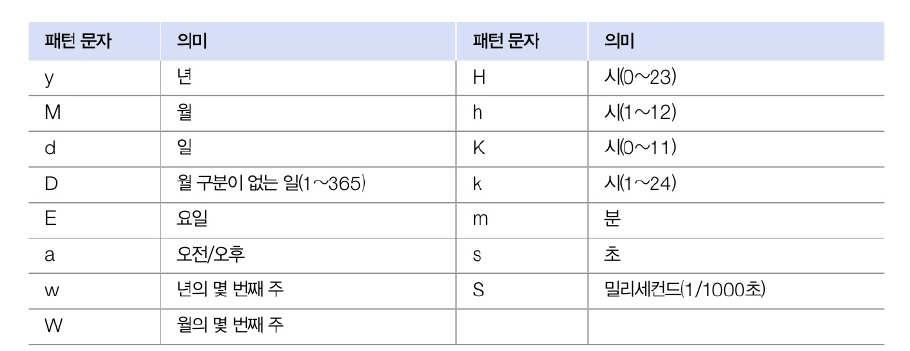

# 12.8 날짜와 시간 클래스
| 클래스           | 설명                        |
|:--------------|:--------------------------|
| Date          | 날짜 정보를 전달하기 위해 사용         |
| Calender      | 다양한 시간대별로 날짜와 시간을 얻을 때 사용 |
| LocalDateTime | 날짜와 시간을 조작할 때 사용          |

## Date 클래스
- 날짜를 표현하는 클래슷
- 객체 간에 날짜 정보를 주고받을 때 사용
- 여러 개의 생성자가 선언되어 있지만 대부분 Deprecated(더 이상 사용되지 않음)됭 Date() 사ㅐㅇ성자만 주로 사용
- `Date()` 생성자는 컴퓨터의 현재 날짜를 읽어 Date 객체로 만듦

```java
import java.util.Date;

Date now = new Date();
```

- 문자열로 얻고 싶은 경우
  - toString() : 영문으로 출력
  - SimpleDateFormat 클래스


## Calender 클래스
- 달력을 표현하는 추상 클래스
- 날짜와 시간을 계산하는 방법이 지역과 문화마다 다름 -> 자식 클래스에서 달력 구햔
- 특별한 역법 아니라면 `getInstacne()` 메소드 이용하여 컴퓨터 설정 시간대 기준으로 하위객체 얻을 수 있음
- 날짜와 시간에 대한 정보는 `get()` 메소드 사용. 상수가 의미하는 값 리턴

```java
import java.util.Calendar;

Calendar now = Calendar.getInstance();
int year = now.get(Calendar.YEAR); // 년도
int month = now.get(Calendar.MONTH) + 1; // 월
int day = now.get(Calendar.DAY_OF_MONTH); // 일
int week = now.get(Calendar.DAY_OF_WEEK); // 요일
int amPm = now.get(Calendar.AM_PM); // 오전 오후
int hour = now.get(Calendar.HOUR); // 시
int minute = now.get(Calendar.MINUTE); // 분
int second = now.get(Calendar.SECOND); // 초
```

- 다른 시간대의 Calender 얻을 수 있음
  - 알고 싶은 시간대의 TimeZone 객체를 얻어, getInstance() 메소드의 매개값으로 넘겨줌

```java
import java.util.Calendar;
import java.util.TimeZone;

TimeZone timeZone = TimeZone.getTimeZone("America/Los_Angeles");
Calendar now = Calendar.getInstance(timeZone);
```

## 날짜와 시간 조작
- Date와 Calender은 날짜와 시간 조작 불가
- LocalDateTime 클래스가 제공하여 조작 가능



```java
import java.time.LocalDateTime;

LocalDateTime now = LocalDateTime.now(); // 날짜아 시간을 얻어 조작
```

## 날짜와 시간 비교



- 특정 날짜와 시간으로 LocalDateTime 객체를 얻는 방법 : int 타입으로 매개값 제공

```java
import java.time.LocalDateTime;

LocalDateTime target = LocalDateTime.of(year, month, dayOfMontj, hour, minute, second);
```

# 12.9 형식 클래스
- Format 클래스
- 숫자 또는 날짜를 원하는 형태의 문자열로 변환해주는 기능 제공
- java.text 패키지에 포함
  - DecimalFormat : 숫자를 형식화된 문자열로 변환
  - SimpleDateFormat : 날짜를 형식화된 문자열로 변환

## Decimal Format
- 숫자를 형식화된 문자열로 변환
- 패턴 정보와 DecimalFormat 객체를 생성하고 `format()` 메소드로 숫자를 제공하면 패턴에 따른 형식화된 문자열



```java
import java.text.DecimalFormat;

DecimalFormat df = new DecimalFormat("#,###.0");
String result = df.format(123456789); // 1,234,567.9
```

## SimpleDate Format
- 날짜를 형식화된 문자열로 변환
- 패턴에는 자릿수에 맞게 기호를 반복해서 작성 가능
  - yyyy : 년도 4자리
  - MM, dd : 월과 일을 2자리
- 패턴 정보와 함게 SimpleDateFormat 객체 생성하여 `format()` 메소드 날짜 제공하면 패턴과 동일한 문자열 얻을 수 있음

```java
import java.text.SimpleDateFormat;
import java.util.Date;

SimpleDateFormat sdf = new SimpleDateFormat("yyyy년 MM월 dd일");
String strDate = sdf.format(new Date()); // 2024년 8월 15일
```


