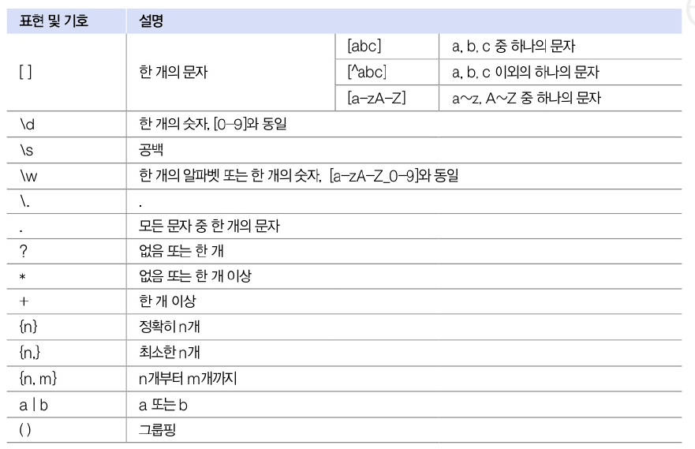
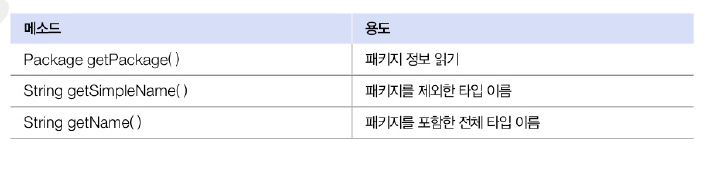
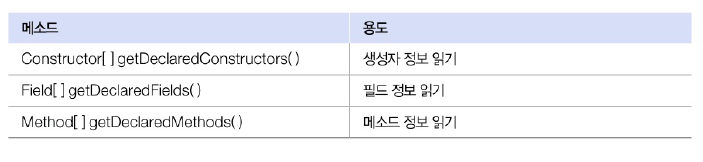
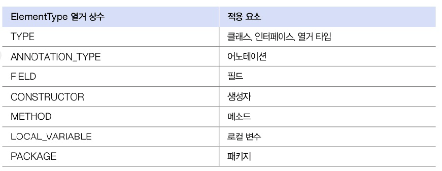
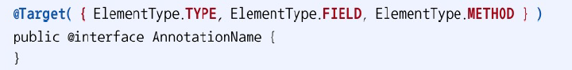
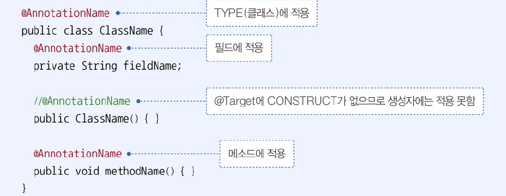
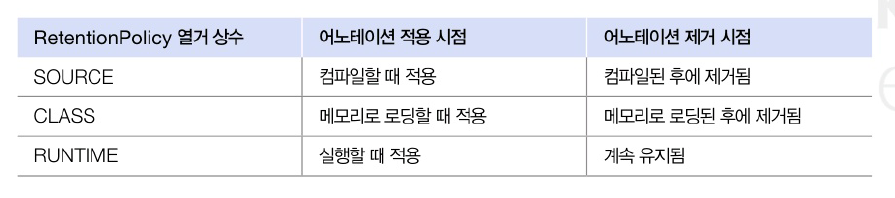
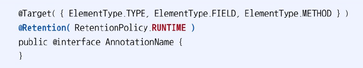
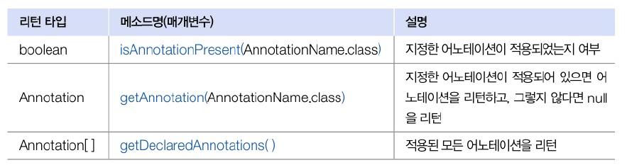

# 12.10 정규 표현식 클래스
- 문자열이 정해져 있는 형식으로 구성되어 있는지 검증 해야하는 경우 사용
- 정규 표현식

## 정규 표현식 작성 방법
- 정규 표현식: 문자 또는 숫자와 관련된 표현, 반복 기호가 결합된 문자열



```java
// 전화번호 형식 : 02-335-1156 혹은 010-1156-1157
(02|010)-\d{3,4}-\d{4}

// 이메일 형식 => \. : 문자로서의 점 . : 모든 문자 중에서 한개의 문자
\w+@\w+\.\w+(\.\w+)?
```

## Pattern 클래스로 검증
- `java.utuil.regex` 패키지의 Pattern 클래스 : 정규 표현식으로 문자열 검증하는 `matches` 메소드 재공
- 첫 번째 매개값 : 정규 표현식
- 두 번째 매개값 : 검증할 문자열
- boolean 타이브로 리턴

```java
import java.util.regex.Pattern;

boolean result = Pattern.matches("정규식", "검증할 문자열");
```

```java
package java_240816;

import java.util.regex.Pattern;

public class PatternExample {
    public static void main(String[] args) {
        String regExp = "(02|010)-\\d{3,4}-\\d{4}";
        String data = "010-123-4567";

        boolean result = Pattern.matches(regExp, data);
        if (result) {
            System.out.println("정규식과 일치합니다.");
        } else {
            System.out.println("정규식과 일치하지 않습니다.");
        }

        regExp = "\\w+@\\w+\\.\\w+(\\.\\w+)?";
        data = "yunanash@gmailcom";

        result = Pattern.matches(regExp, data);
        if (result) {
            System.out.println("정규식과 일치합니다.");
        } else {
            System.out.println("정규식과 일치하지 않습니다.");
        }
    }
}

```

```java
정규식과 일치합니다.
정규식과 일치하지 않습니다.
```

# 12.11 리플렉션
- 리플랙션 : 메타 정보를 프로그램에서 읽고 수정하는 행위
  - 자바는 클래스와 인터페이스의 메타 정보를 Class 객체로 관리
  - 메타 정보 : 패키지 정보, 타입 정보, 멤버(생성자, 필드, 메소드) 정보 등
- 프로그램에서 Class 객체를 얻는 방법
```java
// 클래스로부터 얻는 방법 : 클래스 이름만으로 얻는 방법
Class clazz = 클래스이름.class;
Class clazz =  Class.forName("페키지...클래스 이름");

// 객체로부터 얻는 방법
Class clazz = 객체참조변수.getClass();
```

```java
Class clazz = String.class;
Class clazz =  Class.forName("java.lang.String");

// 객체로부터 얻는 방법
String str = "김영웅";
Class clazz = str.getClass();
```

## 패키지와 타입 정보 얻기
- 패키지의 타입(클래스, 인터페이스) 이름 정보 얻는 메소드



## 멤버 정보 얻기
- 타입(클래스, 인터페이스)가 가지고 있는 멤버 정보를 얻는 메소드




# 12.12 어노테이션
- 코드에서 @로 작성되는 요소
- 어노테이션은 클래스 또는 인터페이스를 컴파일 하거나 실행할 때 어떻게 처리해야할 것인지 알려주는 설정 정보
- 용도
1. 컴파일 시 사용하는 정보 전달
2. 빌드 툴이 코드를 자동으로 생성할 때 사용하는 정보 전달
3. 실행 시 특정 기능을 처리할 때 사용하는 정보 전달
- 자바 프로그램 개발의 필수 요소
- Spring Framework / Spring Boot : 다양한 종류의 어노테이션을 사용해 웹 어플리케이션을 설정하는 데 사용

## 어노테이션 정의와 적용
- 하나의 타입이므로 정의부터 해야 함
- 인터페이스 정의하는 것과 유사
- `@interface` 뒤에 사용할 어노테이션 이름
- 속성을 가질 수 있음 : 타입과 이름으로 구성
  - 이름 뒤에 괄호 붙임
  - 속성의 기본값은  default 키워드로 지정 가능
  - 기본 속성인 value 설정 가능
    - String value(); => `@AnnotationName("값")`
    - 다른 속성의 값을 동시에 주고 싶다면 반드시 언급

```java
public @interface AnnotaionName {
    String prop1();
    int prop2() default 1;
}

// 위와 같이 정의하는 경우 아래와 같이 사용
@AnnotaionName
@AnnotaionName(prop1 = "값");
@AnnotaionName(prop1 = "값", prop2 = 3);
```

## 어노테이션 적용 대상
- 설정 정보 : 어떤 클래스, 메소드에 적용할 것인지 명식해야 함
- `@Target` : 적용 대상을 지정할 때 사용. 기본 속성인 value는 ElementType 배열을 값으로 가짐 -> 적용 대상을 복수 개로 지정하기 위함

- 대상의 종류





## 어노테이션 유지 정책
- 어노테이션을 언제까지 유지할 것인지
- RetentionPolicy 열거 상수로 정의
- `@Retention` 사용




## 어노테이션 설정 정보 이용
- 동작을 가지지 않음
- 이 정보를 통해서 처리하는 것은 애플리케이션
- 적용 대상으로부터 어노테이션의 정보를 얻어낼 수 있음



```java
package java_240816;

import java.lang.annotation.ElementType;
import java.lang.annotation.Retention;
import java.lang.annotation.RetentionPolicy;
import java.lang.annotation.Target;

@Target({ElementType.METHOD}) // 적용대상 METHOD
@Retention(RetentionPolicy.RUNTIME) // 유지정채 RUNTIME
public @interface PrintAnnotation {
    String value() default "-"; // 선의 종류
    int number() default 15; // 출력 횟수
}

```

```java
package java_240816;

public class Service {
    @PrintAnnotation
    public void method1(){
        System.out.println("실행 내용1");
    }

    @PrintAnnotation("*")
    public void method2(){
        System.out.println("실행 내용2");
    }

    @PrintAnnotation(value = "#", number = 20)
    public void method3() {
        System.out.println("실행 내용3");
    }
}

```

```java
package java_240816;

import java.lang.reflect.Method;

public class PrintAnnotationExample {
    public static void main(String[] args) throws Exception {
        Method[] declaredMethods = Service.class.getDeclaredMethods();
        for (Method method : declaredMethods) {
            // PrintAnnotation 얻기
            PrintAnnotation printAnnotation = method.getAnnotation(PrintAnnotation.class);

            // 설정 정보를 이용해서 선 출력
            printLine(printAnnotation);

            // 메소드 호출
            method.invoke(new Service());

            // 설정 정보를 이용해서 선 츨력
            printLine(printAnnotation);
        }
    }

    public static void printLine(PrintAnnotation printAnnotation) {
        if (printAnnotation != null) {
            // number 속성값 얻기
            int number = printAnnotation.number();
            for (int i=0; i<number; i++) {
                // value 속성값 얻기
                String value = printAnnotation.value();
                System.out.print(value);
            }
            System.out.println();
        }

    }
}

```

```java
---------------
실행 내용1
---------------
***************
실행 내용2
***************
####################
실행 내용3
####################

```