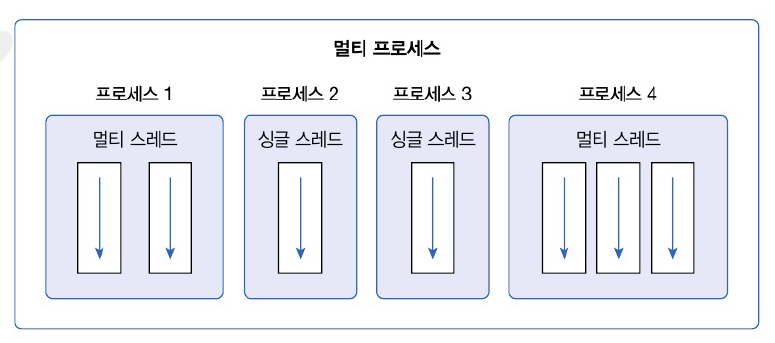
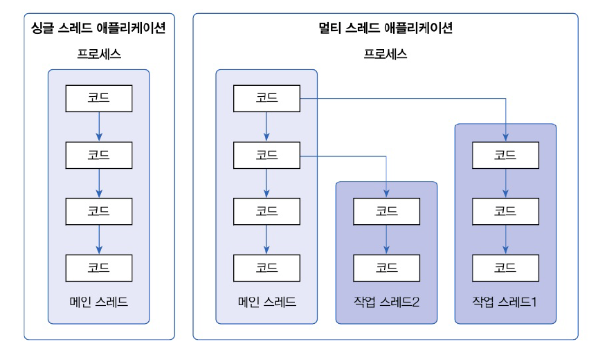

# 14. 멀티 스레드
# 14.1 멀티 스레드 개념
- 운영체제는 실행 중인 프로그램을 프로세스로 관리
- 멀티 태스킹은 두 가지 이상의 작업을 동시에 처리하는 것
- 운영 체제는 멀티 프로세스를 생성해서 처리
- 멀티 프로세스 =/= 멀티 태스킬
  - 하나의 프로세스 내에서 멀티 태스킹 가능 

- 스레드 : 코드의 실행 흐름. 프로세스 내에 스레두가 두 개 -> 두 개의 실행 흐름
- 멀티 프로세스 : 프로그램 단위의 멀티 태스킹
  - 서로 독립적. 하나의 프로세스에서 오류가 발생해도 다른 프로세스에 영향을 미치지 않음
- 멀티 스레드 : 프로그램 내부에서의 멀티 태스킹
  - 프로세스 내부에서 생성. 하나의 스레드가 예외를 발생시키면 프로세스 종료 -> 다른 스레드에 여향을 미침
  - 이 때문에 멀티 스레드 사용시 예외 처리를 잘 해야함
  - 데이터를 분할해서 병렬로 처리하는 곳, 안드로이드 앱에서 네트워크 통신을 위해 사용하기도
  - 다수의 클라이언트 요청을 처리하는 서버를 개발할 때에도 사용

# 14.2 메인 스레드
- 모든 자바 프로그램은 메인 스레드가 main() 메소드 실행하면서 시작
- 메인 스레드는 main() 메소드의 첫 코드부터 순차적으로 실행
- main() 메소드의 마지막 코드를 실행하거나 return 문을 만나면 실행 종료
- 메인 스레드는 필요에 따라 추가 작업 스레드를 만들어 실행시킬 수 있음

- 싱글 스레드는 메인 스레드 종료시 프로세스 종료
- 멀티 스레드에서는 실행중인 스레드가 하나라도 있다면 프로세스는 종료되지 않음
- 메인 스레드가 작업 스레드보다 먼저 종료되더라도 작업 스레드 실행 중이라면 프로세스 종료 X