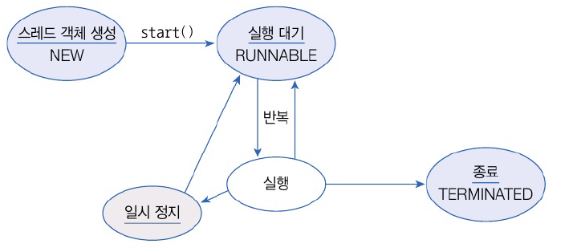
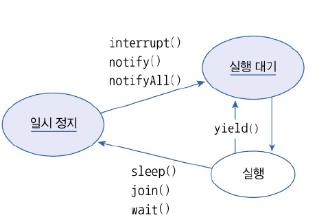
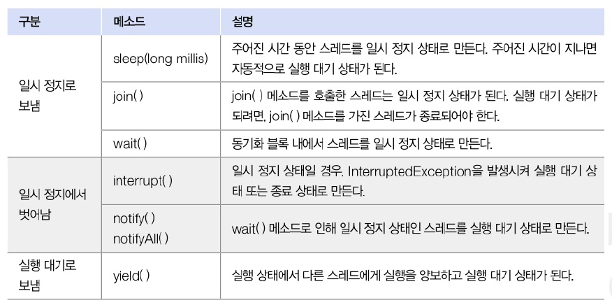
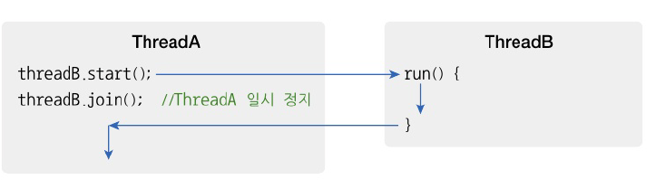
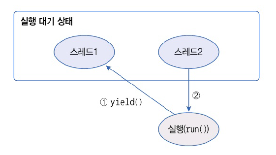

# 14.5 스레드 상태


- 스레드 객체를 생성(NEW)하고 start() 메소드를 호출하면 곧바로 스레드가 실행되는 것 X
- 실행 대기 상태(RUNNABLE) : 실행을 기다리고 있는 상태
- 실행 상태(RUNNING) : 실행 대기하는 스레드는 CPU 스케쥴링에 따라 CPU를 점유하고 run() 실행
  - 실행 스레드는 run() 메소드를 모두 실행하기 전에 스케줄링에 의해 다시 실행 대기 상태로 돌아갈 수 있음
  - 다른 스레드가 실행 상태가 된다
- 스레드는 실행 대기 상태와 실행 상태를 번갈아가며 run() 메소드를 조금씩 실행
- 종료 상태(TERMINATED) : 실행 상태에서 run() 메소드가 종료되면 더 이상 실행할 코드가 없어 스레드의 실행을 머춤
- 일시 정지 상태 : 스레드가 실행할 수 없는 상태
  - 스레드가 다시 실행 상태로 가기 위해서는 일시 정지 상태에서 실행 대기 상태로 가야함



- 일시 정지로 가기 위한 메소드와 벗어나기 위한 메소드
  - Object 클래스의 메소드 : wait(), notify(), notifyAll()
  - Thread 클래스의 메소드 : 그 외



## 주어진 시간 동안 일시 정지
- sleep() : Thread 클래스의 정적 메소드. 실행 중인 스레드를 일정 시간 멈추게 함
  - 매개값 : 얼마동안 일시정지 상태로 있을건지 밀리세컨드(1/1000) 단위로 전달
  - 예외 처리가 필요한 메서드 -> InterruptedException 발생할 수 있기 때문

```java
package java_2409.java_240905;

import java.awt.*;

public class SleepExample {
    public static void main(String[] args) {
        Toolkit toolkit = Toolkit.getDefaultToolkit();
        for(int i = 0; i < 10; i++) {
            toolkit.beep();
            try {
                Thread.sleep(3000);
            } catch (InterruptedException e){
            }
        }
    }
}

```

## 다른 스레드의 종료를 기다림
- 스레드는 다른 스레드와 독릭접으로 실행
- 하지만 다른 스레드가 종료될 때까지 기다렸다가 실행해야하는 경우도 있음
  - 계산 스레드의 작업이 종료된 후 그 결괏값을 받아 처리하는 경우
- join() 메소드 : ThreadA가 ThreadB의 join() 메소드 호출 -> ThreadA는 ThreadB 종료시까지 일시정지. run() 종료 후에 다음 코드 실행



- SumThread 가 계산 모두 마칠때까지 메인스레드가 일시정지 상태에 있다가 최종 결곽밧을 산출하고 종료하면 메인 스레드 실행하는 예제

```java
package java_2409.java_240905;

public class SumThread extends Thread{
    private long sum;

    public long getSum() {
        return sum;
    }

    public void setSum(long sum){
        this.sum = sum;
    }

    @Override
    public void run() {
        for (int i = 1; i <= 100;  i++) {
            sum+=i;
        }
    }
}

```

```java
package java_2409.java_240905;

public class JoinExample {
    public static void main(String[] args) {
        SumThread sumThread = new SumThread();
        sumThread.start();
        try {
            sumThread.join();
        } catch (InterruptedException e) {
        }
        System.out.println("1~100합 : " + sumThread.getSum());
    }
}

```

```java
1~100합 : 5050
```

## 다른 스레드에게 실행 양보
- 스레드가 처리하는 작업은 반복적인 실행을 위해 for문이나 while문을 포함하는 경우가 많음
- 가끔 반복문이 무의미한 반복을 하는 경우가 있음
- 그 때 다른 스레드에게 실행을 양보하고 자신은 실행 대기 상태로 가는 것이 프로그램 선능에 도움
- yield() : 호출한 스레드는 실행 대기 상태로 돌아가고 다른 스레드가 실행 상태



```java
package java_2409.java_240905;

public class WorkThread extends Thread{
    // 필드
    public boolean work = true;

    // 생성자
    public WorkThread(String name) {
        setName(name);
    }

    // 메소드
    @Override
    public void run() {
        while (true) {
            if (work) {
                System.out.println(getName() + ": 작업처리");
            } else {
                Thread.yield();
            }
        }
    }
}

```

```java
package java_2409.java_240905;

public class YieldExample {
    public static void main(String[] args) {
        WorkThread workThreadA = new WorkThread("workThreadA");
        WorkThread workThreadB = new WorkThread("workThreadB");
        workThreadA.start();
        workThreadB.start();

        try {
            Thread.sleep(5000);
        } catch (InterruptedException e) {}
        workThreadA.work = false;

        try {
            Thread.sleep(5000);
        } catch (InterruptedException e) {}
        workThreadA.work = true;
    }
}

```