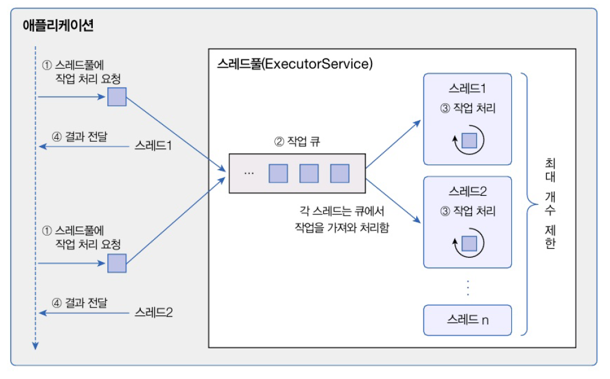
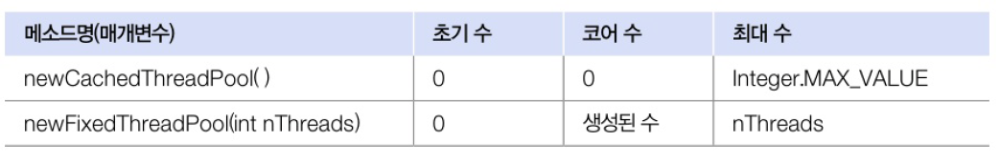
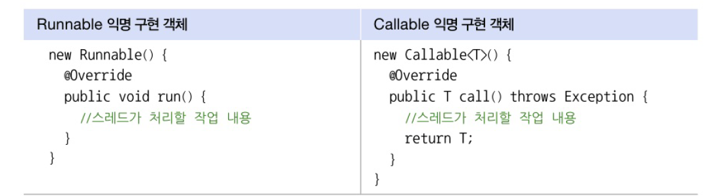
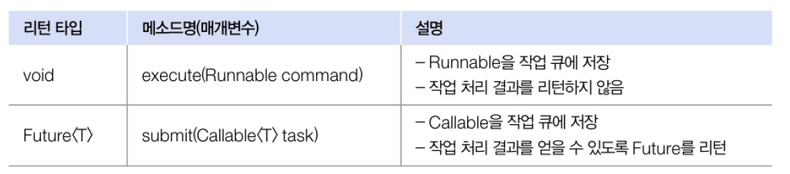

# 14.9 스레드풀
- 병렬 작업 처리가 많아지면 스레드의 개수 폭증 -> CPU가 바빠지고 메모리 사용량이 늘어남, 애플리케이션의 성능 급격히 저하
- 병렬 작업 증가로 인한 스레드의 폭증 방지를 위해 스레드풀 사용!
- 스레드풀 
  - 작업 처리에 사용되는 스레드를 제한된 개수만큼 정해놓고 큐에 들어오는 작업들을 하나씩 맡아 처리하는 방식
  - 작업 처리가 끝난 스레드는 다시 작업 큐에서 새로운 작업을 가져와 처리
  - 이렇게 하면 작업량이 증가해도 스레드의 개수가 늘어나지 않아 애플리케이션의 성능이 급격히 저하되지 않음



## 스레드풀 생성
- java.util.concurrent 패키지에서 `ExcecutorService` 인터페이스와 `Excutors` 클래스 제공



- 초기 수 : 스레드 풀이 생성 될 때 기본적으로 생성되는 스레드 수
- 코어 수 : 스레드가 증가된 후 사용되지 않는 스레드를 제거할 때 최소한 풀에서 유지하는 스레드 수
- 최대 수 : 증가되는 스레드의 한도 수
- `newCacheThreadPool()` : 스레드풀의 초기 수와 코어 수는 0개, 작업 개수가 많아지면 새 스레드를 생성시켜 작업 처리, 60초 동안 스레드가 아무 작업 X-> 스레드 풀에서 제거
- `newFoxedThreadPppl()` : 스레드풀의 초기 수는 0개이고, 작업개수가 많아지면 최대 5개까지 스레드를 생서시켜 작업 처리, 생성된 스레드를 제거하지 않음
- 직접 ThreadPollExcutor로 스레드풀 생성 가능

```java
import java.util.concurrent.ExecutorService;
import java.util.concurrent.SynchronousQueue;
import java.util.concurrent.ThreadPoolExecutor;
import java.util.concurrent.TimeUnit;

ExecutorService threadPool = new ThreadPoolExecutor(
        3, // 코어 스레드 개수
        100, // 최대 스레드 개수
        120L, // 놀고 있는 시간
        TimeUnit.SECONDS, // 놀고 있는 시간 단위
        new SynchronousQueue<Runnable>() // 작업 큐
);
```

## 스레드풀 종료
- 스레드풀의 스레드는기본적으로 데몬스레드 X -> main 스레드 종료되더라도 작업 처리하기 위해 계속 실행 상태로 남아있음
- 스레드풀의 모든 스레드 종료하려면 ExecutorService의 두 메소드 중 하나를 실행
- 남아있는 작업 마무리 후 스레드풀 종료  -> shutdown
- 남아있는 작업과 상관없이 강제 종료 -> shutdowNow

| 리턴 타입          | 메소드명(매개변수)    | 설명                                                                                         |
|----------------|---------------|--------------------------------------------------------------------------------------------|
| void           | shutdown()    | 현재 처리 중인 작업뿐만 아니라 작업 큐에 대기하고 있는 모든 작업을 처리한 뒤에 스레드 풀을 종료시킨다.                                |
| List<Runnable> | shutdownNow() | 현재 작업 처리 중인 스레드를 interrupt해서 작업을 중지시키소 스레드풀을 종료시킨다. 리턴값은 작업 큐에 있는 미처리된 작업(Runnable)의 목록이다. |


## 작업 생성과 처리 요청
- 하나의 작업은 Runnable 또는 Callable 구현 객체로 표현
- 차이점 : 작업 처리 후 리턴값이 있느나 없느냐



- Runnable의 run()은 리턴값이 없음
- Callable의 call()은 리턴값이 있음 -> call()의 리턴값은 Callable<T>에서 지정한 T 타입 파라미터와 동일한 타입
- 작업 처리 요청이란 ExcutorService의 작업 규에 Runnable 혹은 Callable 객체를 넣는 행위
- 작업 큐에 들어가면 처리한 스레드가 있는지 보고 없다면 스레드를 새로 생성시팀



```java
package java_2409.java_240926;

import java.util.concurrent.ExecutorService;
import java.util.concurrent.Executors;

public class RunnableExecuteExample {
    public static void main(String[] args) {
        // 1000개의 메일 생성
        String[][] mails = new String[1000][3];
        for (int i = 0; i < mails.length; i++) {
            mails[i][0] = "admin@my.com";
            mails[i][1] = "member"+i+"@my.com";
            mails[i][2] = "신상품 입고";
        }

        // ExecutorService 활용
        ExecutorService executorService = Executors.newFixedThreadPool(5);

        // 이메일을 보내는 작업 생성 및 처리 요청
        for (int i = 0; i < 1000; i++) {
            final int idx = i;
            executorService.execute(new Runnable() {
                @Override
                public void run() {
                    Thread thread = Thread.currentThread();
                    String from = mails[idx][0];
                    String to = mails[idx][1];
                    String content = mails[idx][2];
                    System.out.println("[" + thread.getName() + "]" +
                            from + "==>" + to + ": " + content);
                }
            });

        }
        executorService.shutdown();
    }
}

```